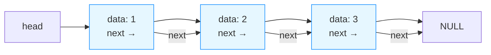

# 绪论

数据元素：数据的基本单位

数据项：构成数据元素的不可分割的最小单位

数据对象：性质相同的数据元素的集合

## 逻辑结构

线性 A-B-C-D

树型（类比树状图）一对多

图形结构 多对多

## 存储结构

顺序存储（类似C语言 数组）

链式存储

索引存储

散列存储

## 算法

时间复杂度和空间复杂度的分析方法：

### 时间复杂度（非递归程序）：

#### （1）常数时间

```c
++x;y++;
```

只有两句话 即只执行两次 即时间复杂度为O(1)。 **执行常数次数（操作次数为固定值）的代码 时间复杂度均为O(1) **

#### （2）线性时间

```c
for(i=1;i<=n;++i)
    ++x
```

执行n次 即时间复杂度为O(n)  **执行次数与n相关的代码 时间复杂度为O(n)**

#### （3）平方时间

```c
for(i=1;i<=n;++i)
    for(j=1;j<=n:++j)
        ++x; //重点：循环最多的次数
```

执行 $n^2$ 次 **即时间复杂度为O($n^2$)**

#### （4）代数式时间

```c
for(i=1;i<=n;++i)  //分析：i=1做一次，i=2做两次......一直到i=n做n次
    for(j=1;j<=i-1;++j)
        ++x;
```

根据分析，上述循环做了 $\sum_{i=1}^{n-1} i$ =$\frac{n(n-1)}{2}$=$\frac{n^2}{2}-\frac{n}{2}$次 

**时间复杂度以最高次项为准，所以上述代码时间复杂度为O($n^2$)次**

#### （5）对数时间

```c
i=1;
while(i<=n)
    i=i*3;
```

分析：

假设上述循环能够执行m次，亦即最后一次循环时
$$
i=1\times3\times3...=3^m
$$
即
$$
3^m>n
$$
两边同时取对数，得
$$
m>\log_{3}{n}
$$
亦即执行$\lfloor log_{3}{n} \rfloor+1$后，跳出循环，我们以$\log_{3}{n}$为主，**亦即时间复杂度为O($\log{3}{n}$)**

### 时间复杂度（递归程序）

```c
int Fun(int n)
{
    if(n=0||n=1)
        return 1;
    else
        return n*Fun(n-1);
}
```

求解过程

假设上述程序的时间复杂度为$T(n)$，

当$n\ge2$时，$T(n)=T(n-1)+O(1)$ ---（最后还要再做一次乘法运算）

而显然，对上式有：
$$
\begin{aligned}
T(n)&= T(n-2)+O(1)+O(1)\\
	&=T(n-3)+O(1)+O(1)+O(1)\\
	&=nO(1)\\
	&=O(n)
\end{aligned}
$$

# 线性表

逻辑结构--一对一

## 运算

#### 基本运算

初始化 ：`InitList(&L)`

插入：`ListInsert(&L,i,e)`

删除：`ListDelete(&L,i)`

判断空表： `ListEmpty(L)`

取值：`GetElem(L,i,&e)`

#### 应用

逆转

找最大元素

多项式运算

两个有序表的合并

图书管理系统

## 存储结构

#### 顺序存储（顺序表）

静态分配空间

```c
int A[20];
```

动态分配空间

```C
int *p=new int[20];
```

特点：开辟了20个内存空间，在C语言中：

```c
malloc
free
```

顺序表的表示：

```c
#define MAXSIZE 100
typedef struct{
    ElemType *elem; //连续空间的首地址
    int length;	//表长
}SqList //包装
```

例如：（34，23，67，43）就可以表示为

L.elem

| 0    | 1    | 2    | 3    | ...  | L.length |
| ---- | ---- | ---- | ---- | ---- | -------- |

| 34   | 23   | 67   | 43   | ...  | 4    |
| ---- | ---- | ---- | ---- | ---- | ---- |

**1.取值**

```c
L.elem[2]=67;//取“67”这个值
```

时间复杂度$O(1)$,非常方便

**2.插入**

插入操作涉及到后续元素的移位，所以**时间复杂度为$O(n)$**,在第i个结点之前插入，需要移动n-i+1次

**3.删除**

删除操作也涉及到后续元素的移位（插入后后续元素++，删除后后续元素前移，--），所以**时间复杂度为$O(n)$.**删除第i个结点，移动n-i次

**相关问题**

约定问题：0空间是否放第一个元素？

边界问题：不要越界

表长的增减

```c
// 输出顺序表
void ListOutput(List L) {  // 参数传递方式和原代码一致（值传递）
    // 遍历有效元素（和原代码逻辑完全一致：i从0到L.length-1）
    for (int i = 0; i < L.length; i++) {
        // printf替代cout，"%d "表示输出整数+空格（原代码的""应为空格，否则元素会粘连）
        printf("%d ", L.elem[i]);
    }
    // 可选：换行优化格式（原代码无，但建议加，否则输出后光标在同一行）
    printf("\n");
}
```

```c
#include <stdlib.h>  // 若使用动态数组需保留，静态数组可删除

// 兼容所有C编译器的布尔类型定义（替代C++的bool）
typedef int bool;
#define true 1
#define false 0

// 顺序表结构体定义（适配动态/静态数组，按需选择）
// 方案1：动态数组版（推荐，灵活）
typedef struct {
    int* elem;   // 指向动态分配的数组
    int length;  // 顺序表有效元素个数
} List;

// 方案2：静态数组版（固定容量，无需malloc/free）
// #define MAX_SIZE 100  // 可自定义最大容量
// typedef struct {
//     int elem[MAX_SIZE];  // 静态数组
//     int length;          // 顺序表有效元素个数
// } List;

// 核心函数：判断顺序表是否升序排列（等效原C++代码）
bool isSort(List L) {
    // 遍历到倒数第二个元素，避免i+1越界
    for (int i = 0; i < L.length - 1; i++) {
        // 存在逆序则立即返回false
        if (L.elem[i] > L.elem[i+1]) {
            return false;
        }
    }
    // 无逆序则返回true（空表/单元素表默认升序）
    return true;
}
```

## 特别补充：malloc和free

以下是按要求整理的 Markdown 格式文本，完整保留原文结构、内容和格式细节，关键信息加粗优化阅读体验：

#### malloc 和 free 详解（C 语言动态内存管理）

`malloc` 和 `free` 是 C 语言中用于**动态内存管理**的核心函数（定义在 `<stdlib.h>` 头文件中）：`malloc` 用于从堆区申请指定大小的内存，`free` 用于释放 `malloc` 申请的内存（避免内存泄漏）。以下是它们的完整用法、搭配示例和核心注意事项，结合你之前的顺序表场景讲解，更易理解。

##### 一、基本语法

| 函数   | 语法格式                     | 功能说明                                                     |
| ------ | ---------------------------- | ------------------------------------------------------------ |
| malloc | `void* malloc(size_t size);` | 向系统申请 `size` 字节的连续内存；<br>成功返回指向该内存的指针，失败返回 `NULL`；<br>返回值是 `void*`，需强制类型转换为实际数据类型。 |
| free   | `void free(void* ptr);`      | 释放 `ptr` 指向的内存（必须是 `malloc/calloc/realloc` 申请的内存）；<br>无返回值，释放后需将 `ptr` 置 `NULL`（避免野指针）。 |

##### 二、核心用法步骤（以顺序表动态数组为例）

**步骤1：引入头文件**

```c
#include <stdlib.h>  // 必须包含，否则malloc/free未定义
```

**步骤2：用 malloc 申请内存**

核心：计算需申请的内存大小 = 元素个数 × 单个元素字节数（`sizeof(类型)`）。
```c
// 定义顺序表（动态版）
typedef struct {
    int* elem;   // 指向动态数组的指针
    int length;  // 有效元素个数
} List;

List L;
int n = 5;  // 要存储5个int类型元素
L.length = n;

// 申请内存：n个int元素 → 大小为 n * sizeof(int)
L.elem = (int*)malloc(n * sizeof(int));  // void* 强制转为 int*

// 关键：校验内存申请是否成功（必做！）
if (L.elem == NULL) {
    // 申请失败（如内存不足），直接退出或处理错误
    printf("内存申请失败！\n");
    return -1;  // 终止程序
}
```

**步骤3：使用申请的内存**

```c
// 给动态数组赋值（和普通数组用法一致）
for (int i = 0; i < L.length; i++) {
    L.elem[i] = i + 1;  // 赋值：1,2,3,4,5
}
```

**步骤4：用 free 释放内存**

核心：内存使用完毕后必须释放，且释放后将指针置 `NULL`（避免野指针）。
```c
free(L.elem);  // 释放L.elem指向的堆内存
L.elem = NULL; // 关键：清空指针，防止后续误操作野指针
```

**完整可运行示例（结合 isSort 函数）**

```c
#include <stdio.h>
#include <stdlib.h>

// 布尔类型定义
typedef int bool;
#define true 1
#define false 0

// 顺序表结构体
typedef struct {
    int* elem;
    int length;
} List;

// 判断顺序表是否升序
bool isSort(List L) {
    for (int i = 0; i < L.length - 1; i++) {
        if (L.elem[i] > L.elem[i+1]) return false;
    }
    return true;
}

int main() {
    // 1. 申请内存
    List L;
    L.length = 5;
    L.elem = (int*)malloc(L.length * sizeof(int));
    if (L.elem == NULL) {
        printf("内存申请失败！\n");
        return -1;
    }

    // 2. 使用内存
    L.elem[0] = 1; L.elem[1] = 2; L.elem[2] = 3; L.elem[3] = 4; L.elem[4] = 5;
    printf("顺序表是否升序：%s\n", isSort(L) ? "是" : "否"); // 输出：是

    // 3. 释放内存
    free(L.elem);
    L.elem = NULL;

    return 0;
}
```

##### 三、关键注意事项（避坑指南）
1. **malloc 必须校验返回值**：
   若内存不足，`malloc` 会返回 `NULL`，直接使用 `NULL` 指针会导致程序崩溃，因此必须判断 `L.elem == NULL`。

2. **free 的使用规则**：
   - 只能释放 `malloc/calloc/realloc` 申请的内存，不能释放栈内存（如局部数组）；
   - 不能重复释放同一块内存（会导致内存错误）；
   - 释放后必须将指针置 `NULL`（否则指针变为“野指针”，指向已释放的无效内存，后续操作会触发未定义行为）。

3. **内存大小计算**：
   用 `sizeof(类型)` 计算单个元素字节数，避免手动写死（如 `4` 代替 `sizeof(int)`），提升代码可移植性（不同平台 `int` 可能占 2/4 字节）。

4. **动态内存的生命周期**：
   `malloc` 申请的内存属于堆区，不会像栈内存（局部变量）一样自动释放，必须手动 `free`，否则会导致**内存泄漏**（程序运行时间越长，占用内存越多，最终崩溃）。

# 链表

## 单链表

C语言中链表的定义方式如下：

```c
#include <stdio.h>
#include <stdilb.h> //用于malloc/free动态内存分配

//定义单链表节点结构体
typedef struct ListNode{
    int data; //数据域：存储整形数据（可替换为任意类型）
    struct ListNode *next; //指针域：指向后继节点
} ListNode; //简化类型名：亦即后续可用ListNode代替struct ListNode

//可选：定义链表头结构体
typedef struct LinkedList{
    ListNode *head; //链表头指针，指向第一个节点
    int size; //链表长度（可选，便于快速获取长度）
} LinkedList
```

<font color="red">关键说明：</font>

`typedef`的作用：简化结构体名称，亦即可以直接用`ListNode` 表示此结构体

`strust ListNode *next ` :指针域必须用`struct ListNode`修饰（因为定义结构体时，`ListNode`别名尚未生效）

头指针：链表的入口，若`head=NULL`表示空链表



链表的结构就如上图所示，其中：

矩形表示组成链表的节点，用C语言表示，就是这样：

```c
// 定义节点的样子（typedef是为了简化名字，不用每次写struct Node）
typedef struct ListNode {
    int data;              // 数据域：存一个整数（比如1、2、3）,整型，不是指针
    struct ListNode *next; // 指针域：指向 ListNode的指针（真正的指针）
} ListNode;
```

- 重点理解 `next`：它是一个「指向 Node 类型的指针」，说白了就是「存下一个节点的地址」；
- 比如节点 A 的`next`存了节点 B 的地址，就表示 A 后面连的是 B。

了解了这些，我们来看看，针对单链表，有哪些操作：

### **1.创建节点**

为单个节点分配内存、初始化数据和指针，作为插入操作的前置步骤

<font color="blue">核心逻辑：</font>

- 用`malloc`分配内存（须检查分配是否成功）
- 新节点的`next`初始化为`NULL`避免野指针

代码示例：

```c
//创建新节点
ListNode* createNode(int data){
    ListNode *newNode = (ListNode*)malloc(sizeof(ListNode));
    //内存分配失败处理
    if(newNode == NULL){
        printf("内存分配失败！\n");
        exit(1);
    }
    newNode->data = data; //初始化数据
    newNode->next = NULL; //初始化指针
    retuen newNode;
}
```

解释:

1. `newNode->data = data;`

- `newNode`是指向`ListNode`结构体的指针（`ListNode *newNode`）

- `->`是成员**访问**运算符，用于通过指针访问结构体成员。

- `newNode->data`表示：通过指针`newNode`访问它指向的节点结构体中的`data`成员。
- 因为`data`是`int`类型，所以它是<font color="blue">**整型变量**</font>，不是指针（亦即用%d访问）。

- `data`表示：把传入的参数`data`复制给这个`data`成员

2. `newNode->next = NULL`

- `newNode->next`是指针成员，存储的是“下一个节点的内存地址”
- `=NULL`表示：让这个指针指向空地址。
- `newNode->next`则访问的是结构体里的`struct ListNode *`类型成员，存储的是“下一个节点的内存地址”，本质就是指针变量。

针对本例的测试函数：

```c
int main(){
	ListNode *node = createNode(10);
    printf("节点创建成功，数据：%d，next:%p\n",node->data,node->next);
    free(node); //释放内存
    return 0;
}
```

特别补充：

`ListNode *newNode = (ListNode*)malloc(sizeof(ListNode));`的理解：

1. `sizeof(ListNode)`

   `sizeof`是C语言的一个运算符，用于**计算某个个数据类型/变量占据的字节数**，这里就是在计算“存储一个`ListNode`的节点，需要申请多大的内存”

2. `malloc(...)`

   用于从堆内存中申请内存。这里就用`malloc(sizeof(ListNode))`申请了`sizeof(ListNode)`大小的内存。

3. `(ListNode*)`

   类型转换。`malloc`返回的是`void*`，亦即无类型指针，但我们需要用“指向ListNode的指针”来操作这块内存，所以必须把`void*`强制转换为`ListNode*`型。

   （类比理解：`void*` = 仓库管理员给你的「通用地址条」（只写了货架位置，没写货架要放什么）；`(ListNode*)` = 把地址条标注成「存放 ListNode 节点的货架」，这样你后续才能正确往货架里放节点的 data 和 next）

4. `ListNode *newNode`

   这一步是定义了一个“指向ListNode的指针变量”`newNode`,并把前面申请到的内存地址赋值给它。

完整理解这个过程

1. 你（程序员）想存放 1 个链表节点，先算好节点需要 8 字节（`sizeof(ListNode)`）；
2. 你向仓库管理员（`malloc`）申请「8 字节的连续货架」；
3. 管理员检查仓库（堆内存），如果有空闲的 8 字节货架，就把货架的「起始位置」（比如 0x1000）告诉你；
4. 你拿到的位置是「通用地址」（`void*`），你给它贴个标签「这是存放 ListNode 的货架」（`(ListNode*)` 转换）；
5. 你把这个位置记在小本本上（`newNode` 指针变量），后续就可以通过这个位置往货架里放数据（`newNode->data = 10`）。

### **2.遍历链表**

功能定义：从表头到表尾一次访问所有节点，可打印、统计或修改节点数据：

核心逻辑：

- 用临时指针`current`遍历，不修改原头指针。
- 终止条件：`current == NULL`(亦即遍历到尾节点的next)

示例代码：

```c
//遍历链表函数
void traverse(ListNode *head){
    if(head == NULL){
        printf("链表为空\n");
        return;
    }
    ListNode *current = head ;
    printf("链表遍历结果：");
    while (current != NULL){
        printf("%d->",current->data);
        current=current->next;
    }
    printf("NULL\n");

}

//测试函数
int main() {
    // 构建链表：10 → 20 → 30 → NULL
    ListNode *head = createNode(10);
    head->next = createNode(20);
    head->next->next = createNode(30);
    
    traverse(head);  // 遍历
    
    // 释放内存（简化版，仅测试用）
    free(head->next->next);
    free(head->next);
    free(head);
    return 0;
}
```

特别说明：

函数的定义和调用

下面以`createNode`为例，展示函数定义与调用的相关注意事项：

1. 函数定义的完整结构

   ```c
   //返回值类型 函数名（参数类型 函数名）{函数体}
   ListNode* createNode(int data){
       ...
       return newNode;
   }
   ```

2. 各部分的核心意义：

   - 返回值类型：`ListNode`

     亦即函数执行完后，返回一个"指向ListNode结构体的指针"（亦即创建好的节点地址）

   - 函数名

     自定义

   - 参数列表

     函数的输入：需要传入一个整型数据，用来初始化节点的`data`成员

   - 函数体

     注意返回值

3. 函数的调用

   1. 直接调用

      ```c
      #include <stdio.h>
      #include <stdlib.h>
      
      // 先定义节点结构体（必须在函数前）
      typedef struct ListNode {
          int data;
          struct ListNode *next;
      } ListNode;
      
      // 1. 先定义createNode函数（或先声明，后定义）
      ListNode* createNode(int data) {
          ListNode *newNode = (ListNode*)malloc(sizeof(ListNode));
          if (newNode == NULL) {
              printf("内存分配失败！\n");
              exit(1);
          }
          newNode->data = data;
          newNode->next = NULL;
          return newNode;
      }
      
      int main() {
          // 2. 调用createNode函数：传入int类型参数，用ListNode*变量接收返回值
          ListNode *node1 = createNode(10); // 创建数据为10的节点
          ListNode *node2 = createNode(20); // 创建数据为20的节点
          
          // 验证调用结果
          printf("节点1的数据：%d\n", node1->data); // 输出10
          printf("节点1的next：%p\n", node1->next); // 输出(nil)（NULL）
          printf("节点2的数据：%d\n", node2->data); // 输出20
          
          // 记得释放内存（避免泄漏）
          free(node1);
          free(node2);
          return 0;
      }
      ```

   2. 函数声明后调用

      ```c
      #include <stdio.h>
      #include <stdlib.h>
      
      // 1. 先声明节点结构体
      typedef struct ListNode {
          int data;
          struct ListNode *next;
      } ListNode;
      
      // 2. 函数声明（和定义的格式一致，末尾加;）
      ListNode* createNode(int data);
      
      int main() {
          // 3. 正常调用（此时函数还没定义，但编译器知道函数格式）
          ListNode *node = createNode(30);
          printf("节点数据：%d\n", node->data);
          free(node);
          return 0;
      }
      
      // 4. 后定义createNode函数
      ListNode* createNode(int data) {
          ListNode *newNode = (ListNode*)malloc(sizeof(ListNode));
          if (newNode == NULL) {
              printf("内存分配失败！\n");
              exit(1);
          }
          newNode->data = data;
          newNode->next = NULL;
          return newNode;
      }
      ```

   3. 调用的注意事项

      - 参数类型必须匹配

        `createNode(int data)`即已经规定了只能传入int类型的值（比如10，变量`a=5`）,不能用`create("10")`(传入字符串)或是`create(node1)`(传入指针)

      - **返回值必须接收 / 使用**：`createNode`返回的节点指针是堆内存地址，如果不接收也不使用，会导致内存泄漏（申请的内存无法释放）； 

        错误调用：`createNode(10);`（只创建节点，不保存地址，后续无法释放）；

        正确调用：`ListNode *node = createNode(10);`（保存地址，后续可操作 / 释放）。

### **3.头部插入**

**功能定义**

在链表的最前端新增节点，效率最高，时间复杂度最低（$O(1)$）.

**核心逻辑**

- 新节点的`next`指向原来的头节点
- 头节点更新为新节点（<font color='blue'>需要传二级指针修改原头指针</font>）

示例代码：

```c
// 头插函数
void prepend(ListNode **head, int data) {
    ListNode *newNode = createNode(data);
    newNode->next = *head;  // 新节点接原头节点
    *head = newNode;        // 更新头指针
}

// 测试
int main() {
    ListNode *head = NULL;  // 空链表
    
    prepend(&head, 30);     // 头插30 → 30→NULL
    prepend(&head, 20);     // 头插20 → 20→30→NULL
    prepend(&head, 10);     // 头插10 → 10→20→30→NULL
    
    traverse(head);
    
    // 释放内存
    free(head->next->next);
    free(head->next);
    free(head);
    return 0;
}
```

特别说明：针对这里的二级指针：

在链表操作中，**只要修改了原头指针的值，就必须用二级指针**

1. 为什么要用二级指针？

   C语言是”值传递“，函数参数传递的是值的副本，没有直接修改原变量的值。

   ```c
   // 错误的头插函数（用一级指针）
   void prepend_error(ListNode *head, int data) {
       ListNode *newNode = createNode(data);
       newNode->next = head; 
       head = newNode; // 这里修改的是「副本指针」，原头指针没变！
   }
   
   int main() {
       ListNode *head = NULL;
       prepend_error(head, 30); // 传递的是head的副本（值为NULL）
       // 调用后，原head依然是NULL，头插失败！
       traverse(head); // 输出「链表为空」
       return 0;
   }
   ```

   所以上面这段错误的示例，错误的地方就在于：

   - `main`中的`head`是"原指针"（保存链表头地址）
   - 调用`prepend_error(head,30)`时，函数接收的是`head`的副本，函数内部对于`head=newNode`只是修改了副本标签，原来`main`中的`head`完全没有变化，头插自然是失败了。

   因此，我们采用**二级指针**

2. 二级指针

   | 指针类型       | 本质                   | 存储的内容         | 通俗类比                 |
   | -------------- | ---------------------- | ------------------ | ------------------------ |
   | 一级指针 `T*`  | 指向「数据」的指针     | 数据的内存地址     | 写着「快递盒位置」的标签 |
   | 二级指针 `T**` | 指向「一级指针」的指针 | 一级指针的内存地址 | 写着「标签位置」的纸条   |

   以链表头指针为例：

   - `ListNode *head`存储”头节点的内存地址“。
   - `ListNode **head`存储”一级指针head的内存地址“。

3. 接下来，我们来可视化一下二级指针的作用：

   ```markdown
   // main函数初始状态：head是NULL（值为0x0）
   main中的head（一级指针）：
     地址：0x2000 → 存储的值：0x0（NULL）
   
   // 调用prepend(&head, 30)：传递的是head的地址（0x2000）
   prepend函数的参数head（二级指针）：
     地址：0x3000 → 存储的值：0x2000（main中head的地址）
   
   // 步骤1：创建新节点30，地址0x1000
   newNode → 地址0x1000：data=30，next=NULL
   
   // 步骤2：newNode->next = *head
   *head 是「二级指针解引用」→ 拿到main中head的值（0x0）
   newNode->next = 0x0 → 新节点next指向NULL
   
   // 步骤3：*head = newNode
   *head 再次解引用 → 直接修改main中head的存储值
   main中的head（地址0x2000）→ 存储的值从0x0改为0x1000（新节点地址）
   ```

   ```c
   //逐行拆解代码中二级指针的具体作用
   void prepend(ListNode **head, int data) {
       // 1. 创建新节点（比如data=30，地址0x1000）
       ListNode *newNode = createNode(data);
       
       // 2. newNode->next = *head
       // *head：解引用二级指针，拿到main中head的当前值（初始是NULL）
       // 作用：让新节点的next指向「原头节点」（空链表时指向NULL）
       newNode->next = *head;  
       
       // 3. *head = newNode
       // *head：再次解引用，直接修改main中head的存储值
       // 作用：把原头指针更新为新节点的地址，完成头插
       *head = newNode;        
   }
   
   // main中调用：prepend(&head, 30)
   // &head：取main中head指针的地址（二级指针），传给函数
   ```

4. 最后，我们来用通俗类比的方式加深记忆

把 `main` 中的 `head` 想象成「你手里的地址标签」（写着链表头的位置）：

- 传一级指针 `head`：把标签复印一份给函数，函数改复印件，你的原标签没变；
- 传二级指针 `&head`：把「你放标签的抽屉地址」告诉函数，函数直接跑到你的抽屉里修改原标签；
- `*head`：函数根据抽屉地址，打开抽屉拿到你的原标签，修改上面的内容。

### **4.尾部插入**

**功能定义**

在链表的最后新增节点，也是最常用的插入方式。

**核心逻辑**

空链表：头指针直接指向新节点

非空链表：遍历到尾节点（`next==NULL`）,尾节点`next`指向新节点。

**代码示例**

```c
// 尾插函数
void append(ListNode **head, int data) {
    ListNode *newNode = createNode(data);
    // 空链表
    if (*head == NULL) {
        *head = newNode;
        return;
    }
    // 找尾节点
    ListNode *last = *head;
    while (last->next != NULL) {
        last = last->next;
    }
    last->next = newNode;  // 尾节点接新节点
}

// 测试
int main() {
    ListNode *head = NULL;  // 空链表
    
    append(&head, 10);      // 尾插10 → 10→NULL
    append(&head, 20);      // 尾插20 → 10→20→NULL
    append(&head, 30);      // 尾插30 → 10→20→30→NULL
    
    traverse(head);
    
    // 释放内存
    free(head->next->next);
    free(head->next);
    free(head);
    return 0;
}
```

### **5.指定位置插入**

**功能定义**

在指定节点（如值为x的节点）后插入新节点

**核心逻辑**

- 先找到前驱节点
- 新节点的`next`接前驱的`next`，前驱的`next`接新节点（避免链表断裂）

**示例代码**

```c
// 指定节点后插入
void insertAfter(ListNode *head, int prevData, int data) {
    // 找前驱节点
    ListNode *prev = head;
    while (prev != NULL && prev->data != prevData) {
        prev = prev->next;
    }
    if (prev == NULL) {
        printf("未找到前驱节点%d，插入失败\n", prevData);
        return;
    }
    // 插入新节点
    ListNode *newNode = createNode(data);
    newNode->next = prev->next;
    prev->next = newNode;
}

// 测试
int main() {
    // 构建链表：10 → 20 → 30 → NULL
    ListNode *head = createNode(10);
    head->next = createNode(20);
    head->next->next = createNode(30);
    
    insertAfter(head, 20, 25);  // 在20后插入25 → 10→20→25→30→NULL
    traverse(head);
    
    insertAfter(head, 40, 50);  // 前驱节点40不存在，插入失败
    
    // 释放内存
    free(head->next->next->next);
    free(head->next->next);
    free(head->next);
    free(head);
    return 0;
}
```

代码解释：

1. 插入函数`insertAfter`

   ```c
   void insertAfter(ListNode *head,int prevData,int Data){
       //步骤1：遍历链表，找到值为prevData的前驱节点
       ListNode *prev=head; //初始化遍历指针，从链表头开始
       /*循环条件：1.prev不为空（亦即没有遍历到链表尾部）
        *2.当前节点值不等于目标值
        */
       while(prev!=NULL&&prev->data!=prevData){
           prev=prev->next;//指针后移，找下一个节点
       }
       
       //步骤2：判断是否找到前驱节点
       if(prev==NULL){//亦即遍历到链表尾都没找到（prev变成NULL）
           printf("未找到前驱节点%d，插入失败\n"，prevData);
           return; //直接返回，中止函数
       }
       
       //步骤3：找到前驱节点后，插入新节点（核心逻辑）
       ListNode *newNode=createNode(data); //创建值为data的新节点,next初始为NULL
       newNode->next=prev->next; //新节点的next指向‘前驱节点原来的下一个节点’
       prev->next =newNode; //前驱节点的next指向新节点，完成插入
   }
   ```

   亦即：

   ```markdown
   // 插入前：20的next指向30
   20 → 30
   // 步骤①：newNode(25)的next = 20->next → 25→30
   20 → 30
   25 → 30
   // 步骤②：20->next = 25 → 20→25→30
   最终：20 → 25 → 30
   ```

2. 关键细节与易错点：

   - 为什么使用一级指针？

     这个函数不修改头指针，只是在中间插节点，**只有在空链表时要改头指针的时候**才需要二级指针。

   - 循环条件

     先判断`prev`是否为空，避免`prev->data`访问空指针导致崩溃

   - 内存释放顺序

     必须从后往前释放，如果先释放`head(10)`，会丢失后续节点地址，导致内存泄漏

   - 新节点插入的顺序

     先让`newNode->next`指向`prev`的下一个节点，再让`prev->next`指向`NewNode`，掉到会丢失链表的后续节点。

3. 总结：

   1. 遍历找目标前驱节点（容错：没找到则失败）；
   2. 新节点接管前驱的后续节点；
   3. 前驱节点指向新节点；
   4. 测试覆盖「合法插入」和「非法插入」，最后规范释放内存。

### **6.指定值删除**

**功能定义**

删除链表中第一个值为x的节点。<font color="red">需要处理三种边界情况</font>。

**核心逻辑**

- 空链表：直接返回
- 删除头节点：头指针后移，释放原来的头节点
- 删除中间/尾节点：找到前驱节点，跳过目标节点，释放内存

**示例代码**

```c
// 删除指定值节点
void deleteNode(ListNode **head, int data) {
    // 空链表
    if (*head == NULL) {
        printf("链表为空，删除失败\n");
        return;
    }
    ListNode *temp = *head;
    ListNode *prev = NULL;
    
    // 删除头节点
    if (temp != NULL && temp->data == data) {
        *head = temp->next;
        free(temp);
        return;
    }
    // 找目标节点的前驱
    while (temp != NULL && temp->data != data) {
        prev = temp;
        temp = temp->next;
    }
    // 未找到目标节点
    if (temp == NULL) {
        printf("未找到节点%d，删除失败\n", data);
        return;
    }
    // 删除中间/尾节点
    prev->next = temp->next;
    free(temp);
}

// 测试
int main() {
    // 构建链表：10 → 20 → 25 → 30 → NULL
    ListNode *head = createNode(10);
    head->next = createNode(20);
    head->next->next = createNode(25);
    head->next->next->next = createNode(30);
    
    deleteNode(&head, 25);  // 删除25 → 10→20→30→NULL
    traverse(head);
    
    deleteNode(&head, 40);  // 未找到40，删除失败
    
    // 释放内存
    free(head->next->next);
    free(head->next);
    free(head);
    return 0;
}
```

### **7.查找节点**

**功能定义**

查找值为x的节点是否存在，返回位置（从0开始）或-1。

**核心逻辑**

遍历链表，匹配数据则返回索引，否则返回-1.

**示例代码**

```c
// 查找节点
int search(ListNode *head, int data) {
    ListNode *current = head;
    int index = 0;
    while (current != NULL) {
        if (current->data == data) {
            return index;
        }
        current = current->next;
        index++;
    }
    return -1;
}

// 测试
int main() {
    // 构建链表：10 → 20 → 30 → NULL
    ListNode *head = createNode(10);
    head->next = createNode(20);
    head->next->next = createNode(30);
    
    int pos1 = search(head, 20);
    printf("节点20的位置：%d\n", pos1);  // 输出1
    
    int pos2 = search(head, 40);
    printf("节点40的位置：%d\n", pos2);  // 输出-1
    
    // 释放内存
    free(head->next->next);
    free(head->next);
    free(head);
    return 0;
}
```

**<font color="red">注意函数的参数传递！</font>**

### **8.求链表长度**

**功能定义**

统计链表中节点的总数，空链表长度为 0。

**核心逻辑**

遍历链表，用计数器累加，直到 `current == NULL`。

**代码示例**

```c
// 求链表长度
int getLength(ListNode *head) {
    int length = 0;
    ListNode *current = head;
    while (current != NULL) {
        length++;
        current = current->next;
    }
    return length;
}
// 测试
int main() {
    // 构建链表：10 → 20 → 30 → NULL
    ListNode *head = createNode(10);
    head->next = createNode(20);
    head->next->next = createNode(30);
    
    printf("链表长度：%d\n", getLength(head));  // 输出3
    
    // 空链表测试
    ListNode *emptyHead = NULL;
    printf("空链表长度：%d\n", getLength(emptyHead));  // 输出0
    
    // 释放内存
    free(head->next->next);
    free(head->next);
    free(head);
    return 0;
}
```

### **9.销毁链表并释放内存**

**功能定义**

释放所有节点内存，避免内存泄漏，头指针置空。

**核心逻辑**

先保存下一个节点，再释放当前节点，最后头指针置空。

**示例代码**

```c
void freeList(ListNode **head){
    // 步骤1：初始化遍历指针，指向链表头节点（解引用二级指针拿到原头指针的值）
    ListNode *current=*head;  
    // 步骤2：定义临时变量next，用于保存「当前节点的下一个节点地址」
    ListNode *next;           
    
    // 步骤3：循环遍历所有节点（直到current指向NULL，即链表尾）
    while(current!=NULL){     
        // 关键：先保存下一个节点的地址！
        // 如果先free(current)，会丢失next地址，导致后续节点无法访问
        next=current->next;   
        
        // 释放当前节点的内存（归还系统）
        free(current);        
        // 遍历指针后移，指向之前保存的下一个节点
        current = next;       
    }
    
    // 步骤4：将原头指针置空（核心！二级指针的作用）
    // *head是解引用，直接修改主函数中head指针的原值为NULL
    *head =NULL;             
}
```

**代码解释及执行逻辑**

1. 执行逻辑：

   ```markdown
   初始状态：current=10(亦即head指向10)，next暂时未被赋值。
   
   第1次循环：
   next = current->next → next=20
   free(current) → 释放10的内存
   current = next → current=20
   
   第2次循环：
   next = current->next → next=30
   free(current) → 释放20的内存
   current = next → current=30
   
   第3次循环：
   next = current->next → next=NULL
   free(current) → 释放30的内存
   current = next → current=NULL
   
   循环结束：
   *head=NULL → 主函数中的head指针被置空，链表彻底销毁
   ```

2. 相关问题

   - 为什么先保存next地址？

     如果先`free(current)`的话，current指向的内存节点就将被释放，此时`current->next`将成为无效地址（亦即野指针），导致后续节点内存泄漏。

   - 为什么用二级指针？

     函数最后要把主函数的**头指针**置空（`head=NULL`）,而C语言是值传递，一级指针无法修改原来头指针的值，必须使用二级指针（亦即指向指针的指针）才能直接操作原头指针。

   - 为什么要置空`head=NULL`

     释放所有节点后，原头指针仍然指向原来的内存地址（但该地址已经被系统回收）成为“野指针”。置空后，后续对head的操作（比如判断`if(head==NULL)`）能正确识别链表已被销毁。

3. 常考错点：

   ```c
   // 错误写法：先free再拿next，导致崩溃/内存泄漏
   void freeList_error(ListNode *head) {
       while(head!=NULL){
           free(head);       // 先释放，head变成野指针
           head = head->next;// 访问野指针的next，程序崩溃
       }
   }
   ```

### **10.反转链表**

**功能定义**

将链表指针方向反转（如10->20->30->NULL变为30->20->10->NULL）

**核心逻辑**

用**<font color="green">"前驱（prev）+当前（current）+后继（next）"</font>**三个指针，循环反转指针指向。

**示例代码**

```c
// 反转链表
ListNode* reverseList(ListNode *head) {
    ListNode *prev = NULL;   // 前驱节点，初始NULL
    ListNode *current = head;// 当前节点，初始头节点
    ListNode *next = NULL;   // 后继节点，临时保存
    
    while (current != NULL) {
        next = current->next;  // 保存下一个节点
        current->next = prev;  // 反转当前节点指针
        prev = current;        // 前驱后移
        current = next;        // 当前后移
    }
    head = prev;  // 新头节点是原尾节点（prev）
    return head;
}

// 测试
int main() {
    // 构建链表：10 → 20 → 30 → NULL
    ListNode *head = createNode(10);
    head->next = createNode(20);
    head->next->next = createNode(30);
    
    printf("反转前：");
    traverse(head);
    
    head = reverseList(head);  // 反转
    
    printf("反转后：");
    traverse(head);
    
    // 释放内存
    freeList(&head);
    return 0;
}
```

**代码详解**

1. 关于`ListNode* reverseList(ListNode *head)`

   这个语句定义了一个**返回值类型为`ListNode*`(亦即链表节点指针)**的函数。

   `ListNode`是结构体类型。

   这个函数的参数和返回值都用到了<font color="blue">链表节点的指针</font>。

   通俗类比，把`ListNode*`想象成快递柜地址的话，就是

   - 函数参数`ListNode *head`：你告诉函数“原来链表的第一个快递柜地址”，（函数接收一个"指向`ListNode`结构体的指针"亦即原链表的头指针）
   - 返回值 `ListNode*`：函数帮你反转快递柜的连接顺序后，返回 “新链表的第一个快递柜地址”（表示函数执行完后，会返回一个「指向 `ListNode` 结构体（链表节点）的指针」（通常返回反转后链表的新头节点））

2. 为什么返回值是`ListNode`?

   链表反转的核心逻辑是：原链表的头节点会变成尾节点，而原链表的尾节点会变成新链表的头节点。函数需要把「反转后的新头节点地址」返回给调用者，这样调用者才能访问到反转后的整个链表。

   ```c
   // 原链表：10→20→30→NULL
   ListNode *newHead = reverseList(head);
   // newHead 接收返回值，指向反转后的头节点30，链表变成 30→20→10→NULL
   ```

3. 代码的核心思路是什么？

   链表的本质是 “节点通过 `next` 指针串联”，那么反转的核心就是：**把每个节点的 `next` 指针，从「指向下一个节点」改成「指向前一个节点」**

   最后原链表的尾节点（NULL 前的节点）变成新头节点。

4. 一些关键细节。

   - 为什么要保存`next`?

     如果先改`current->next`，会丢失下一个节点的地址（比如 10 的 next 改成 NULL 后，就找不到 20 了），所以必须先把 `current->next` 存到 `next` 里。

   - `prev`的作用？

     记录当前节点的 “前一个节点”，是反转指针的核心（让当前节点的 next 指向 prev）。

   - 循环结束后`prev`为什么是新头？

     循环结束时 `current=NULL`，最后一个处理的节点是 30，此时 `prev` 刚好指向 30（原尾节点），也就是新链表的头节点。

5. `head=prev`是可以省略的，在这里这个语句与`return prev`的效果一样。

   这里写 `head=prev` 只是为了更直观（让原 head 变量指向新头）。

6. 简化记忆的口诀

   循环内四步：**存 `next `→ 反指针 → `prev` 走 → `current` 走**

   循环外：返回 `prev`（或把` head` 赋值为 `prev `再返回）。

### **11.查找中间节点**

**功能定义**

找到链表的中间节点（偶数长度返回第二个中间节点）。

**核心逻辑**

快慢指针：快指针走 2 步，慢指针走 1 步，快指针到尾时慢指针在中间。

**示例代码**

```c
// 查找中间节点
ListNode* findMiddle(ListNode *head) {
    if (head == NULL) return NULL;
    
    ListNode *slow = head;  // 慢指针：走1步
    ListNode *fast = head;  // 快指针：走2步
    
    while (fast != NULL && fast->next != NULL) {
        slow = slow->next;
        fast = fast->next->next;
    }
    return slow;  // 慢指针指向中间节点
}

// 测试
int main() {
    // 奇数长度链表：10→20→30→40→50→NULL（中间30）
    ListNode *head1 = createNode(10);
    head1->next = createNode(20);
    head1->next->next = createNode(30);
    head1->next->next->next = createNode(40);
    head1->next->next->next->next = createNode(50);
    
    ListNode *mid1 = findMiddle(head1);
    printf("奇数长度链表中间节点：%d\n", mid1->data);  // 输出30
    
    // 偶数长度链表：10→20→30→40→NULL（中间30）
    ListNode *head2 = createNode(10);
    head2->next = createNode(20);
    head2->next->next = createNode(30);
    head2->next->next->next = createNode(40);
    
    ListNode *mid2 = findMiddle(head2);
    printf("偶数长度链表中间节点：%d\n", mid2->data);  // 输出30
    
    // 释放内存
    freeList(&head1);
    freeList(&head2);
    return 0;
}
```

**相关解释**

- 关于循环条件`fast!=NULL && fast->next !=NULL`

  这个循环终止的唯一要求是<font color="blue">快指针不能再走两步</font>，也就是说，`fast != NULL`和`fast->next !=NULL`是必须同时满足的两个条件。

### **12.查找倒数第k个节点**

**功能定义**

找到链表中倒数第 k 个节点（如倒数第 1 个是尾节点）。

**核心逻辑**

快慢指针：快指针先提前走 k 步，然后快慢指针同步走，快指针到尾时慢指针即为目标。

**示例代码**

```c
// 查找倒数第k个节点
ListNode* findKthFromEnd(ListNode *head, int k) {
    if (head == NULL || k <= 0) return NULL;
    
    ListNode *fast = head;
    ListNode *slow = head;
    
    // 快指针先走k步
    for (int i = 0; i < k; i++) {
        if (fast == NULL) return NULL;  // k超过链表长度
        fast = fast->next;
    }
    
    // 快慢指针同步走
    while (fast != NULL) {
        fast = fast->next;
        slow = slow->next;
    }
    return slow;
}

// 测试
int main() {
    // 构建链表：10 → 20 → 30 → 40 → 50 → NULL
    ListNode *head = createNode(10);
    head->next = createNode(20);
    head->next->next = createNode(30);
    head->next->next->next = createNode(40);
    head->next->next->next->next = createNode(50);
    
    ListNode *k1 = findKthFromEnd(head, 2);
    printf("倒数第2个节点：%d\n", k1->data);  // 输出40
    
    ListNode *k2 = findKthFromEnd(head, 5);
    printf("倒数第5个节点：%d\n", k2->data);  // 输出10
    
    // 释放内存
    freeList(&head);
    return 0;
}
```

### **13.判断链表中是否有环**

**功能定义**

检测单链表是否存在循环（尾节点 `next` 指向链表中某个节点）。

**核心逻辑**

快慢指针：快指针走 2 步，慢指针走 1 步，若相遇则有环；否则无环。

**示例代码**

```c
// 判断链表是否有环
int hasCycle(ListNode *head) {
    if (head == NULL || head->next == NULL) return 0;  // 空/单节点无环
    
    ListNode *slow = head;
    ListNode *fast = head->next;
    
    while (slow != fast) {
        if (fast == NULL || fast->next == NULL) return 0;  // 快指针到尾，无环
        slow = slow->next;        // 慢指针走1步
        fast = fast->next->next;  // 快指针走2步
    }
    return 1;  // 相遇，有环
}

// 测试
int main() {
    // 无环链表：10→20→30→NULL
    ListNode *head1 = createNode(10);
    head1->next = createNode(20);
    head1->next->next = createNode(30);
    printf("无环链表：%d\n", hasCycle(head1));  // 输出0
    
    // 有环链表：10→20→30→20（环）
    ListNode *head2 = createNode(10);
    head2->next = createNode(20);
    head2->next->next = createNode(30);
    head2->next->next->next = head2->next;  // 30指向20，形成环
    printf("有环链表：%d\n", hasCycle(head2));  // 输出1
    
    // 释放无环链表内存（有环链表需手动释放，避免死循环）
    freeList(&head1);
    free(head2->next->next);
    free(head2->next);
    free(head2);
    return 0;
}
```

**<font color="red">注意：</font>**

- `if (head == NULL || head->next == NULL) return 0; ` 

  空链表/单节点链表 无环

**详解**

- 设计逻辑：**环内的指针会无限循环，而速度不同的两个指针终会相遇**

- <font color="blue">涉及到**快慢指针**的循环，一定要判断**快指针是不是能安全走两步**</font>，亦即`fast!=NULL&&fast->next!=NULL`

- 为什么设定为**慢指针一次走1步，快指针一次走2步**？

  核心是**有速度差才能相遇**。

  但是，如果快指针走3步或是4步，虽然也能判定是否成环，但更容易因为链表长度短等原因触发空指针错误。

  如果链表无环的话，快指针会先走到尾部，不会无限循环.

- **空间复杂度：$O(1)$，因为只用到了两个指针遍历链表。**

### **14.合并两个有序链表**

**功能定义**

将两个升序单链表合并为一个新的升序单链表。

**核心逻辑** 

新建哑节点（哨兵节点），依次比较两个链表节点值，小的接入新链表。

**示例代码**

```c
ListNode* mergeTwoLists(ListNode *l1, ListNode *l2) {
    // 步骤1：初始化哑节点和尾指针（解决头节点难处理的问题）
    ListNode dummy;          // 哑节点（栈上节点，不用free，考试重点！）
    ListNode *tail = &dummy; // 尾指针，始终指向新链表最后一个节点
    dummy.next = NULL;       // 新链表初始为空
    
    // 步骤2：循环比较l1和l2的当前节点，小的接入新链表
    // 循环条件：l1和l2都不为空（两堆牌都有牌）
    while (l1 != NULL && l2 != NULL) {
        if (l1->data < l2->data) { // l1当前节点更小，选l1
            tail->next = l1;       // 把l1当前节点接到新链表尾部
            l1 = l1->next;         // l1指针后移（拿l1下一张牌）
        } else {                   // l2当前节点更小/相等，选l2
            tail->next = l2;       // 把l2当前节点接到新链表尾部
            l2 = l2->next;         // l2指针后移
        }
        tail = tail->next;         // 新链表尾指针后移（准备接下一个节点）
    }
    
    // 步骤3：处理剩余节点（其中一堆牌已经拿完，另一堆直接接上去）
    tail->next = (l1 != NULL) ? l1 : l2;
    
    // 步骤4：返回合并后链表的真正头节点（哑节点的next）
    return dummy.next;
}

// 测试
int main() {
    // 链表1：10→30→50→NULL
    ListNode *l1 = createNode(10);
    l1->next = createNode(30);
    l1->next->next = createNode(50);
    
    // 链表2：20→40→60→NULL
    ListNode *l2 = createNode(20);
    l2->next = createNode(40);
    l2->next->next = createNode(60);
    
    // 合并
    ListNode *merged = mergeTwoLists(l1, l2);
    printf("合并后链表：");
    traverse(merged);
    
    // 释放内存
    freeList(&merged);
    return 0;
}
```

**代码解释**

1. 核心思路：

   合并两个有序链表的核心思路就一句话：**像整理两堆排好序的扑克牌，每次选两堆顶牌里更小的那张，接到新链表末尾；一堆牌拿完后，把另一堆剩下的牌直接接上去**。

   下面分步讲解：

   **第一步 解决“新链表头节点难确定“的问题--引入”哑节点“**

   合并时最麻烦的是：不知道新链表第一个节点该选 l1 还是 l2 的第一个节点。

   所以先造一个「哑节点（哨兵）」（不用存有效数据，只当 “临时头”），新链表的节点都接在它后面，最后返回哑节点的 next 就是真正的头。

   **第二步：核心循环--逐个选更小的节点接入**

   假设要合并的两个有序链表：

   - l1：10 → 30 → 50 → NULL
   - l2：20 → 40 → 60 → NULL

   循环规则：只要 l1 和 l2 都有节点（没遍历完），就做 3 件事：

   1. 比较 l1 和 l2 当前节点的值，选更小的那个；
   2. 把这个更小的节点接到新链表的「尾指针」后面；
   3. 选中的链表指针后移（比如选了 l1 的 10，l1 就移到 30），新链表的尾指针也后移（准备接下一个）。

   **第三步：处理剩余节点**

   当其中一个链表遍历完（比如 l1 先到 NULL），把另一个链表剩下的节点直接接到新链表末尾即可（比如 l2 剩下的 60，直接接上就行，因为本身是有序的）。

2. 核心框架

   ```c
   ListNode* mergeTwoLists(ListNode *l1, ListNode *l2) {
       // 1. 初始化哑节点和尾指针
       ListNode dummy;
       ListNode *tail = &dummy;
       dummy.next = NULL;
       
       // 2. 循环选更小的节点
       while (l1 != NULL && l2 != NULL) {
           if (l1->data < l2->data) {
               tail->next = l1;
               l1 = l1->next;
           } else {
               tail->next = l2;
               l2 = l2->next;
           }
           tail = tail->next;
       }
       
       // 3. 接剩余节点
       tail->next = l1 ? l1 : l2;
       
       // 4. 返回真正的头节点
       return dummy.next;
   }
   ```

3. 关键考点：

   - ”哑节点“的作用

     不用判断 “新链表第一个节点是 l1 还是 l2”，统一从哑节点的 next 开始，简化逻辑，避免空指针错误。

     考试写法：必须定义`ListNode dummy;` + `tail = &dummy;`，这是合并链表的 “标准操作”。

   - 循环条件

     必须是`l1 != NULL && l2 != NULL`（两链表都有节点才比较），少一个都会出错。

   - 剩余节点处理

     用三元运算符`tail->next = l1 ? l1 : l2;`（或 if-else），把没遍历完的链表直接接上去，不用再循环。

   - 三目运算符

     ```c
     条件表达式 ? 表达式1 : 表达式2
     ```

     条件表达式为真执行前面（1），反之则执行后面（2）

   - 返回值

     必须返回`dummy.next`，而不是`dummy`（dummy 是栈上节点，返回它的地址会出错），也不是 tail（tail 是最后一个节点）。

4. 相关语法：

   - 结构体变量的定义与初始化（栈上定义）

     ```c
     ListNode dummy; //核心：定义结构体变量（栈上）
     dummy.next=NULL;
     ```

     知识点有：

     1. `ListNode`是提前用`typedef`重命名的结构体类型

        ```c
        typedef struct ListNode{
            int data; //数据域
            struct ListNode *next; //指针域：指向同类型结构体的指针
        }ListNode;  //typedef重命名，让struct ListNode 可以简写为ListNode
        ```

     2. 所以，`ListNode dummy`定义了一个**栈上的结构体变量**。（作为对比，之前定义的`createNode`是`malloc`创建在堆上的结构体指针，亦即`ListNode *newNode`，而这里的`dummy`是直接的结构体变量，不是指针。）

     3. `dummy.next=NULL;`通过`变量名.成员名`的方式访问结构体成员（这是结构体变量的访问方式）

        - 注意：如果是结构体指针（比如`ListNode *tail`），要通过`指针名->成员名`进行访问（比如`tail->next`）

   - 结构体指针的使用

     ```c
     ListNode *tail=&dummy; //结构体变量取地址，赋值给结构体指针
     //循环中访问指针成员
     tail->next=l1;
     tail=tail->next;
     ```

     知识点有：

     - `&dummy`:取结构体变量`dummmy`的地址，类型是`ListNode`(亦即结构体指针)
     - `ListNode *tail = &dummy`:定义结构体指针`tail`，让其指向`dummy`这个结构体变量；
     - `tail->next`结构体指针访问成员用`->`，等价于`(*tail).next`(亦即先解引用指针，再用`.`访问)；

   - 关于`*`的位置

     `ListNode* mergeTwoLists`和`ListNode dummy`中`*`的有无，本质是区分**“指向结构体的指针”**和**“结构体变量”**

     1. 先明确：`*`的意思是？

        `*`出现在类型的后面（如`ListNode*`）表示“该变量是指向`ListNode`类型的指针”。

        没有`*`表示“该变量是`ListNode`类型的实体（亦即实实在在的结构体变量）”

     2. 那么，`*`应该加在哪里呢？

        - 情况1：**函数返回值/参数（如`ListNode* mergeTwoLists`）**

          **<font color='red'>链表操作函数的返回值/参数</font>，几乎都要加`*`(用指针)，**因为链表节点是通过`malloc`在堆上创建的，只能用指针访问（堆内存没有“实体名”，只有地址）。

          如果返回/传递结构体实体，会触发值拷贝（复制整个结构体），效率极低，且易丢失链表指针关系。

          比如：

          ```c
          // 函数返回值：ListNode* → 表示返回「指向ListNode的指针」
          ListNode* mergeTwoLists(ListNode *l1, ListNode *l2) 
          // 函数参数：ListNode *l1 → 表示参数是「指向ListNode的指针」
          ```

          - 为什么返回`ListNode*`：合并后的链表头节点是堆上的节点（`createNode`创建），只能用指针指向它，返回指针才能拿到链表的起始地址；
          - 若写成`ListNode mergeTwoLists(...)`：返回的是结构体实体，函数结束后堆链表的指针关系会丢失，完全错误。

        - 情况2：**定义结构体变量（如`ListNode dummy`）**

          只有**临时、栈上的哑节点**会定义成"无`*`的实体"，其他链表节点必须加`*`（指针）

          因为哑节点只是临时占位，但是普通链表节点是通过`malloc`在堆上创建的，必须用指针。

          比如：

          ```c
          // 无*：ListNode dummy → 定义「ListNode类型的实体变量」（栈上）
          ListNode dummy; 
          // 有*：ListNode *tail → 定义「指向ListNode的指针」，指向dummy的地址
          ListNode *tail = &dummy; 
          ```

          - `dummy`是实体：用`.`访问成员（`dummy.next`），占用栈内存，函数结束后自动释放（但它的`next`指向堆节点，不影响）；
          - `tail`是指针：用`->`访问成员（`tail->next`），本身只存地址（存的是`dummy`的地址），不是实体。

     3. 易错辨析

        | 错误写法                  | 正确写法                   | 错误原因                                               |
        | ------------------------- | -------------------------- | ------------------------------------------------------ |
        | `ListNode* dummy;`        | `ListNode dummy;`          | 哑节点无需指针，栈上实体更高效，且指针未初始化会野指针 |
        | `ListNode tail = &dummy;` | `ListNode *tail = &dummy;` | `&dummy`是地址，只能赋值给指针类型，实体无法存地址     |
        | `dummy->next = NULL;`     | `dummy.next = NULL;`       | 实体用`.`，指针用`->`，混写直接编译错误                |
        | `ListNode merge(...)`     | `ListNode* merge(...)`     | 返回实体会拷贝整个结构体，丢失堆链表指针               |

## 双链表

