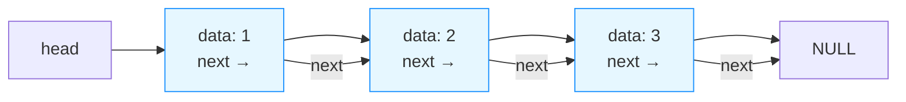

# 绪论

数据元素：数据的基本单位

数据项：构成数据元素的不可分割的最小单位

数据对象：性质相同的数据元素的集合

## 逻辑结构

线性 A-B-C-D

树型（类比树状图）一对多

图形结构 多对多

## 存储结构

顺序存储（类似C语言 数组）

链式存储

索引存储

散列存储

## 算法

时间复杂度和空间复杂度的分析方法：

### 时间复杂度（非递归程序）：

#### （1）常数时间

```c
++x;y++;
```

只有两句话 即只执行两次 即时间复杂度为O(1)。 **执行常数次数（操作次数为固定值）的代码 时间复杂度均为O(1) **

#### （2）线性时间

```c
for(i=1;i<=n;++i)
    ++x
```

执行n次 即时间复杂度为O(n)  **执行次数与n相关的代码 时间复杂度为O(n)**

#### （3）平方时间

```c
for(i=1;i<=n;++i)
    for(j=1;j<=n:++j)
        ++x; //重点：循环最多的次数
```

执行 $n^2$ 次 **即时间复杂度为O($n^2$)**

#### （4）代数式时间

```c
for(i=1;i<=n;++i)  //分析：i=1做一次，i=2做两次......一直到i=n做n次
    for(j=1;j<=i-1;++j)
        ++x;
```

根据分析，上述循环做了 $\sum_{i=1}^{n-1} i$ =$\frac{n(n-1)}{2}$=$\frac{n^2}{2}-\frac{n}{2}$次 

**时间复杂度以最高次项为准，所以上述代码时间复杂度为O($n^2$)次**

#### （5）对数时间

```c
i=1;
while(i<=n)
    i=i*3;
```

分析：

假设上述循环能够执行m次，亦即最后一次循环时
$$
i=1\times3\times3...=3^m
$$
即
$$
3^m>n
$$
两边同时取对数，得
$$
m>\log_{3}{n}
$$
亦即执行$\lfloor log_{3}{n} \rfloor+1$后，跳出循环，我们以$\log_{3}{n}$为主，**亦即时间复杂度为O($\log{3}{n}$)**

### 时间复杂度（递归程序）

```c
int Fun(int n)
{
    if(n=0||n=1)
        return 1;
    else
        return n*Fun(n-1);
}
```

求解过程

假设上述程序的时间复杂度为$T(n)$，

当$n\ge2$时，$T(n)=T(n-1)+O(1)$ ---（最后还要再做一次乘法运算）

而显然，对上式有：
$$
\begin{aligned}
T(n)&= T(n-2)+O(1)+O(1)\\
	&=T(n-3)+O(1)+O(1)+O(1)\\
	&=nO(1)\\
	&=O(n)
\end{aligned}
$$

# 线性表

逻辑结构--一对一

## 运算

#### 基本运算

初始化 ：`InitList(&L)`

插入：`ListInsert(&L,i,e)`

删除：`ListDelete(&L,i)`

判断空表： `ListEmpty(L)`

取值：`GetElem(L,i,&e)`

#### 应用

逆转

找最大元素

多项式运算

两个有序表的合并

图书管理系统

## 存储结构

#### 顺序存储（顺序表）

静态分配空间

```c
int A[20];
```

动态分配空间

```C
int *p=new int[20];
```

特点：开辟了20个内存空间，在C语言中：

```c
malloc
free
```

顺序表的表示：

```c
#define MAXSIZE 100
typedef struct{
    ElemType *elem; //连续空间的首地址
    int length;	//表长
}SqList //包装
```

例如：（34，23，67，43）就可以表示为

L.elem

| 0    | 1    | 2    | 3    | ...  | L.length |
| ---- | ---- | ---- | ---- | ---- | -------- |

| 34   | 23   | 67   | 43   | ...  | 4    |
| ---- | ---- | ---- | ---- | ---- | ---- |

**1.取值**

```c
L.elem[2]=67;//取“67”这个值
```

时间复杂度$O(1)$,非常方便

**2.插入**

插入操作涉及到后续元素的移位，所以**时间复杂度为$O(n)$**,在第i个结点之前插入，需要移动n-i+1次

**3.删除**

删除操作也涉及到后续元素的移位（插入后后续元素++，删除后后续元素前移，--），所以**时间复杂度为$O(n)$.**删除第i个结点，移动n-i次

**相关问题**

约定问题：0空间是否放第一个元素？

边界问题：不要越界

表长的增减

```c
// 输出顺序表
void ListOutput(List L) {  // 参数传递方式和原代码一致（值传递）
    // 遍历有效元素（和原代码逻辑完全一致：i从0到L.length-1）
    for (int i = 0; i < L.length; i++) {
        // printf替代cout，"%d "表示输出整数+空格（原代码的""应为空格，否则元素会粘连）
        printf("%d ", L.elem[i]);
    }
    // 可选：换行优化格式（原代码无，但建议加，否则输出后光标在同一行）
    printf("\n");
}
```

```c
#include <stdlib.h>  // 若使用动态数组需保留，静态数组可删除

// 兼容所有C编译器的布尔类型定义（替代C++的bool）
typedef int bool;
#define true 1
#define false 0

// 顺序表结构体定义（适配动态/静态数组，按需选择）
// 方案1：动态数组版（推荐，灵活）
typedef struct {
    int* elem;   // 指向动态分配的数组
    int length;  // 顺序表有效元素个数
} List;

// 方案2：静态数组版（固定容量，无需malloc/free）
// #define MAX_SIZE 100  // 可自定义最大容量
// typedef struct {
//     int elem[MAX_SIZE];  // 静态数组
//     int length;          // 顺序表有效元素个数
// } List;

// 核心函数：判断顺序表是否升序排列（等效原C++代码）
bool isSort(List L) {
    // 遍历到倒数第二个元素，避免i+1越界
    for (int i = 0; i < L.length - 1; i++) {
        // 存在逆序则立即返回false
        if (L.elem[i] > L.elem[i+1]) {
            return false;
        }
    }
    // 无逆序则返回true（空表/单元素表默认升序）
    return true;
}
```

## 特别补充：malloc和free

以下是按要求整理的 Markdown 格式文本，完整保留原文结构、内容和格式细节，关键信息加粗优化阅读体验：

#### malloc 和 free 详解（C 语言动态内存管理）

`malloc` 和 `free` 是 C 语言中用于**动态内存管理**的核心函数（定义在 `<stdlib.h>` 头文件中）：`malloc` 用于从堆区申请指定大小的内存，`free` 用于释放 `malloc` 申请的内存（避免内存泄漏）。以下是它们的完整用法、搭配示例和核心注意事项，结合你之前的顺序表场景讲解，更易理解。

##### 一、基本语法

| 函数   | 语法格式                     | 功能说明                                                     |
| ------ | ---------------------------- | ------------------------------------------------------------ |
| malloc | `void* malloc(size_t size);` | 向系统申请 `size` 字节的连续内存；<br>成功返回指向该内存的指针，失败返回 `NULL`；<br>返回值是 `void*`，需强制类型转换为实际数据类型。 |
| free   | `void free(void* ptr);`      | 释放 `ptr` 指向的内存（必须是 `malloc/calloc/realloc` 申请的内存）；<br>无返回值，释放后需将 `ptr` 置 `NULL`（避免野指针）。 |

##### 二、核心用法步骤（以顺序表动态数组为例）

**步骤1：引入头文件**

```c
#include <stdlib.h>  // 必须包含，否则malloc/free未定义
```

**步骤2：用 malloc 申请内存**

核心：计算需申请的内存大小 = 元素个数 × 单个元素字节数（`sizeof(类型)`）。
```c
// 定义顺序表（动态版）
typedef struct {
    int* elem;   // 指向动态数组的指针
    int length;  // 有效元素个数
} List;

List L;
int n = 5;  // 要存储5个int类型元素
L.length = n;

// 申请内存：n个int元素 → 大小为 n * sizeof(int)
L.elem = (int*)malloc(n * sizeof(int));  // void* 强制转为 int*

// 关键：校验内存申请是否成功（必做！）
if (L.elem == NULL) {
    // 申请失败（如内存不足），直接退出或处理错误
    printf("内存申请失败！\n");
    return -1;  // 终止程序
}
```

**步骤3：使用申请的内存**

```c
// 给动态数组赋值（和普通数组用法一致）
for (int i = 0; i < L.length; i++) {
    L.elem[i] = i + 1;  // 赋值：1,2,3,4,5
}
```

**步骤4：用 free 释放内存**

核心：内存使用完毕后必须释放，且释放后将指针置 `NULL`（避免野指针）。
```c
free(L.elem);  // 释放L.elem指向的堆内存
L.elem = NULL; // 关键：清空指针，防止后续误操作野指针
```

**完整可运行示例（结合 isSort 函数）**

```c
#include <stdio.h>
#include <stdlib.h>

// 布尔类型定义
typedef int bool;
#define true 1
#define false 0

// 顺序表结构体
typedef struct {
    int* elem;
    int length;
} List;

// 判断顺序表是否升序
bool isSort(List L) {
    for (int i = 0; i < L.length - 1; i++) {
        if (L.elem[i] > L.elem[i+1]) return false;
    }
    return true;
}

int main() {
    // 1. 申请内存
    List L;
    L.length = 5;
    L.elem = (int*)malloc(L.length * sizeof(int));
    if (L.elem == NULL) {
        printf("内存申请失败！\n");
        return -1;
    }

    // 2. 使用内存
    L.elem[0] = 1; L.elem[1] = 2; L.elem[2] = 3; L.elem[3] = 4; L.elem[4] = 5;
    printf("顺序表是否升序：%s\n", isSort(L) ? "是" : "否"); // 输出：是

    // 3. 释放内存
    free(L.elem);
    L.elem = NULL;

    return 0;
}
```

##### 三、关键注意事项（避坑指南）
1. **malloc 必须校验返回值**：
   若内存不足，`malloc` 会返回 `NULL`，直接使用 `NULL` 指针会导致程序崩溃，因此必须判断 `L.elem == NULL`。

2. **free 的使用规则**：
   - 只能释放 `malloc/calloc/realloc` 申请的内存，不能释放栈内存（如局部数组）；
   - 不能重复释放同一块内存（会导致内存错误）；
   - 释放后必须将指针置 `NULL`（否则指针变为“野指针”，指向已释放的无效内存，后续操作会触发未定义行为）。

3. **内存大小计算**：
   用 `sizeof(类型)` 计算单个元素字节数，避免手动写死（如 `4` 代替 `sizeof(int)`），提升代码可移植性（不同平台 `int` 可能占 2/4 字节）。

4. **动态内存的生命周期**：
   `malloc` 申请的内存属于堆区，不会像栈内存（局部变量）一样自动释放，必须手动 `free`，否则会导致**内存泄漏**（程序运行时间越长，占用内存越多，最终崩溃）。

# 链表

## 单链表

C语言中链表的定义方式如下：

```c
#include <stdio.h>
#include <stdilb.h> //用于malloc/free动态内存分配

//定义单链表节点结构体
typedef struct ListNode{
    int data; //数据域：存储整形数据（可替换为任意类型）
    struct ListNode *next; //指针域：指向后继节点
} ListNode; //简化类型名：亦即后续可用ListNode代替struct ListNode

//可选：定义链表头结构体
typedef struct LinkedList{
    ListNode *head; //链表头指针，指向第一个节点
    int size; //链表长度（可选，便于快速获取长度）
} LinkedList
```

<font color="red">关键说明：</font>

`typedef`的作用：简化结构体名称，亦即可以直接用`ListNode` 表示此结构体

`strust ListNode *next ` :指针域必须用`struct ListNode`修饰（因为定义结构体时，`ListNode`别名尚未生效）

头指针：链表的入口，若`head=NULL`表示空链表



链表的结构就如上图所示，其中：

矩形表示组成链表的节点，用C语言表示，就是这样：

```c
// 定义节点的样子（typedef是为了简化名字，不用每次写struct Node）
typedef struct ListNode {
    int data;              // 数据域：存一个整数（比如1、2、3）,整型，不是指针
    struct ListNode *next; // 指针域：指向 ListNode的指针（真正的指针）
} ListNode;
```

- 重点理解 `next`：它是一个「指向 Node 类型的指针」，说白了就是「存下一个节点的地址」；
- 比如节点 A 的`next`存了节点 B 的地址，就表示 A 后面连的是 B。

了解了这些，我们来看看，针对单链表，有哪些操作：

### **1.创建节点**

为单个节点分配内存、初始化数据和指针，作为插入操作的前置步骤

<font color="blue">核心逻辑：</font>

- 用`malloc`分配内存（须检查分配是否成功）
- 新节点的`next`初始化为`NULL`避免野指针

代码示例：

```c
//创建新节点
ListNode* createNode(int data){
    ListNode *newNode = (ListNode*)malloc(sizeof(ListNode));
    //内存分配失败处理
    if(newNode == NULL){
        printf("内存分配失败！\n");
        exit(1);
    }
    newNode->data = data; //初始化数据
    newNode->next = NULL; //初始化指针
    retuen newNode;
}
```

解释:

1. `newNode->data = data;`

- `newNode`是指向`ListNode`结构体的指针（`ListNode *newNode`）

- `->`是成员**访问**运算符，用于通过指针访问结构体成员。

- `newNode->data`表示：通过指针`newNode`访问它指向的节点结构体中的`data`成员。
- 因为`data`是`int`类型，所以它是<font color="blue">**整型变量**</font>，不是指针（亦即用%d访问）。

- `data`表示：把传入的参数`data`复制给这个`data`成员

2. `newNode->next = NULL`

- `newNode->next`是指针成员，存储的是“下一个节点的内存地址”
- `=NULL`表示：让这个指针指向空地址。
- `newNode->next`则访问的是结构体里的`struct ListNode *`类型成员，存储的是“下一个节点的内存地址”，本质就是指针变量。

针对本例的测试函数：

```c
int main(){
	ListNode *node = createNode(10);
    printf("节点创建成功，数据：%d，next:%p\n",node->data,node->next);
    free(node); //释放内存
    return 0;
}
```

特别补充：

`ListNode *newNode = (ListNode*)malloc(sizeof(ListNode));`的理解：

1. `sizeof(ListNode)`

   `sizeof`是C语言的一个运算符，用于**计算某个个数据类型/变量占据的字节数**，这里就是在计算“存储一个`ListNode`的节点，需要申请多大的内存”

2. `malloc(...)`

   用于从堆内存中申请内存。这里就用`malloc(sizeof(ListNode))`申请了`sizeof(ListNode)`大小的内存。

3. `(ListNode*)`

   类型转换。`malloc`返回的是`void*`，亦即无类型指针，但我们需要用“指向ListNode的指针”来操作这块内存，所以必须把`void*`强制转换为`ListNode*`型。

   （类比理解：`void*` = 仓库管理员给你的「通用地址条」（只写了货架位置，没写货架要放什么）；`(ListNode*)` = 把地址条标注成「存放 ListNode 节点的货架」，这样你后续才能正确往货架里放节点的 data 和 next）

4. `ListNode *newNode`

   这一步是定义了一个“指向ListNode的指针变量”`newNode`,并把前面申请到的内存地址赋值给它。

完整理解这个过程

1. 你（程序员）想存放 1 个链表节点，先算好节点需要 8 字节（`sizeof(ListNode)`）；
2. 你向仓库管理员（`malloc`）申请「8 字节的连续货架」；
3. 管理员检查仓库（堆内存），如果有空闲的 8 字节货架，就把货架的「起始位置」（比如 0x1000）告诉你；
4. 你拿到的位置是「通用地址」（`void*`），你给它贴个标签「这是存放 ListNode 的货架」（`(ListNode*)` 转换）；
5. 你把这个位置记在小本本上（`newNode` 指针变量），后续就可以通过这个位置往货架里放数据（`newNode->data = 10`）。

### **2.遍历链表**

功能定义：从表头到表尾一次访问所有节点，可打印、统计或修改节点数据：

核心逻辑：

- 用临时指针`current`遍历，不修改原头指针。
- 终止条件：`current == NULL`(亦即遍历到尾节点的next)

示例代码：

```c
//遍历链表函数
void traverse(ListNode *head){
    if(head == NULL){
        printf("链表为空\n");
        return;
    }
    ListNode *current = head ;
    printf("链表遍历结果：");
    while (current != NULL){
        printf("%d->",current->data);
        current=current->next;
    }
    printf("NULL\n");

}

//测试函数
int main() {
    // 构建链表：10 → 20 → 30 → NULL
    ListNode *head = createNode(10);
    head->next = createNode(20);
    head->next->next = createNode(30);
    
    traverse(head);  // 遍历
    
    // 释放内存（简化版，仅测试用）
    free(head->next->next);
    free(head->next);
    free(head);
    return 0;
}
```

特别说明：

函数的定义和调用

下面以`createNode`为例，展示函数定义与调用的相关注意事项：

1. 函数定义的完整结构

   ```c
   //返回值类型 函数名（参数类型 函数名）{函数体}
   ListNode* createNode(int data){
       ...
       return newNode;
   }
   ```

2. 各部分的核心意义：

   - 返回值类型：`ListNode`

     亦即函数执行完后，返回一个"指向ListNode结构体的指针"（亦即创建好的节点地址）

   - 函数名

     自定义

   - 参数列表

     函数的输入：需要传入一个整型数据，用来初始化节点的`data`成员

   - 函数体

     注意返回值

3. 函数的调用

   1. 直接调用

      ```c
      #include <stdio.h>
      #include <stdlib.h>
      
      // 先定义节点结构体（必须在函数前）
      typedef struct ListNode {
          int data;
          struct ListNode *next;
      } ListNode;
      
      // 1. 先定义createNode函数（或先声明，后定义）
      ListNode* createNode(int data) {
          ListNode *newNode = (ListNode*)malloc(sizeof(ListNode));
          if (newNode == NULL) {
              printf("内存分配失败！\n");
              exit(1);
          }
          newNode->data = data;
          newNode->next = NULL;
          return newNode;
      }
      
      int main() {
          // 2. 调用createNode函数：传入int类型参数，用ListNode*变量接收返回值
          ListNode *node1 = createNode(10); // 创建数据为10的节点
          ListNode *node2 = createNode(20); // 创建数据为20的节点
          
          // 验证调用结果
          printf("节点1的数据：%d\n", node1->data); // 输出10
          printf("节点1的next：%p\n", node1->next); // 输出(nil)（NULL）
          printf("节点2的数据：%d\n", node2->data); // 输出20
          
          // 记得释放内存（避免泄漏）
          free(node1);
          free(node2);
          return 0;
      }
      ```

   2. 函数声明后调用

      ```c
      #include <stdio.h>
      #include <stdlib.h>
      
      // 1. 先声明节点结构体
      typedef struct ListNode {
          int data;
          struct ListNode *next;
      } ListNode;
      
      // 2. 函数声明（和定义的格式一致，末尾加;）
      ListNode* createNode(int data);
      
      int main() {
          // 3. 正常调用（此时函数还没定义，但编译器知道函数格式）
          ListNode *node = createNode(30);
          printf("节点数据：%d\n", node->data);
          free(node);
          return 0;
      }
      
      // 4. 后定义createNode函数
      ListNode* createNode(int data) {
          ListNode *newNode = (ListNode*)malloc(sizeof(ListNode));
          if (newNode == NULL) {
              printf("内存分配失败！\n");
              exit(1);
          }
          newNode->data = data;
          newNode->next = NULL;
          return newNode;
      }
      ```

   3. 调用的注意事项

      - 参数类型必须匹配

        `createNode(int data)`即已经规定了只能传入int类型的值（比如10，变量`a=5`）,不能用`create("10")`(传入字符串)或是`create(node1)`(传入指针)

      - **返回值必须接收 / 使用**：`createNode`返回的节点指针是堆内存地址，如果不接收也不使用，会导致内存泄漏（申请的内存无法释放）； 

        错误调用：`createNode(10);`（只创建节点，不保存地址，后续无法释放）；

        正确调用：`ListNode *node = createNode(10);`（保存地址，后续可操作 / 释放）。

### **3.头部插入**

**功能定义**

在链表的最前端新增节点，效率最高，时间复杂度最低（$O(1)$）.

**核心逻辑**

- 新节点的`next`指向原来的头节点
- 头节点更新为新节点（<font color='blue'>需要传二级指针修改原头指针</font>）

示例代码：

```c
// 头插函数
void prepend(ListNode **head, int data) {
    ListNode *newNode = createNode(data);
    newNode->next = *head;  // 新节点接原头节点
    *head = newNode;        // 更新头指针
}

// 测试
int main() {
    ListNode *head = NULL;  // 空链表
    
    prepend(&head, 30);     // 头插30 → 30→NULL
    prepend(&head, 20);     // 头插20 → 20→30→NULL
    prepend(&head, 10);     // 头插10 → 10→20→30→NULL
    
    traverse(head);
    
    // 释放内存
    free(head->next->next);
    free(head->next);
    free(head);
    return 0;
}
```

特别说明：针对这里的二级指针：

在链表操作中，**只要修改了原头指针的值，就必须用二级指针**

1. 为什么要用二级指针？

   C语言是”值传递“，函数参数传递的是值的副本，没有直接修改原变量的值。

   ```c
   // 错误的头插函数（用一级指针）
   void prepend_error(ListNode *head, int data) {
       ListNode *newNode = createNode(data);
       newNode->next = head; 
       head = newNode; // 这里修改的是「副本指针」，原头指针没变！
   }
   
   int main() {
       ListNode *head = NULL;
       prepend_error(head, 30); // 传递的是head的副本（值为NULL）
       // 调用后，原head依然是NULL，头插失败！
       traverse(head); // 输出「链表为空」
       return 0;
   }
   ```

   所以上面这段错误的示例，错误的地方就在于：

   - `main`中的`head`是"原指针"（保存链表头地址）
   - 调用`prepend_error(head,30)`时，函数接收的是`head`的副本，函数内部对于`head=newNode`只是修改了副本标签，原来`main`中的`head`完全没有变化，头插自然是失败了。

   因此，我们采用**二级指针**

2. 二级指针

   | 指针类型       | 本质                   | 存储的内容         | 通俗类比                 |
   | -------------- | ---------------------- | ------------------ | ------------------------ |
   | 一级指针 `T*`  | 指向「数据」的指针     | 数据的内存地址     | 写着「快递盒位置」的标签 |
   | 二级指针 `T**` | 指向「一级指针」的指针 | 一级指针的内存地址 | 写着「标签位置」的纸条   |

   以链表头指针为例：

   - `ListNode *head`存储”头节点的内存地址“。
   - `ListNode **head`存储”一级指针head的内存地址“。

3. 接下来，我们来可视化一下二级指针的作用：

   ```markdown
   // main函数初始状态：head是NULL（值为0x0）
   main中的head（一级指针）：
     地址：0x2000 → 存储的值：0x0（NULL）
   
   // 调用prepend(&head, 30)：传递的是head的地址（0x2000）
   prepend函数的参数head（二级指针）：
     地址：0x3000 → 存储的值：0x2000（main中head的地址）
   
   // 步骤1：创建新节点30，地址0x1000
   newNode → 地址0x1000：data=30，next=NULL
   
   // 步骤2：newNode->next = *head
   *head 是「二级指针解引用」→ 拿到main中head的值（0x0）
   newNode->next = 0x0 → 新节点next指向NULL
   
   // 步骤3：*head = newNode
   *head 再次解引用 → 直接修改main中head的存储值
   main中的head（地址0x2000）→ 存储的值从0x0改为0x1000（新节点地址）
   ```

   ```c
   //逐行拆解代码中二级指针的具体作用
   void prepend(ListNode **head, int data) {
       // 1. 创建新节点（比如data=30，地址0x1000）
       ListNode *newNode = createNode(data);
       
       // 2. newNode->next = *head
       // *head：解引用二级指针，拿到main中head的当前值（初始是NULL）
       // 作用：让新节点的next指向「原头节点」（空链表时指向NULL）
       newNode->next = *head;  
       
       // 3. *head = newNode
       // *head：再次解引用，直接修改main中head的存储值
       // 作用：把原头指针更新为新节点的地址，完成头插
       *head = newNode;        
   }
   
   // main中调用：prepend(&head, 30)
   // &head：取main中head指针的地址（二级指针），传给函数
   ```

4. 最后，我们来用通俗类比的方式加深记忆

   把 `main` 中的 `head` 想象成「你手里的地址标签」（写着链表头的位置）：

   - 传一级指针 `head`：把标签复印一份给函数，函数改复印件，你的原标签没变；
   - 传二级指针 `&head`：把「你放标签的抽屉地址」告诉函数，函数直接跑到你的抽屉里修改原标签；
   - `*head`：函数根据抽屉地址，打开抽屉拿到你的原标签，修改上面的内容。

5. 在这里，关于二级指针，我们给出一个更通俗化的理解方式：

   我们已经知道了，根据链表的定义，它是由很多个结构体元素组成的“链式结构”，每个结构体元素包含data（节点值）和next（指向下一个节点的指针）。

   结构体的定义如下：

   ```c
   typedef struct Node{
   	int data;
   	struct Node *next;
   }Node;
   ```

   上面定义中的`struct Node *next` 就框死了这个`next`—— 它只能是 “指向 Node 类型结构体的指针”，存的是 “下一个 Node 结构体的地址”，不是 “结构体里元素的地址”（这里纠正个小细节：next 存的是整个下一个节点的地址，不是节点里某一个元素的地址）

   功能函数要让这个传递进去的值存在结构体里，并让它的 next 指向原来的头节点，让传递进去的 data 成为新头节点的值，所以说我们的功能函数首先要完成的目标就是，传一个值进去，存住它。

   所以 我们定义一个`*newNode`，为了保证这个指针的安全，它的前面加上一个`Node`，就把它框在了`Node`这个 “离散的结构体” 里

   ```c
   Node *newNode=createNode(data);	//createNode()见定义
   ```

   上面的语句里 `newNode`就是链表内部的一个指向新数据的指针，它的值就是链表内这个新数据（新节点）的地址 ——`createNode`里 malloc 给新节点分配了内存，newNode 就拿着这个新节点的门牌号。

   接下来 我们要让这个新数据的 next 指向原来的头节点。新数据的 next 怎么表示？我们的新数据的地址就是 newNode 这个指针指向的地方，根据链表的结构，既然 newNode 已经被框在了结构体里，那我们就用它来访问结构体的成员。

   所以我们用`newNode->next`表示这个新数据的 next（`->`就是 “通过结构体指针访问结构体成员” 的专属写法），同时，我们把原来链表头节点的地址赋给它：

   ```c
   newNode->next = *head; 
   ```

   再把现在的 newNode 的地址赋给`*head`，我们的新链表，就准备就绪了：

   ```c
   *head = newNode;
   ```

   那么为什么要用二级指针呢？

   原因就在于，头插函数操作的，不是 “原来的头节点（那个结构体）”，而是 “指向头节点的头指针”—— 这里先掰清楚两个关键概念：

   - 「头节点」：是实实在在的 Node 结构体，有 data、有 next，占内存；
   - 「头指针（我们代码里的 head）」：是个`Node *`类型的变量，它不存数据，只存 “头节点的地址”—— 说白了，head 就是个记着头节点门牌号的小本子。

   我们要改的不是头节点这个结构体本身（比如改头节点的 data），而是要改 “头指针里记的门牌号”—— 原来头指针记的是旧头节点的地址，现在要改成新节点的地址，这样链表的入口才会指向新节点。

   那既然我们要改它（改 head 这个小本子里的门牌号），就绕不开 “改原件要传地址” 的规则：

   - 如果函数参数只传`Node *head`，那传进去的是 head 里的门牌号副本 —— 函数里改的是副本本子，主函数里的原本子（head）纹丝不动，新节点插了也白插；
   - 所以必须传 “head 这个小本子本身的地址”（也就是`&head`），函数参数要用 “能存指针地址的二级指针”（`Node **head`）来接 —— 这样函数里拿到的是 head 本子的门牌号，就能直接改原本子里记的内容了。

   再把这个逻辑落回代码，就全通了：

   ```c
   // 函数参数是二级指针，接的是主函数里head的地址
   void InsertHead(Node **head, int data) {
       Node *newNode = createNode(data); // 造新节点，拿新节点地址
       newNode->next = *head; // *head = 解引用二级指针，拿到原head里记的旧头节点地址 → 新节点的next指向旧头节点
       *head = newNode; // 解引用二级指针，直接改原head里的内容 → 让head记新节点的地址，新节点成了新头
   }
   
   // 主函数里调用
   int main() {
       Node *head = NULL; // 头指针，初始记的是NULL（空链表）
       InsertHead(&head, 10); // &head = 取head本子的地址，传给二级指针
       // 调用后，head里的内容从NULL变成了新节点的地址，头插成功
   }
   ```

   

### **4.尾部插入**

**功能定义**

在链表的最后新增节点，也是最常用的插入方式。

**核心逻辑**

空链表：头指针直接指向新节点

非空链表：遍历到尾节点（`next==NULL`）,尾节点`next`指向新节点。

**代码示例**

```c
// 尾插函数
void append(ListNode **head, int data) {
    ListNode *newNode = createNode(data);
    // 空链表
    if (*head == NULL) {
        *head = newNode;
        return;
    }
    // 找尾节点
    ListNode *last = *head;
    while (last->next != NULL) {
        last = last->next;
    }
    last->next = newNode;  // 尾节点接新节点
}

// 测试
int main() {
    ListNode *head = NULL;  // 空链表
    
    append(&head, 10);      // 尾插10 → 10→NULL
    append(&head, 20);      // 尾插20 → 10→20→NULL
    append(&head, 30);      // 尾插30 → 10→20→30→NULL
    
    traverse(head);
    
    // 释放内存
    free(head->next->next);
    free(head->next);
    free(head);
    return 0;
}
```

### **5.指定位置插入**

**功能定义**

在指定节点（如值为x的节点）后插入新节点

**核心逻辑**

- 先找到前驱节点
- 新节点的`next`接前驱的`next`，前驱的`next`接新节点（避免链表断裂）

**示例代码**

```c
// 指定节点后插入
void insertAfter(ListNode *head, int prevData, int data) {
    // 找前驱节点
    ListNode *prev = head;
    while (prev != NULL && prev->data != prevData) {
        prev = prev->next;
    }
    if (prev == NULL) {
        printf("未找到前驱节点%d，插入失败\n", prevData);
        return;
    }
    // 插入新节点
    ListNode *newNode = createNode(data);
    newNode->next = prev->next;
    prev->next = newNode;
}

// 测试
int main() {
    // 构建链表：10 → 20 → 30 → NULL
    ListNode *head = createNode(10);
    head->next = createNode(20);
    head->next->next = createNode(30);
    
    insertAfter(head, 20, 25);  // 在20后插入25 → 10→20→25→30→NULL
    traverse(head);
    
    insertAfter(head, 40, 50);  // 前驱节点40不存在，插入失败
    
    // 释放内存
    free(head->next->next->next);
    free(head->next->next);
    free(head->next);
    free(head);
    return 0;
}
```

代码解释：

1. 插入函数`insertAfter`

   ```c
   void insertAfter(ListNode *head,int prevData,int Data){
       //步骤1：遍历链表，找到值为prevData的前驱节点
       ListNode *prev=head; //初始化遍历指针，从链表头开始
       /*循环条件：1.prev不为空（亦即没有遍历到链表尾部）
        *2.当前节点值不等于目标值
        */
       while(prev!=NULL&&prev->data!=prevData){
           prev=prev->next;//指针后移，找下一个节点
       }
       
       //步骤2：判断是否找到前驱节点
       if(prev==NULL){//亦即遍历到链表尾都没找到（prev变成NULL）
           printf("未找到前驱节点%d，插入失败\n"，prevData);
           return; //直接返回，中止函数
       }
       
       //步骤3：找到前驱节点后，插入新节点（核心逻辑）
       ListNode *newNode=createNode(data); //创建值为data的新节点,next初始为NULL
       newNode->next=prev->next; //新节点的next指向‘前驱节点原来的下一个节点’
       prev->next =newNode; //前驱节点的next指向新节点，完成插入
   }
   ```

   亦即：

   ```markdown
   // 插入前：20的next指向30
   20 → 30
   // 步骤①：newNode(25)的next = 20->next → 25→30
   20 → 30
   25 → 30
   // 步骤②：20->next = 25 → 20→25→30
   最终：20 → 25 → 30
   ```

2. 关键细节与易错点：

   - 为什么使用一级指针？

     这个函数不修改头指针，只是在中间插节点，**只有在空链表时要改头指针的时候**才需要二级指针。

   - 循环条件

     先判断`prev`是否为空，避免`prev->data`访问空指针导致崩溃

   - 内存释放顺序

     必须从后往前释放，如果先释放`head(10)`，会丢失后续节点地址，导致内存泄漏

   - 新节点插入的顺序

     先让`newNode->next`指向`prev`的下一个节点，再让`prev->next`指向`NewNode`，掉到会丢失链表的后续节点。

3. 总结：

   1. 遍历找目标前驱节点（容错：没找到则失败）；
   2. 新节点接管前驱的后续节点；
   3. 前驱节点指向新节点；
   4. 测试覆盖「合法插入」和「非法插入」，最后规范释放内存。

### **6.指定值删除**

**功能定义**

删除链表中第一个值为x的节点。<font color="red">需要处理三种边界情况</font>。

**核心逻辑**

- 空链表：直接返回
- 删除头节点：头指针后移，释放原来的头节点
- 删除中间/尾节点：找到前驱节点，跳过目标节点，释放内存

**示例代码**

```c
// 删除指定值节点
void deleteNode(ListNode **head, int data) {
    // 空链表
    if (*head == NULL) {
        printf("链表为空，删除失败\n");
        return;
    }
    ListNode *temp = *head;
    ListNode *prev = NULL;
    
    // 删除头节点
    if (temp != NULL && temp->data == data) {
        *head = temp->next;
        free(temp);
        return;
    }
    // 找目标节点的前驱
    while (temp != NULL && temp->data != data) {
        prev = temp;
        temp = temp->next;
    }
    // 未找到目标节点
    if (temp == NULL) {
        printf("未找到节点%d，删除失败\n", data);
        return;
    }
    // 删除中间/尾节点
    prev->next = temp->next;
    free(temp);
}

// 测试
int main() {
    // 构建链表：10 → 20 → 25 → 30 → NULL
    ListNode *head = createNode(10);
    head->next = createNode(20);
    head->next->next = createNode(25);
    head->next->next->next = createNode(30);
    
    deleteNode(&head, 25);  // 删除25 → 10→20→30→NULL
    traverse(head);
    
    deleteNode(&head, 40);  // 未找到40，删除失败
    
    // 释放内存
    free(head->next->next);
    free(head->next);
    free(head);
    return 0;
}
```

### **7.查找节点**

**功能定义**

查找值为x的节点是否存在，返回位置（从0开始）或-1。

**核心逻辑**

遍历链表，匹配数据则返回索引，否则返回-1.

**示例代码**

```c
// 查找节点
int search(ListNode *head, int data) {
    ListNode *current = head;
    int index = 0;
    while (current != NULL) {
        if (current->data == data) {
            return index;
        }
        current = current->next;
        index++;
    }
    return -1;
}

// 测试
int main() {
    // 构建链表：10 → 20 → 30 → NULL
    ListNode *head = createNode(10);
    head->next = createNode(20);
    head->next->next = createNode(30);
    
    int pos1 = search(head, 20);
    printf("节点20的位置：%d\n", pos1);  // 输出1
    
    int pos2 = search(head, 40);
    printf("节点40的位置：%d\n", pos2);  // 输出-1
    
    // 释放内存
    free(head->next->next);
    free(head->next);
    free(head);
    return 0;
}
```

**<font color="red">注意函数的参数传递！</font>**

### **8.求链表长度**

**功能定义**

统计链表中节点的总数，空链表长度为 0。

**核心逻辑**

遍历链表，用计数器累加，直到 `current == NULL`。

**代码示例**

```c
// 求链表长度
int getLength(ListNode *head) {
    int length = 0;
    ListNode *current = head;
    while (current != NULL) {
        length++;
        current = current->next;
    }
    return length;
}
// 测试
int main() {
    // 构建链表：10 → 20 → 30 → NULL
    ListNode *head = createNode(10);
    head->next = createNode(20);
    head->next->next = createNode(30);
    
    printf("链表长度：%d\n", getLength(head));  // 输出3
    
    // 空链表测试
    ListNode *emptyHead = NULL;
    printf("空链表长度：%d\n", getLength(emptyHead));  // 输出0
    
    // 释放内存
    free(head->next->next);
    free(head->next);
    free(head);
    return 0;
}
```

### **9.销毁链表并释放内存**

**功能定义**

释放所有节点内存，避免内存泄漏，头指针置空。

**核心逻辑**

先保存下一个节点，再释放当前节点，最后头指针置空。

**示例代码**

```c
void freeList(ListNode **head){
    // 步骤1：初始化遍历指针，指向链表头节点（解引用二级指针拿到原头指针的值）
    ListNode *current=*head;  
    // 步骤2：定义临时变量next，用于保存「当前节点的下一个节点地址」
    ListNode *next;           
    
    // 步骤3：循环遍历所有节点（直到current指向NULL，即链表尾）
    while(current!=NULL){     
        // 关键：先保存下一个节点的地址！
        // 如果先free(current)，会丢失next地址，导致后续节点无法访问
        next=current->next;   
        
        // 释放当前节点的内存（归还系统）
        free(current);        
        // 遍历指针后移，指向之前保存的下一个节点
        current = next;       
    }
    
    // 步骤4：将原头指针置空（核心！二级指针的作用）
    // *head是解引用，直接修改主函数中head指针的原值为NULL
    *head =NULL;             
}
```

**代码解释及执行逻辑**

1. 执行逻辑：

   ```markdown
   初始状态：current=10(亦即head指向10)，next暂时未被赋值。
   
   第1次循环：
   next = current->next → next=20
   free(current) → 释放10的内存
   current = next → current=20
   
   第2次循环：
   next = current->next → next=30
   free(current) → 释放20的内存
   current = next → current=30
   
   第3次循环：
   next = current->next → next=NULL
   free(current) → 释放30的内存
   current = next → current=NULL
   
   循环结束：
   *head=NULL → 主函数中的head指针被置空，链表彻底销毁
   ```

2. 相关问题

   - 为什么先保存next地址？

     如果先`free(current)`的话，current指向的内存节点就将被释放，此时`current->next`将成为无效地址（亦即野指针），导致后续节点内存泄漏。

   - 为什么用二级指针？

     函数最后要把主函数的**头指针**置空（`head=NULL`）,而C语言是值传递，一级指针无法修改原来头指针的值，必须使用二级指针（亦即指向指针的指针）才能直接操作原头指针。

   - 为什么要置空`head=NULL`

     释放所有节点后，原头指针仍然指向原来的内存地址（但该地址已经被系统回收）成为“野指针”。置空后，后续对head的操作（比如判断`if(head==NULL)`）能正确识别链表已被销毁。

3. 常考错点：

   ```c
   // 错误写法：先free再拿next，导致崩溃/内存泄漏
   void freeList_error(ListNode *head) {
       while(head!=NULL){
           free(head);       // 先释放，head变成野指针
           head = head->next;// 访问野指针的next，程序崩溃
       }
   }
   ```

### **10.反转链表**

**功能定义**

将链表指针方向反转（如10->20->30->NULL变为30->20->10->NULL）

**核心逻辑**

用**<font color="green">"前驱（prev）+当前（current）+后继（next）"</font>**三个指针，循环反转指针指向。

**示例代码**

```c
// 反转链表
ListNode* reverseList(ListNode *head) {
    ListNode *prev = NULL;   // 前驱节点，初始NULL
    ListNode *current = head;// 当前节点，初始头节点
    ListNode *next = NULL;   // 后继节点，临时保存
    
    while (current != NULL) {
        next = current->next;  // 保存下一个节点
        current->next = prev;  // 反转当前节点指针
        prev = current;        // 前驱后移
        current = next;        // 当前后移
    }
    head = prev;  // 新头节点是原尾节点（prev）
    return head;
}

// 测试
int main() {
    // 构建链表：10 → 20 → 30 → NULL
    ListNode *head = createNode(10);
    head->next = createNode(20);
    head->next->next = createNode(30);
    
    printf("反转前：");
    traverse(head);
    
    head = reverseList(head);  // 反转
    
    printf("反转后：");
    traverse(head);
    
    // 释放内存
    freeList(&head);
    return 0;
}
```

**代码详解**

1. 关于`ListNode* reverseList(ListNode *head)`

   这个语句定义了一个**返回值类型为`ListNode*`(亦即链表节点指针)**的函数。

   `ListNode`是结构体类型。

   这个函数的参数和返回值都用到了<font color="blue">链表节点的指针</font>。

   通俗类比，把`ListNode*`想象成快递柜地址的话，就是

   - 函数参数`ListNode *head`：你告诉函数“原来链表的第一个快递柜地址”，（函数接收一个"指向`ListNode`结构体的指针"亦即原链表的头指针）
   - 返回值 `ListNode*`：函数帮你反转快递柜的连接顺序后，返回 “新链表的第一个快递柜地址”（表示函数执行完后，会返回一个「指向 `ListNode` 结构体（链表节点）的指针」（通常返回反转后链表的新头节点））

2. 为什么返回值是`ListNode`?

   链表反转的核心逻辑是：原链表的头节点会变成尾节点，而原链表的尾节点会变成新链表的头节点。函数需要把「反转后的新头节点地址」返回给调用者，这样调用者才能访问到反转后的整个链表。

   ```c
   // 原链表：10→20→30→NULL
   ListNode *newHead = reverseList(head);
   // newHead 接收返回值，指向反转后的头节点30，链表变成 30→20→10→NULL
   ```

3. 代码的核心思路是什么？

   链表的本质是 “节点通过 `next` 指针串联”，那么反转的核心就是：**把每个节点的 `next` 指针，从「指向下一个节点」改成「指向前一个节点」**

   最后原链表的尾节点（NULL 前的节点）变成新头节点。

4. 一些关键细节。

   - 为什么要保存`next`?

     如果先改`current->next`，会丢失下一个节点的地址（比如 10 的 next 改成 NULL 后，就找不到 20 了），所以必须先把 `current->next` 存到 `next` 里。

   - `prev`的作用？

     记录当前节点的 “前一个节点”，是反转指针的核心（让当前节点的 next 指向 prev）。

   - 循环结束后`prev`为什么是新头？

     循环结束时 `current=NULL`，最后一个处理的节点是 30，此时 `prev` 刚好指向 30（原尾节点），也就是新链表的头节点。

5. `head=prev`是可以省略的，在这里这个语句与`return prev`的效果一样。

   这里写 `head=prev` 只是为了更直观（让原 head 变量指向新头）。

6. 简化记忆的口诀

   循环内四步：**存 `next `→ 反指针 → `prev` 走 → `current` 走**

   循环外：返回 `prev`（或把` head` 赋值为 `prev `再返回）。

### **11.查找中间节点**

**功能定义**

找到链表的中间节点（偶数长度返回第二个中间节点）。

**核心逻辑**

快慢指针：快指针走 2 步，慢指针走 1 步，快指针到尾时慢指针在中间。

**示例代码**

```c
// 查找中间节点
ListNode* findMiddle(ListNode *head) {
    if (head == NULL) return NULL;
    
    ListNode *slow = head;  // 慢指针：走1步
    ListNode *fast = head;  // 快指针：走2步
    
    while (fast != NULL && fast->next != NULL) {
        slow = slow->next;
        fast = fast->next->next;
    }
    return slow;  // 慢指针指向中间节点
}

// 测试
int main() {
    // 奇数长度链表：10→20→30→40→50→NULL（中间30）
    ListNode *head1 = createNode(10);
    head1->next = createNode(20);
    head1->next->next = createNode(30);
    head1->next->next->next = createNode(40);
    head1->next->next->next->next = createNode(50);
    
    ListNode *mid1 = findMiddle(head1);
    printf("奇数长度链表中间节点：%d\n", mid1->data);  // 输出30
    
    // 偶数长度链表：10→20→30→40→NULL（中间30）
    ListNode *head2 = createNode(10);
    head2->next = createNode(20);
    head2->next->next = createNode(30);
    head2->next->next->next = createNode(40);
    
    ListNode *mid2 = findMiddle(head2);
    printf("偶数长度链表中间节点：%d\n", mid2->data);  // 输出30
    
    // 释放内存
    freeList(&head1);
    freeList(&head2);
    return 0;
}
```

**相关解释**

- 关于循环条件`fast!=NULL && fast->next !=NULL`

  这个循环终止的唯一要求是<font color="blue">快指针不能再走两步</font>，也就是说，`fast != NULL`和`fast->next !=NULL`是必须同时满足的两个条件。

### **12.查找倒数第k个节点**

**功能定义**

找到链表中倒数第 k 个节点（如倒数第 1 个是尾节点）。

**核心逻辑**

快慢指针：快指针先提前走 k 步，然后快慢指针同步走，快指针到尾时慢指针即为目标。

**示例代码**

```c
// 查找倒数第k个节点
ListNode* findKthFromEnd(ListNode *head, int k) {
    if (head == NULL || k <= 0) return NULL;
    
    ListNode *fast = head;
    ListNode *slow = head;
    
    // 快指针先走k步
    for (int i = 0; i < k; i++) {
        if (fast == NULL) return NULL;  // k超过链表长度
        fast = fast->next;
    }
    
    // 快慢指针同步走
    while (fast != NULL) {
        fast = fast->next;
        slow = slow->next;
    }
    return slow;
}

// 测试
int main() {
    // 构建链表：10 → 20 → 30 → 40 → 50 → NULL
    ListNode *head = createNode(10);
    head->next = createNode(20);
    head->next->next = createNode(30);
    head->next->next->next = createNode(40);
    head->next->next->next->next = createNode(50);
    
    ListNode *k1 = findKthFromEnd(head, 2);
    printf("倒数第2个节点：%d\n", k1->data);  // 输出40
    
    ListNode *k2 = findKthFromEnd(head, 5);
    printf("倒数第5个节点：%d\n", k2->data);  // 输出10
    
    // 释放内存
    freeList(&head);
    return 0;
}
```

### **13.判断链表中是否有环**

**功能定义**

检测单链表是否存在循环（尾节点 `next` 指向链表中某个节点）。

**核心逻辑**

快慢指针：快指针走 2 步，慢指针走 1 步，若相遇则有环；否则无环。

**示例代码**

```c
// 判断链表是否有环
int hasCycle(ListNode *head) {
    if (head == NULL || head->next == NULL) return 0;  // 空/单节点无环
    
    ListNode *slow = head;
    ListNode *fast = head->next;
    
    while (slow != fast) {
        if (fast == NULL || fast->next == NULL) return 0;  // 快指针到尾，无环
        slow = slow->next;        // 慢指针走1步
        fast = fast->next->next;  // 快指针走2步
    }
    return 1;  // 相遇，有环
}

// 测试
int main() {
    // 无环链表：10→20→30→NULL
    ListNode *head1 = createNode(10);
    head1->next = createNode(20);
    head1->next->next = createNode(30);
    printf("无环链表：%d\n", hasCycle(head1));  // 输出0
    
    // 有环链表：10→20→30→20（环）
    ListNode *head2 = createNode(10);
    head2->next = createNode(20);
    head2->next->next = createNode(30);
    head2->next->next->next = head2->next;  // 30指向20，形成环
    printf("有环链表：%d\n", hasCycle(head2));  // 输出1
    
    // 释放无环链表内存（有环链表需手动释放，避免死循环）
    freeList(&head1);
    free(head2->next->next);
    free(head2->next);
    free(head2);
    return 0;
}
```

**<font color="red">注意：</font>**

- `if (head == NULL || head->next == NULL) return 0; ` 

  空链表/单节点链表 无环

**详解**

- 设计逻辑：**环内的指针会无限循环，而速度不同的两个指针终会相遇**

- <font color="blue">涉及到**快慢指针**的循环，一定要判断**快指针是不是能安全走两步**</font>，亦即`fast!=NULL&&fast->next!=NULL`

- 为什么设定为**慢指针一次走1步，快指针一次走2步**？

  核心是**有速度差才能相遇**。

  但是，如果快指针走3步或是4步，虽然也能判定是否成环，但更容易因为链表长度短等原因触发空指针错误。

  如果链表无环的话，快指针会先走到尾部，不会无限循环.

- **空间复杂度：$O(1)$，因为只用到了两个指针遍历链表。**

### **14.合并两个有序链表**

**功能定义**

将两个升序单链表合并为一个新的升序单链表。

**核心逻辑** 

新建哑节点（哨兵节点），依次比较两个链表节点值，小的接入新链表。

**示例代码**

```c
ListNode* mergeTwoLists(ListNode *l1, ListNode *l2) {
    // 步骤1：初始化哑节点和尾指针（解决头节点难处理的问题）
    ListNode dummy;          // 哑节点（栈上节点，不用free，考试重点！）
    ListNode *tail = &dummy; // 尾指针，始终指向新链表最后一个节点
    dummy.next = NULL;       // 新链表初始为空
    
    // 步骤2：循环比较l1和l2的当前节点，小的接入新链表
    // 循环条件：l1和l2都不为空（两堆牌都有牌）
    while (l1 != NULL && l2 != NULL) {
        if (l1->data < l2->data) { // l1当前节点更小，选l1
            tail->next = l1;       // 把l1当前节点接到新链表尾部
            l1 = l1->next;         // l1指针后移（拿l1下一张牌）
        } else {                   // l2当前节点更小/相等，选l2
            tail->next = l2;       // 把l2当前节点接到新链表尾部
            l2 = l2->next;         // l2指针后移
        }
        tail = tail->next;         // 新链表尾指针后移（准备接下一个节点）
    }
    
    // 步骤3：处理剩余节点（其中一堆牌已经拿完，另一堆直接接上去）
    tail->next = (l1 != NULL) ? l1 : l2;
    
    // 步骤4：返回合并后链表的真正头节点（哑节点的next）
    return dummy.next;
}

// 测试
int main() {
    // 链表1：10→30→50→NULL
    ListNode *l1 = createNode(10);
    l1->next = createNode(30);
    l1->next->next = createNode(50);
    
    // 链表2：20→40→60→NULL
    ListNode *l2 = createNode(20);
    l2->next = createNode(40);
    l2->next->next = createNode(60);
    
    // 合并
    ListNode *merged = mergeTwoLists(l1, l2);
    printf("合并后链表：");
    traverse(merged);
    
    // 释放内存
    freeList(&merged);
    return 0;
}
```

**代码解释**

1. 核心思路：

   合并两个有序链表的核心思路就一句话：**像整理两堆排好序的扑克牌，每次选两堆顶牌里更小的那张，接到新链表末尾；一堆牌拿完后，把另一堆剩下的牌直接接上去**。

   下面分步讲解：

   **第一步 解决“新链表头节点难确定“的问题--引入”哑节点“**

   合并时最麻烦的是：不知道新链表第一个节点该选 l1 还是 l2 的第一个节点。

   所以先造一个「哑节点（哨兵）」（不用存有效数据，只当 “临时头”），新链表的节点都接在它后面，最后返回哑节点的 next 就是真正的头。

   **第二步：核心循环--逐个选更小的节点接入**

   假设要合并的两个有序链表：

   - l1：10 → 30 → 50 → NULL
   - l2：20 → 40 → 60 → NULL

   循环规则：只要 l1 和 l2 都有节点（没遍历完），就做 3 件事：

   1. 比较 l1 和 l2 当前节点的值，选更小的那个；
   2. 把这个更小的节点接到新链表的「尾指针」后面；
   3. 选中的链表指针后移（比如选了 l1 的 10，l1 就移到 30），新链表的尾指针也后移（准备接下一个）。

   **第三步：处理剩余节点**

   当其中一个链表遍历完（比如 l1 先到 NULL），把另一个链表剩下的节点直接接到新链表末尾即可（比如 l2 剩下的 60，直接接上就行，因为本身是有序的）。

2. 核心框架

   ```c
   ListNode* mergeTwoLists(ListNode *l1, ListNode *l2) {
       // 1. 初始化哑节点和尾指针
       ListNode dummy;
       ListNode *tail = &dummy;
       dummy.next = NULL;
       
       // 2. 循环选更小的节点
       while (l1 != NULL && l2 != NULL) {
           if (l1->data < l2->data) {
               tail->next = l1;
               l1 = l1->next;
           } else {
               tail->next = l2;
               l2 = l2->next;
           }
           tail = tail->next;
       }
       
       // 3. 接剩余节点
       tail->next = l1 ? l1 : l2;
       
       // 4. 返回真正的头节点
       return dummy.next;
   }
   ```

3. 关键考点：

   - ”哑节点“的作用

     不用判断 “新链表第一个节点是 l1 还是 l2”，统一从哑节点的 next 开始，简化逻辑，避免空指针错误。

     考试写法：必须定义`ListNode dummy;` + `tail = &dummy;`，这是合并链表的 “标准操作”。

   - 循环条件

     必须是`l1 != NULL && l2 != NULL`（两链表都有节点才比较），少一个都会出错。

   - 剩余节点处理

     用三元运算符`tail->next = l1 ? l1 : l2;`（或 if-else），把没遍历完的链表直接接上去，不用再循环。

   - 三目运算符

     ```c
     条件表达式 ? 表达式1 : 表达式2
     ```

     条件表达式为真执行前面（1），反之则执行后面（2）

   - 返回值

     必须返回`dummy.next`，而不是`dummy`（dummy 是栈上节点，返回它的地址会出错），也不是 tail（tail 是最后一个节点）。

4. 相关语法：

   - 结构体变量的定义与初始化（栈上定义）

     ```c
     ListNode dummy; //核心：定义结构体变量（栈上）
     dummy.next=NULL;
     ```

     知识点有：

     1. `ListNode`是提前用`typedef`重命名的结构体类型

        ```c
        typedef struct ListNode{
            int data; //数据域
            struct ListNode *next; //指针域：指向同类型结构体的指针
        }ListNode;  //typedef重命名，让struct ListNode 可以简写为ListNode
        ```

     2. 所以，`ListNode dummy`定义了一个**栈上的结构体变量**。（作为对比，之前定义的`createNode`是`malloc`创建在堆上的结构体指针，亦即`ListNode *newNode`，而这里的`dummy`是直接的结构体变量，不是指针。）

     3. `dummy.next=NULL;`通过`变量名.成员名`的方式访问结构体成员（这是结构体变量的访问方式）

        - 注意：如果是结构体指针（比如`ListNode *tail`），要通过`指针名->成员名`进行访问（比如`tail->next`）

   - 结构体指针的使用

     ```c
     ListNode *tail=&dummy; //结构体变量取地址，赋值给结构体指针
     //循环中访问指针成员
     tail->next=l1;
     tail=tail->next;
     ```

     知识点有：

     - `&dummy`:取结构体变量`dummmy`的地址，类型是`ListNode`(亦即结构体指针)
     - `ListNode *tail = &dummy`:定义结构体指针`tail`，让其指向`dummy`这个结构体变量；
     - `tail->next`结构体指针访问成员用`->`，等价于`(*tail).next`(亦即先解引用指针，再用`.`访问)；

   - 关于`*`的位置

     `ListNode* mergeTwoLists`和`ListNode dummy`中`*`的有无，本质是区分**“指向结构体的指针”**和**“结构体变量”**

     1. 先明确：`*`的意思是？

        `*`出现在类型的后面（如`ListNode*`）表示“该变量是指向`ListNode`类型的指针”。

        没有`*`表示“该变量是`ListNode`类型的实体（亦即实实在在的结构体变量）”

     2. 那么，`*`应该加在哪里呢？

        - 情况1：**函数返回值/参数（如`ListNode* mergeTwoLists`）**

          **<font color='red'>链表操作函数的返回值/参数</font>，几乎都要加`*`(用指针)，**因为链表节点是通过`malloc`在堆上创建的，只能用指针访问（堆内存没有“实体名”，只有地址）。

          如果返回/传递结构体实体，会触发值拷贝（复制整个结构体），效率极低，且易丢失链表指针关系。

          比如：

          ```c
          // 函数返回值：ListNode* → 表示返回「指向ListNode的指针」
          ListNode* mergeTwoLists(ListNode *l1, ListNode *l2) 
          // 函数参数：ListNode *l1 → 表示参数是「指向ListNode的指针」
          ```

          - 为什么返回`ListNode*`：合并后的链表头节点是堆上的节点（`createNode`创建），只能用指针指向它，返回指针才能拿到链表的起始地址；
          - 若写成`ListNode mergeTwoLists(...)`：返回的是结构体实体，函数结束后堆链表的指针关系会丢失，完全错误。

        - 情况2：**定义结构体变量（如`ListNode dummy`）**

          只有**临时、栈上的哑节点**会定义成"无`*`的实体"，其他链表节点必须加`*`（指针）

          因为哑节点只是临时占位，但是普通链表节点是通过`malloc`在堆上创建的，必须用指针。

          比如：

          ```c
          // 无*：ListNode dummy → 定义「ListNode类型的实体变量」（栈上）
          ListNode dummy; 
          // 有*：ListNode *tail → 定义「指向ListNode的指针」，指向dummy的地址
          ListNode *tail = &dummy; 
          ```

          - `dummy`是实体：用`.`访问成员（`dummy.next`），占用栈内存，函数结束后自动释放（但它的`next`指向堆节点，不影响）；
          - `tail`是指针：用`->`访问成员（`tail->next`），本身只存地址（存的是`dummy`的地址），不是实体。

     3. 易错辨析

        | 错误写法                  | 正确写法                   | 错误原因                                               |
        | ------------------------- | -------------------------- | ------------------------------------------------------ |
        | `ListNode* dummy;`        | `ListNode dummy;`          | 哑节点无需指针，栈上实体更高效，且指针未初始化会野指针 |
        | `ListNode tail = &dummy;` | `ListNode *tail = &dummy;` | `&dummy`是地址，只能赋值给指针类型，实体无法存地址     |
        | `dummy->next = NULL;`     | `dummy.next = NULL;`       | 实体用`.`，指针用`->`，混写直接编译错误                |
        | `ListNode merge(...)`     | `ListNode* merge(...)`     | 返回实体会拷贝整个结构体，丢失堆链表指针               |

## 双链表

首先我们需要明确的是，为什么会有双链表？

双链表的`prev`（前驱指针）+`next`（后继指针）是为了**弥补单链表 “反向操作低效、找前驱困难” 的问题**，本质是 “用少量内存开销（多一个指针）换操作效率的提升”

单链表有下面的这些缺点：

1. **找某个节点的前驱节点**：只能从头节点遍历到目标节点的前一个，时间复杂度 O (n)（比如删除节点时，要先找前驱）；
2. **反向遍历链表**：单链表无法直接做到，必须额外用栈 / 数组存储节点，多花 O (n) 空间；
3. **删除尾节点**：单链表要先遍历到倒数第二个节点（找尾节点的前驱），才能修改`next=NULL`，效率低；
4. **已知节点删除**：单链表必须知道前驱节点才能删，而双链表直接用`prev`就能拿到前驱。

那么，双链表就有下面的这些用处:

| 指针   | 指向               | 核心作用                                                     |
| ------ | ------------------ | ------------------------------------------------------------ |
| `next` | 当前节点的后继节点 | 和单链表一致，支持 “从前往后” 遍历、插入、删除（基础功能）   |
| `prev` | 当前节点的前驱节点 | 支持 “从后往前” 遍历、直接找前驱节点、反向操作（解决单链表的痛点） |

**举个最直观的例子：删除已知节点**

假设要删除双链表中节点`p`（已知`p`的地址）：

- 单链表：必须先遍历找`p`的前驱`pre`（O (n) 时间），再执行`pre->next = p->next`；

- 双链表：直接用`p->prev`拿到前驱（O (1) 时间），执行下面的代码即可：

  ```c
  // 删除双链表中已知节点p（前提：p非空，且不是头/尾节点）
  void deleteDNode(DListNode *p) {
      if (p == NULL) return;
      // 第一步：处理前驱节点的next
      p->prev->next = p->next;
      // 第二步：处理后继节点的prev
      p->next->prev = p->prev;
      // 最后释放p的内存
      free(p);
  }
  ```

  需要特别注意的是：<font color='red'>**双链表指针的“联动维护”**</font>--**两个指针再一次操作后，要一起维护，否则链表会断掉。**

  - 插入节点：既要改`next`也要改`prev`（比如在`p`后插`newNode`，要改`p->next`、`newNode->prev`、`newNode->next`、`p->next->prev`）；
  - 删除节点：既要改前驱的`next`，也要改后继的`prev`（比如删`p`，要改`p->prev->next`和`p->next->prev`）；
  - 对比单链表：只需维护`next`，双链表的 “双指针” 是考试改错题的高频考点（比如漏改`prev`导致断链）。

下面，我们给出基础功能（包含定义 创建 遍历 在指定节点后插入 释放内存）函数以及测试代码示例：

### 1.基础功能（定义 创建节点 遍历 插入 释放内存）

```c
#include "stdlib.h"
#include "stdio.h"
#include "../utf8support.h"

// 双链表核心定义
typedef struct DlistNode{
    int data;
    struct DlistNode *prev; //前驱指针
    struct DlistNode *next; //后继指针
}DlistNode;

//创建双链表节点
DlistNode* createDNote(int data){
    DlistNode *newNode=(DlistNode*) malloc(sizeof (DlistNode));
    newNode->data=data;
    newNode->prev=NULL;
    newNode->next=NULL;
    return newNode;
}

//遍历双链表（正向）
void traverseDlist(DlistNode *head){
    DlistNode *current=head;
    if(current==NULL){
        printf("双链表为空!\n");
        return;

    }
    printf("正向遍历双链表");
    while(current!=NULL){
        printf("%d ",current->data);
        current=current->next;
    }
    printf("\n");
}

//遍历双链表（反向）
void traverseDlistReverse(DlistNode *head){
    DlistNode *current=head;
    if(current==NULL){
        printf("双链表为空！\n");
        return;
    }

    //先走到尾节点
    while (current->next!=NULL){
        current=current->next;
    }

    //反向遍历（依靠prev指针）
    printf("反向遍历双链表\n");
    while(current!=NULL){
        printf("%d ",current->data);
        current=current->prev; //反向移动
    }
    printf("\n");
}

//在指定节点后插入
void insertAfterDlist(DlistNode *p,int data){
    if(p==NULL){
        printf("插入失败！前驱节点为空！\n");
        return;
    }
    DlistNode *newNode= createDNote(data);
    //维护next指针
    newNode->next=p->next;
    p->next=newNode;
    //维护prev指针
    newNode->prev=p;
    if(newNode->next != NULL) { // 若p不是尾节点，更新后继的prev
        newNode->next->prev = newNode;
    }
}

//释放内存
void freeDList(DlistNode  **head) {
    DlistNode  *current = *head;
    while (current != NULL) {
        DlistNode *next = current->next; // 先保存下一个节点
        free(current);
        current = next;
    }
    *head = NULL; // 置空头指针，避免野指针
}

//测试
int main() {
    INIT_UTF8_CONSOLE();
    // ========== 步骤1：创建空双链表，初始化头节点 ==========
    DlistNode  *head = NULL;
    // 创建第一个节点（头节点）
    head = createDNote(10);
    printf("创建头节点10后：\n");
    traverseDlist(head); // 测试：正向遍历（输出10）

    // ========== 步骤2：插入节点，构建链表 10⇄20⇄30 ==========
    insertAfterDlist(head, 20); // 在10后插入20
    insertAfterDlist(head->next, 30); // 在20后插入30
    printf("\n插入20、30后：\n");
    traverseDlist(head); // 正向遍历：10 20 30
    traverseDlistReverse(head); // 反向遍历：30 20 10

    // ========== 步骤3：测试空链表场景 ==========
    DlistNode *emptyList = NULL;
    printf("\n测试空链表遍历：\n");
    traverseDlist(emptyList); // 输出“双链表为空！”

    // ========== 步骤4：释放内存 ==========
    freeDList(&head);
    freeDList(&emptyList); // 空链表释放无副作用
    printf("\n内存已释放，测试结束！\n");

    return 0;
}
```

**测试代码设计思路（考试 / 开发通用）**

1. 测试核心原则

- **覆盖边界场景**：空链表、单节点链表、多节点链表；
- **验证指针正确性**：正向遍历测`next`，反向遍历测`prev`；
- **防御性编程**：加`NULL`判断（比如插入时检查前驱节点、遍历前检查头节点）；
- **内存安全**：测试完释放内存，避免泄漏。

2. 关键测试点拆解

| 测试场景       | 测试代码动作                           | 预期结果                       |
| -------------- | -------------------------------------- | ------------------------------ |
| 创建单节点链表 | `head = createDNode(10)` + 正向遍历    | 输出 “正向遍历双链表：10”      |
| 插入多节点     | 插入 20、30 后正向 / 反向遍历          | 正向：10 20 30；反向：30 20 10 |
| 空链表遍历     | 传入`NULL`调用`traverseDList`          | 输出 “双链表为空！”            |
| 指针维护正确性 | 反向遍历依赖`prev`，验证是否能从尾到首 | 反向输出顺序正确，无崩溃       |

需要注意的是：

| 维度     | 核心规则                                 | 考试易错点                              |
| -------- | ---------------------------------------- | --------------------------------------- |
| 指针名字 | prev/next 只是约定俗成的名字（好理解）   | 不用纠结名字，重点看赋值逻辑            |
| 定义顺序 | 和指向无关，只影响内存布局               | 误以为 “先定义的指向前，后定义的指向后” |
| 指向逻辑 | 赋值语句决定指向（`p->prev = 前节点`）   | 漏写赋值导致指针指向错误（断链）        |
| 核心功能 | prev 存前驱地址、next 存后继地址（约定） | 反向遍历时用 prev，正向遍历时用 next    |

亦即：

结构体中`prev`和`next`的定义顺序，只影响：

- 节点在内存中的存储顺序（比如先存 data，再存 next，最后存 prev）；
- 占用的内存大小（但因为都是指针，总大小不变）。

而指针 “指向谁”，完全由你代码中的**赋值语句**决定：

- 你写`p->prev = q`，就表示 p 的 prev 指针指向 q（q 是前一个节点）；
- 你写`p->next = r`，就表示 p 的 next 指针指向 r（r 是后一个节点）；
- 哪怕你把指针名字改成`a`和`b`，只要赋值时让`a=前一个地址`、`b=后一个地址`，依然是双链表。

### 2. 进阶使用（头插/尾插/删除指定值/判环）

#### **代码示例**

```c
#include "stdlib.h"
#include "stdio.h"
#include "../utf8support.h"

// 双链表核心定义
typedef struct DlistNode
{
    int data;
    struct DlistNode *prev; // 前驱指针
    struct DlistNode *next; // 后继指针
} DlistNode;

/**********************************************************
 * @brief  创建双链表节点
 * @param  data 节点存储的整型数据
 * @return DlistNode* 成功返回新节点指针，失败返回NULL
 * @note   节点创建后prev和next默认初始化为NULL
 *********************************************************/
DlistNode *createDNote(int data)
{
    DlistNode *newNode = (DlistNode *)malloc(sizeof(DlistNode));
    if (newNode == NULL) // 工业级内存分配校验
    {
        perror("malloc failed to create DlistNode");
        return NULL;
    }
    newNode->data = data;
    newNode->prev = NULL;
    newNode->next = NULL;
    return newNode;
}

/**********************************************************
 * @brief  正向遍历双链表
 * @param  head 双链表头节点指针
 * @return void
 * @note   空链表会打印提示信息，遍历结果以空格分隔
 *********************************************************/
void traverseDlist(DlistNode *head)
{
    DlistNode *current = head;
    if (current == NULL)
    {
        printf("双链表为空!\n");
        return;
    }

    printf("正向遍历双链表：");
    while (current != NULL)
    {
        printf("%d ", current->data);
        current = current->next;
    }
    printf("\n");
}

/**********************************************************
 * @brief  反向遍历双链表
 * @param  head 双链表头节点指针
 * @return void
 * @note   先定位到尾节点，再通过prev指针反向遍历
 *********************************************************/
void traverseDlistReverse(DlistNode *head)
{
    DlistNode *current = head;
    if (current == NULL)
    {
        printf("双链表为空！\n");
        return;
    }

    // 先走到尾节点
    while (current->next != NULL)
    {
        current = current->next;
    }

    // 反向遍历（依靠prev指针）
    printf("反向遍历双链表：");
    while (current != NULL)
    {
        printf("%d ", current->data);
        current = current->prev; // 反向移动
    }
    printf("\n");
}

/**********************************************************
 * @brief  在指定节点后插入新节点
 * @param  p 插入位置的前驱节点指针
 * @param  data 新节点存储的整型数据
 * @return void
 * @note   若前驱节点为NULL则打印错误提示，不执行插入
 *********************************************************/
void insertAfterDlist(DlistNode *p, int data)
{
    if (p == NULL)
    {
        printf("插入失败！前驱节点为空！\n");
        return;
    }
    DlistNode *newNode = createDNote(data);
    if (newNode == NULL) // 校验节点创建结果
    {
        printf("插入失败！节点创建失败！\n");
        return;
    }
    // 维护next指针
    newNode->next = p->next;
    p->next = newNode;
    // 维护prev指针
    newNode->prev = p;
    if (newNode->next != NULL)
    { // 若p不是尾节点，更新后继的prev
        newNode->next->prev = newNode;
    }
}

/**********************************************************
 * @brief  释放双链表所有节点内存
 * @param  head 指向双链表头节点指针的指针
 * @return void
 * @note   释放后会将头指针置NULL，避免野指针
 *********************************************************/
void freeDList(DlistNode **head)
{
    if (head == NULL || *head == NULL) // 空指针校验
    {
        return;
    }
    DlistNode *current = *head;
    while (current != NULL)
    {
        DlistNode *next = current->next; // 先保存下一个节点
        free(current);
        current = next;
    }
    *head = NULL; // 置空头指针，避免野指针
}

/**********************************************************
 * @brief  双链表头插法插入新节点
 * @param  head 原双链表头节点指针
 * @param  data 新节点存储的整型数据
 * @return DlistNode* 插入后的新头节点指针
 * @note   空链表头插仍有效，返回新节点作为头
 *********************************************************/
DlistNode *insertHeadDlist(DlistNode *head, int data)
{
    DlistNode *newNode = createDNote(data);
    if (newNode == NULL) // 校验节点创建结果
    {
        printf("头插失败！节点创建失败！\n");
        return head;
    }
    // 若原链表非空，更新原头节点的prev
    if (head != NULL)
    {
        newNode->next = head;
        head->prev = newNode;
    }
    return newNode; // 新节点成为新头
}

/**********************************************************
 * @brief  按值删除双链表中第一个匹配的节点
 * @param  head 原双链表头节点指针
 * @param  val 要删除的节点数据值
 * @return DlistNode* 删除后的新头节点指针
 * @note   支持删除头/中/尾节点，无匹配节点则返回原头
 *********************************************************/
DlistNode *deleteValDlist(DlistNode *head, int val)
{
    DlistNode *current = head;
    while (current != NULL)
    {
        if (current->data == val)
        {
            // 情况1：删除的是头节点
            if (current->prev == NULL)
            {
                head = current->next; // 新头是当前节点的next
                if (head != NULL)
                { // 若新头非空，更新其prev为NULL
                    head->prev = NULL;
                }
            }
            // 情况2：删除的是中间/尾节点
            else
            {
                current->prev->next = current->next; // 前驱的next跳过当前节点
                if (current->next != NULL)
                { // 若当前节点非尾节点，更新后继的prev
                    current->next->prev = current->prev;
                }
            }
            free(current); // 释放内存
            break;         // 只删除第一个匹配节点
        }
        current = current->next; // 未匹配，继续遍历
    }
    return head; // 返回可能更新后的头节点
}

/**********************************************************
 * @brief  反转双链表
 * @param  head 原双链表头节点指针
 * @return DlistNode* 反转后的新头节点指针
 * @note   空链表/单节点链表反转后返回原头
 *********************************************************/
DlistNode *reverseDlist(DlistNode *head)
{
    DlistNode *cur = head;
    DlistNode *temp = NULL; // 临时保存next指针
    while (cur != NULL)
    {
        // 步骤1：保存当前节点的next（避免后续修改后丢失）
        temp = cur->next;
        // 步骤2：反转当前节点的prev和next
        cur->next = cur->prev;
        cur->prev = temp;
        // 步骤3：更新头节点并后移当前节点
        head = cur; // 更新头节点（最后cur会指向原尾节点）
        cur = temp;
    }
    return head;
}

/**********************************************************
 * @brief  判断双链表是否存在环
 * @param  head 双链表头节点指针
 * @return int 1表示有环，0表示无环
 * @note   采用快慢指针法，时间复杂度O(n)，空间复杂度O(1)
 *********************************************************/
int hasCycleDlist(DlistNode *head)
{
    if (head == NULL || head->next == NULL)
    { // 空/单节点无环
        return 0;
    }
    DlistNode *slow = head;
    DlistNode *fast = head->next; // 快指针初始领先1步，避免初始相遇
    while (slow != fast)
    {
        // 快指针到尾（无环）
        if (fast == NULL || fast->next == NULL)
        {
            return 0;
        }
        slow = slow->next;       // 慢指针走1步
        fast = fast->next->next; // 快指针走2步
    }
    return 1; // 相遇则有环
}

/**********************************************************
 * @brief  双链表功能测试主函数
 * @return int 程序退出码，0表示正常退出
 * @note   覆盖创建、插入、遍历、删除、反转、判环、释放全流程
 *********************************************************/
int main()
{
    INIT_UTF8_CONSOLE();
    // ========== 步骤1：创建空双链表，初始化头节点 ==========
    DlistNode *head = NULL;
    // 创建第一个节点（头节点）
    head = createDNote(10);
    printf("创建头节点10后：\n");
    traverseDlist(head); // 测试：正向遍历（输出10）

    // ========== 步骤2：插入节点，构建链表 10⇄20⇄30 ==========
    insertAfterDlist(head, 20);       // 在10后插入20
    insertAfterDlist(head->next, 30); // 在20后插入30
    printf("\n插入20、30后：\n");
    traverseDlist(head);       // 正向遍历：10 20 30
    traverseDlistReverse(head); // 反向遍历：30 20 10

    // ========== 步骤3：测试头插功能 ==========
    head = insertHeadDlist(head, 5); // 头插5 → 5⇄10⇄20⇄30
    printf("\n头插5后：\n");
    traverseDlist(head); // 正向遍历：5 10 20 30

    // ========== 步骤4：测试按值删除功能 ==========
    head = deleteValDlist(head, 20); // 删除20 → 5⇄10⇄30
    printf("\n删除20后：\n");
    traverseDlist(head);       // 正向遍历：5 10 30
    traverseDlistReverse(head); // 反向遍历：30 10 5

    // ========== 步骤5：测试反转功能 ==========
    head = reverseDlist(head); // 反转 → 30⇄10⇄5
    printf("\n反转后：\n");
    traverseDlist(head);       // 正向遍历：30 10 5
    traverseDlistReverse(head); // 反向遍历：5 10 30

    // ========== 步骤6：测试判环功能 ==========
    printf("\n双链表是否有环：%d（0=无环，1=有环）\n", hasCycleDlist(head)); // 输出0

    // ========== 步骤7：测试空链表场景 ==========
    DlistNode *emptyList = NULL;
    printf("\n测试空链表遍历：\n");
    traverseDlist(emptyList); // 输出“双链表为空！”

    // ========== 步骤8：释放内存 ==========
    freeDList(&head);
    freeDList(&emptyList); // 空链表释放无副作用
    printf("\n内存已释放，测试结束！\n");

    return 0;
}
```

#### **注意事项（避坑清单）**

1. 指针维护：双向联动，缺一不可

- 插入节点时：必须同时维护`prev`和`next`（比如`insertAfterDlist`中，既要改`p->next`和`newNode->next`，也要改`newNode->prev`和`newNode->next->prev`）；“先挂后、再挂前”，确保双向指针闭环。
- 删除节点时：若删除的是尾节点，无需更新`cur->next->prev`（因为`cur->next=NULL`），避免空指针访问崩溃。

2. 边界条件：空链表 / 单节点 / 头尾节点必校验

| 函数场景           | 必做校验                 |
| ------------------ | ------------------------ |
| 插入 / 删除        | 检查传入节点是否为`NULL` |
| 头插 / 头删        | 检查原头节点是否为`NULL` |
| 遍历 / 反转 / 判环 | 检查空链表 / 单节点场景  |

3. 内存管理：避免泄漏 + 野指针
- 创建节点：必须校验`malloc`返回值（工业级代码必备，刷题可简化，但考试写了加分）；
- 释放链表：必须用二级指针（`freeDList(DlistNode **head)`），释放后置`*head=NULL`，避免野指针；
- 删除节点：释放节点前必须先断开链表关联，再`free`（避免释放后仍访问）。

4. 函数返回值：头节点变更需返回新头
头插、头删、链表反转操作会改变头节点，函数必须返回新头节点，且调用时要接收（比如`head = insertHeadDlist(head, 5)`）；
✘ 错误：直接调用
`insertHeadDlist(head, 5)`
不接收返回值 → 头节点丢失，链表操作异常。

# 栈

在说栈之前，还是有必要先说说线性表。

线性表是**n个具有相同数据类型的数据元素的有限序列**，核心特征是“数据元素之间存在一对一的线性逻辑关系”--也就是说，除了第一个元素之外，每个元素有且只有一个前驱，除了最后一个元素之外，每个元素也有且仅有一个后驱。

线性表的关键逻辑关系如下;

| 元素角色                | 逻辑关系描述                         | 示例（线性表a1,a2,a3....） |
| ----------------------- | ------------------------------------ | -------------------------- |
| 第一个元素（a1）        | 无前驱，仅有一个后继（a2）           | a1的后继是a2，无前置元素   |
| 中间元素（aᵢ, 2≤i≤n-1） | 有一个前驱（aᵢ₋₁）和一个后继（aᵢ₊₁） | a₃的前驱是 a₂，后继是 a₄   |
| 最后一个元素（aₙ）      | 有一个前驱（aₙ₋₁），无后继           | a₅的前驱是 a₄，无后续元素  |

在前面，我们已经学习过了链表，现在，我们给出链表更确切的定义：

1. 顺序存储结构（**顺序表**）

- **实现方式**：用**连续的内存空间**（如 C 语言数组）存储元素，元素的物理位置与逻辑顺序一致。
- **核心特征**：
  - 可通过 “下标” 直接访问任意元素<font color="red">（随机访问，时间复杂度 O (1)）</font>；
  - 插入 / 删除元素需移动后续元素（时间复杂度 O (n)，因要保持内存连续）；
  - 需预先分配固定容量（静态）或动态调整容量（动态，用`malloc/free`）。
- **示例**：数组`[10,20,30,40]`，a₁=10 存下标 0，a₂=20 存下标 1，直接通过`arr[2]`访问 a₃=30。

2. 链式存储结构（**链表**）

- **实现方式**：用**离散的内存空间**存储元素（每个元素叫 “节点”），节点包含 “数据域”（存元素值）和 “指针域”（存下一个 / 上一个节点地址），通过指针串联元素。
- **核心特征**：
  - 不可随机访问，需从表头遍历到目标元素<font color="red">（时间复杂度 O (n)）</font>；
  - 插入 / 删除元素仅需修改指针（时间复杂度 O (1)，已知前驱节点时）；
  - 无需预先分配容量，元素个数随插入 / 删除动态变化（内存利用率高）。
- **常见类型**：
  - 单链表：节点仅含 “后继指针”（如`ListNode {data; next*}`）；
  - 双链表：节点含 “前驱指针 + 后继指针”（如`DListNode {data; prev*; next*}`）。

现在，我们引入“栈”。

## 1. 核心定义

- 需要明确的是，栈是一种线性表，它<font color='red'>**仅允许在表尾（也就是栈顶）**进行插入/删除操作</font>，遵循”**后进先出**“的原则
- 关于”栈“的基本术语：栈顶（操作端）、栈底（固定端）、空栈、满栈。

## 2.存储结构

| 类型   | 核心实现               | 判空条件         | 判满条件               | 核心操作                                                |
| ------ | ---------------------- | ---------------- | ---------------------- | ------------------------------------------------------- |
| 顺序栈 | 数组+栈顶指针（top）   | `top==base`      | `top-base==stacksiaze` | 入栈：`*top++=data`;出栈：`*--top`                      |
| 链式栈 | 单链表（表头即为栈顶） | `栈顶指针==NULL` | 无（内存足够则无满栈） | 入栈：头插`new->next=top;top=new`,出栈：`top=top->next` |

## 3.核心考点

- 操作特性：仅栈顶操作，后进先出。
- 应用：括号匹配，进制转换、表达式求值、函数调用栈
- 易错点：顺序栈栈满/空判断，链式栈内存释放。

特别说明：什么是后进先出？

**最后进入栈的元素，最先被取出，最先进入栈的元素，最后被取出**

## 4. 相关代码示例及要点

### 1.基本功能--顺序栈

```c
#include "stdlib.h"
#include "stdio.h"
#include "../utf8support.h"

// 栈的顺序存储结构（顺序栈）
#define MAX_STACK_SIZE 100 // 栈最大容量
typedef struct 
{
    int *base;  // 栈底指针（固定，指向栈内存基址）
    int *top;   // 栈顶指针（指向栈顶元素的下一个位置）
    int stacksize; // 栈最大容量
} SqStack;

/**********************************************************
 * @brief  初始化顺序栈
 * @param  stack 待初始化的顺序栈指针
 * @return int 0=成功，-1=失败（内存分配失败）
 * @note   栈底与栈顶指针初始重合，栈空状态
 *********************************************************/
int InitSqStack(SqStack *stack)
{
    // 分配栈内存
    stack->base = (int *)malloc(MAX_STACK_SIZE * sizeof(int));
    if (stack->base == NULL)
    {
        perror("malloc failed for SqStack");
        return -1;
    }
    stack->top = stack->base; // 栈空：top == base
    stack->stacksize = MAX_STACK_SIZE;
    return 0;
}

/**********************************************************
 * @brief  判断顺序栈是否为空
 * @param  stack 顺序栈指针
 * @return int 1=空，0=非空
 *********************************************************/
int IsSqStackEmpty(SqStack *stack)
{
    return (stack->top == stack->base) ? 1 : 0;
}

/**********************************************************
 * @brief  顺序栈入栈（压栈）
 * @param  stack 顺序栈指针
 * @param  data 待入栈的整型数据
 * @return int 0=成功，-1=失败（栈满）
 * @note   入栈后栈顶指针上移
 *********************************************************/
int PushSqStack(SqStack *stack, int data)
{
    // 检查栈满（top - base == 最大容量）
    if (stack->top - stack->base >= stack->stacksize)
    {
        printf("栈满，入栈失败！\n");
        return -1;
    }
    *(stack->top++) = data; // 数据入栈，top上移
    return 0;
}

/**
 * @brief 顺序栈出栈（弹栈）
 * @param stack 顺序栈指针
 * @param data 存储出栈数据的指针（输出参数）
 * @return int 0=成功，-1=失败（栈空）
 * @note 出栈后栈顶指针下移
 */
int PopSqStack(SqStack *stack,int *data){
    if(IsSqStackEmpty(stack)){
        printf("栈空，入栈失败\n");
        return -1;
    }
    *data=*(--stack->top); //top下移，再取数据
    return 0;
}

/**********************************************************
 * @brief  获取顺序栈栈顶元素
 * @param  stack 顺序栈指针
 * @param  data 存储栈顶数据的指针（输出参数）
 * @return int 0=成功，-1=失败（栈空）
 * @note   不改变栈顶指针位置
 *********************************************************/
int GetSqStackTop(SqStack *stack, int *data)
{
    if (IsSqStackEmpty(stack))
    {
        printf("栈空，无栈顶元素！\n");
        return -1;
    }
    *data = *(stack->top - 1); // 取top前一个位置的数据
    return 0;
}

/**********************************************************
 * @brief  销毁顺序栈（释放内存）
 * @param  stack 顺序栈指针
 * @return void
 * @note   释放后将base/top置NULL，避免野指针
 *********************************************************/
void DestroySqStack(SqStack *stack)
{
    if (stack->base != NULL)
    {
        free(stack->base);
        stack->base = stack->top = NULL; // 置空
        stack->stacksize = 0;
    }
}

// 顺序栈测试函数
void TestSqStack()
{
    INIT_UTF8_CONSOLE();
    SqStack stack;
    int data;

    // 初始化栈
    if (InitSqStack(&stack) != 0) return;
    printf("顺序栈初始化成功！\n");

    // 入栈：10→20→30
    PushSqStack(&stack, 10);
    PushSqStack(&stack, 20);
    PushSqStack(&stack, 30);
    printf("入栈3个元素（10,20,30）后，栈顶元素：");
    GetSqStackTop(&stack, &data);
    printf("%d\n", data); // 预期输出30

    // 出栈
    PopSqStack(&stack, &data);
    printf("出栈1个元素：%d，剩余栈顶元素：", data); // 预期输出30
    GetSqStackTop(&stack, &data);
    printf("%d\n", data); // 预期输出20

    // 销毁栈
    DestroySqStack(&stack);
    printf("顺序栈销毁成功！\n");
}
```

重难点：

1. 关于stack结构体核心成员的说明：

   ```c
   typedef struct {
       int *base;  // 栈底指针（固定指向栈内存的起始位置，不移动）
       int *top;   // 栈顶指针（指向“下一个可入栈的空位置”，会移动）
       int stacksize; // 栈最大容量
   } SqStack;
   ```

   1. `int *base`--栈底指针

      - 类型：`int *`,亦即指向int类型的指针，存储内存地址
      - 作用：固定指向栈内存的起始位置（栈一旦初始化，base就不在移动）
      - 核心意义：
        - 标记栈的“根”位置，比如初始化后base指向地址`0x100`,直到栈销毁前，base都指向这里
        - 用于判断栈空（`top == base`）、计算栈内元素个数（`top - base`）。

   2. `int *top` --栈顶指针

      - 类型：与base相同，保证指针加减的一致性
      - 作用：**指向下一个可以入栈的空位置**（注意：不是最后一个有效数据的位置！）
      - 核心意义：
        - 入栈：往 top 指向的柜子放快递，top+1(`top++`)；
        - 出栈：top-1，从当前柜子取快递(`--top`)；

   3. `int stacksize`--栈最大容量

      - 类型：`int`--普通整型
      - 作用：记录栈能存储的**最大元素个数**，（比如：定义`MAX_STACK_SIZE=100`,stacksize就等于100.）
      - 核心意义：
        - 判断栈满（`top->base>=stacksize`）
        - 避免入栈时超出内存范围（亦即数组越界）

   4. 整体逻辑：

      假设我们初始化了一个栈：

      ```c
      SqStack s;
      InitSqStack(&s); // 初始化后：
      // s.base = 0x100（栈内存起始地址）
      // s.top = 0x100（和base重合，栈空）
      // s.stacksize = 100（最大能存100个int）
      ```

      场景 1：栈空状态

      | 内存地址 | 存储值 | base/top 指向       | 说明                   |
      | -------- | ------ | ------------------- | ---------------------- |
      | 0x100    | 空     | base=0x100top=0x100 | 栈空，top 和 base 重合 |
      | 0x104    | 空     | -                   | 未使用                 |
      | ...      | ...    | -                   | ...                    |
      | 0x28C    | 空     | -                   | 栈内存最后一个位置     |

      场景 2：入栈 2 个元素（10、20）

      ```c
      PushSqStack(&s, 10); // 往0x100存10，top移到0x104
      PushSqStack(&s, 20); // 往0x104存20，top移到0x108
      ```

      | 内存地址 | 存储值 | base/top 指向 | 说明                            |
      | -------- | ------ | ------------- | ------------------------------- |
      | 0x100    | 10     | base=0x100    | 第一个入栈元素                  |
      | 0x104    | 20     | -             | 第二个入栈元素                  |
      | 0x108    | 空     | top=0x108     | top 指向 “下一个可入栈的空位置” |
      | ...      | ...    | -             | ...                             |

      核心计算逻辑（通过三个成员实现）

      - 栈内元素个数：`top - base`（比如入栈 2 个元素，`0x108 - 0x100 = 2`）；
      - 栈空判断：`top == base`（元素个数为 0）；
      - 栈满判断：`top - base >= stacksize`（元素个数达到最大容量）。

2. 顺序栈入栈：

   ```c
   int PushSqStack(SqStack *stack, int data)
   {
       // 检查栈满（top - base == 最大容量）
       if (stack->top - stack->base >= stack->stacksize)
       {
           printf("栈满，入栈失败！\n");
           return -1;
       }
       *(stack->top++) = data; // 数据入栈，top上移
       return 0;
   }
   ```

   重点：***(stack->top++)=data**:

   1. 执行顺序：

      - 执行`stack->top`  **取栈顶指针的当前地址**

      - 执行`*stack->top=data`  **把数据存入当前栈顶位置**

        （`*`是“解引用运算符”，作用是“访问指针指向的内存地址，并赋值”。在这里，`data=10`，就是把10存入`0x100`这个地址，完成“数据入栈”）

      - 执行`top++` **栈顶指针上移，指向新的空位置**

        `++`是**后置自增符**，先使用这个值，这个值再自增，所以赋值完成后，`top`指针从`0x100`移到了`0x104`

   2. 关键易错：

      1. 一定使用**后置自增**，先赋值再移动指针。

      2. *不能丢，data是一个int类型的数据，而`stack->top`是指针，直接给指针赋值会让程序崩溃。

      3. 关于出栈的对应操作:

         出栈的核心代码是 `*(--stack->top)`，是 “先移指针（--top），再取值”，刚好和入栈的 “先取值，后移指针” 对应，保证栈的逻辑闭环。

   3. 等价写法：

      ```c
      // 1. 把数据存入当前top指向的位置
      *stack->top = data;
      // 2. top指针往后移（上移），指向新的空位置
      stack->top = stack->top + 1;
      // 等价于 stack->top++;
      ```

3. 顺序栈弹栈

   弹栈的意思就是<font color='blue'>最后入栈的数据被优先弹出、栈顶指针下移</font>。所以也就可以理解为何有对应的“压栈”了。

   下面，我们给出示例代码：

   ```c
   int PopSqStack(SqStack *stack,int *data){
       if(IsSqStackEmpty(stack)){
           printf("栈空，入栈失败\n");
           return -1;
       }
       *data=*(--stack->top); //top下移，再取数据
       return 0;
   }
   ```

   1. 关于`PopSqStack(SqStack *stack,int *data)`中的`*data`

      这里的`data`是**指针类型**，目的是“让函数把出栈的数值返回给调用者”。

      1. 通俗的例子解释指针在这里的作用：

         假设你找朋友（函数）帮你从笔筒（栈）里拿一支笔（出栈数据），有两种方式：

         1. 朋友直接喊：“我拿到了黑色笔！”（对应`return`返回值）；
         2. 你递给他一个空盒子（对应`data`指针），他把笔放进盒子里，你拿回盒子就拿到了笔。

         `PopSqStack` 函数的设计逻辑是第二种：

         - 函数的核心任务是 “完成出栈操作”（返回值`int`用来表示 “出栈成功 / 失败”：0 成功，-1 失败）；
         - 而出栈的 “具体数值”，需要通过`data`这个指针 “输出” 给调用者。

      2. 关于函数定义的详细说明：

         | 参数 / 返回值 | 类型        | 作用                                  | 为什么这么设计？                                          |
         | ------------- | ----------- | ------------------------------------- | --------------------------------------------------------- |
         | 返回值 `int`  | 整型        | 表示出栈操作的结果（0 成功 /-1 失败） | 函数需要先告诉调用者 “操作是否成功”，这是优先级更高的信息 |
         | `stack`       | `SqStack *` | 指向要操作的栈结构体                  | 避免拷贝整个栈（节省内存），直接操作原栈                  |
         | `data`        | `int *`     | 指向存储出栈数值的内存地址            | 把出栈的数值 “写” 到调用者指定的内存里，实现数值返回      |

      3. 为什么`data`必须是指针？

         假如在这里，data是普通int:

         ```c
         // 错误写法：data是普通int，函数内赋值无法传递到外部
         int PopSqStack(SqStack *stack, int data) {
             if (stack->top == stack->base) return -1;
             data = *(--stack->top); // 这里赋值的是“函数内部的局部变量data”
             return 0;
         }
         
         // 调用时
         int num;
         PopSqStack(&s, num); // 函数内的data和外部的num是两个独立变量，num不会被赋值！
         printf("%d", num); // 输出随机值（未初始化）
         ```

         问题核心：C 语言的参数传递是 “值传递”—— 函数里的`data`是外部`num`的 “拷贝”，函数内给`data`赋值，只会修改拷贝，不会影响外部的`num`。

         所以，**正确写法**应该是：

         ```c
         // 正确写法：data是指针，指向外部num的地址
         int PopSqStack(SqStack *stack, int *data) {
             if (stack->top == stack->base) return -1;
             *data = *(--stack->top); // 解引用指针，把数值写入外部num的内存
             return 0;
         }
         
         // 调用时
         int num;
         PopSqStack(&s, &num); // 传递num的地址给data指针
         printf("%d", num); // 输出出栈的数值（比如30）
         ```

         关键逻辑：

         1. `&num` 是取变量`num`的内存地址（比如`0x200`）；
         2. `data` 接收这个地址，变成`data = 0x200`；
         3. `*data` 是 “解引用”—— 访问`0x200`这个地址，把出栈的数值（比如 30）写进去；
         4. 外部的`num`存在`0x200`地址，自然就拿到了 30。

         再好理解一些，就是：--stack->top是指向出栈数据的内存地址的指针，通过解引用让他成为了出栈数据，然后赋值给解引用之后的data，也就是把出栈数据写在了data指向的（亦即和外部的num相同的）内存地址上，num借此被赋值为30。

         | 指针 / 变量 | 地址               | 存储的值（操作前） | 存储的值（操作后）       |
         | ----------- | ------------------ | ------------------ | ------------------------ |
         | stack->top  | 0x10C              | （指针本身的地址） | 0x108（下移后）          |
         | *stack->top | 0x108              | 30（栈内有效数据） | 30（不变）               |
         | data        | （函数内局部地址） | 0x200（指向 num）  | 0x200（不变）            |
         | *data       | 0x200              | 随机值             | 30（写入后）             |
         | num         | 0x200              | 随机值             | 30（和 * data 共享地址） |

      4. 记忆：**什么时候用指针？**

         满足以下任一条件，就需要用指针：

         1. **输出型参数**：需要把函数内部的结果传递到外部（比如`PopSqStack`的`data`）；
         2. **避免拷贝大数据**：比如传递栈结构体`SqStack`，用指针`SqStack*`只传 4/8 字节的地址，而非拷贝整个结构体；
         3. **修改外部变量**：需要在函数内修改外部变量的值（比如`freeDList`的`head`是`DlistNode**`，要修改外部的头指针）。

      5. 简化理解：

         - `int num;` → 买了一个抽屉（变量），抽屉编号是`0x200`（地址）；
         - `&num` → 写有抽屉编号的标签；
         - `int *data = #` → 把标签交给函数；
         - `*data = 30;` → 函数根据标签找到抽屉，把 30 放进去；
         - 你打开自己的抽屉（`num`），就看到了 30。

   2. 关于`*data = *(--stack->top); `

      - 假设当前栈的状态如下:

        | 内存地址 | 存储值 | 说明                           |
        | -------- | ------ | ------------------------------ |
        | 0x100    | 10     | 第一个入栈元素                 |
        | 0x104    | 20     | 第二个入栈元素                 |
        | 0x108    | 30     | 第三个入栈元素（栈顶有效数据） |
        | 0x10C    | 空     | top 当前指向的空位置           |

        现在，我们要执行出栈操作，亦即**<font color='green'>把30取出来，让`top`指针移回到`0x108`</font>**

      - 步骤1：执行`--stack->top`**（让栈顶指针下移，指向有效数据）**

        `--stack->top` 是**前置自减**，特点是「先移动指针，再使用指针的值」：

        ```c
        // 步骤1代码：top指针从0x10C 减1（int占4字节，实际减4），指向0x108
        stack->top = stack->top - 1; 
        // 等价于 --stack->top;
        ```

        此时指针变化：

        原 top：0x10C（空位置） → 新 top：0x108（指向存储 30 的有效位置）。

      - 步骤2：**取 top 指针指向的数值（拿到出栈的 30）**

        ```c
        // 步骤2代码：解引用新的top指针，拿到0x108地址里的30
        int pop_value = *stack->top; 
        // 此时pop_value = 30
        ```

        `*stack->top` 的意思是「访问 top 指针指向的内存地址，取出里面的值」，这里就是从 0x108 地址里拿出 30。(**先访问，再解引用**)

      - 步骤3：**把取出的数值赋值给 data 指针指向的外部变量**

        ```c
        // 步骤3代码：把30写入data指针指向的外部内存（比如外部num的地址0x200）
        *data = pop_value; 
        ```

        `*data` 是「解引用 data 指针」，也就是找到外部变量（比如 num）的内存地址（0x200），把 30 写进去 —— 这样外部就能拿到出栈的数值了。

   3. 完整拆分代码+调用过程示例：

      ```c
      int PopSqStack(SqStack *stack, int *data) {
          // 第一步：判断栈是否为空（空栈不能出栈）
          if (stack->top == stack->base) {
              printf("栈空，出栈失败！\n");
              return -1;
          }
      
          // 第二步：top指针下移（前置--，先移再用）
          stack->top = stack->top - 1; // 等价于 --stack->top;
      
          // 第三步：取出top指向的数值（出栈的核心数据）
          int pop_value = *stack->top;
      
          // 第四步：把数值传给外部的data指针
          *data = pop_value;
      
          // 返回操作结果：0表示成功
          return 0;
      }
      
      int main() {
          SqStack s;
          InitSqStack(&s);
          PushSqStack(&s, 10);
          PushSqStack(&s, 20);
          PushSqStack(&s, 30); // 入栈后top指向0x10C
      
          int num; // 外部变量，地址假设是0x200
          PopSqStack(&s, &num); // 传递num的地址给data
      
          // 执行过程跟踪：
          // 1. 栈非空，执行stack->top = 0x10C - 1 → 0x108；
          // 2. pop_value = *0x108 → 30；
          // 3. *data（即*0x200）= 30 → num=30；
          // 4. 返回0，出栈成功。
      
          printf("出栈的数值：%d\n", num); // 输出30
          return 0;
      }
      ```

   4. 关键易错：

      1. **前置 -- 和后置 ++ 的区别**：

         - 入栈是 `*(stack->top++)`（后置 ++：先赋值，再移指针）；

         - 出栈是 `*(--stack->top)`（前置 --：先移指针，再取值）；

           两者是 “反向操作”，保证栈的逻辑闭环。

      2. **为什么要先移指针？**

         因为 top 原本指向 “空位置”（0x10C），必须先移到有效数据的位置（0x108），才能取出 30—— 如果先取值再移指针，会拿到空位置的垃圾值。

      3. **拆完和原代码的关系**

         拆分版和

         ```
         *data = *(--stack->top);
         ```

         功能完全一致，只是把 “指针移动、取值、赋值” 拆成了独立步骤，原代码是 C 语言的 “简洁写法”，少写了临时变量（pop_value）。

4. 顺序栈读取栈顶元素

   代码：

   ```c
   int GetSqStackTop(SqStack *stack,int *data){
       if(IsSqStackEmpty(stack)){
           printf("the stack is empty, there is no top elements\n");
           return -1;
       }
       *data=*(stack->top-1); //取top前一个位置的数据
       /** 上面这一行的代码可以等效为
        * int *top_data_addr= stack->top -1; -->第一步：算出栈顶有效数据的地址（空位置地址 - 1个int长度）
        * int top_value = *top_data_addr; -->第二步：解引用地址，取出相应的值
        * *data=*top_value; -->第三步：把取出的值写入data指向的外部变量
        */
        return 0;
   }
   ```

   重点：核心代码`*data=*(stack->top-1)`

   上面这段代码的作用是**获取栈顶元素（只读，不弹出）**，和弹栈的区别就是**只看栈顶值，不移动top指针**，也就是栈的结构不变。

   还是用之前的栈状态举例：

   | 内存地址                                                     | 存储值 | 说明                           |
   | ------------------------------------------------------------ | ------ | ------------------------------ |
   | 0x100                                                        | 10     | 第一个入栈元素                 |
   | 0x104                                                        | 20     | 第二个入栈元素                 |
   | 0x108                                                        | 30     | 第三个入栈元素（栈顶有效数据） |
   | 0x10C                                                        | 空     | top 当前指向的 “下一个空位置”  |
   | 此时`stack->top = 0x10C`（重点：top 永远指向空位置，栈顶有效数据在 top 的前一个位置）。 |        |                                |

   我们的目标是--**只读取栈顶的30，不移动top指针**

   - 步骤1：**计算栈顶有效数据的地址**

     ```c
     // 步骤1代码：算出栈顶有效数据的地址（空位置地址 - 1个int长度）
     int *top_data_addr = stack->top - 1; 
     ```

     - `stack->top`是当前top指针的地址：0x10c

     - `stack->top-1`：因为int占据4字节，实际是
       $$
       0x10c-4=0x188
       $$

     - 最终`top_data_addr=0x108`：指向存储30的有效位置

     - **注意：**

       1. **`stack->top`的地址是”下一个空位置“**，**<font color='red'>不是有效数据！</font>**，**所以要-1.**

       2. 指针减法的本质;

          `stack->top - 1` 不是简单的地址减 1，而是 “地址减`sizeof(int)`（4 字节）”——C 语言会根据指针指向的数据类型自动调整，不用手动算字节数。

   - 步骤2：**取出该地址里的数值（拿到栈顶的30）**

     ```c
     // 步骤2代码：解引用地址，取出30
     int top_value = *top_data_addr; 
     ```

     `*top_data_addr` 就是 “访问 0x108 这个地址，取出里面的值”，此时`top_value = 30`（栈顶元素）。

   - 步骤3：**把数值传给外部的data指针。**

     ```c
     // 步骤3代码：把30写入data指向的外部变量（比如num）
     *data = top_value; 
     ```

     和之前弹栈的逻辑一致：`*data` 解引用外部变量的地址（比如 num 的地址 0x200），把 30 写进去，外部就能拿到栈顶值。

   下面我们给出完整版的代码、调用示例和执行流程：

   ```c
   // 获取栈顶元素（仅读，不弹出）
   int GetSqStackTop(SqStack *stack, int *data) {
       // 先判断栈是否为空
       if (stack->top == stack->base) {
           printf("栈空，无栈顶元素！\n");
           return -1;
       }
   
       // 步骤1：计算栈顶有效数据的地址（top前一个位置）
       int *top_data_addr = stack->top - 1;
   
       // 步骤2：取出栈顶数值
       int top_value = *top_data_addr;
   
       // 步骤3：把数值传给外部
       *data = top_value;
   
       return 0; // 成功
   }
   
   int main() {
       SqStack s;
       InitSqStack(&s);
       PushSqStack(&s, 10);
       PushSqStack(&s, 20);
       PushSqStack(&s, 30); // 入栈后top=0x10C
   
       int num; // 外部变量，地址0x200
       GetSqStackTop(&s, &num); // 仅获取栈顶值，不弹栈
   
       // 执行过程：
       // 1. 栈非空，计算top_data_addr = 0x10C - 1 → 0x108；
       // 2. top_value = *0x108 → 30；
       // 3. *data（0x200）= 30 → num=30；
       // 4. top仍为0x10C（关键：指针没动）。
   
       printf("栈顶元素：%d\n", num); // 输出30
       printf("top地址：%p\n", s.top); // 输出0x10C，确认指针没动
       return 0;
   }
   ```

   比较：获取栈顶元素 和 弹栈

   | 操作         | 代码核心            | top 指针是否移动    | 栈结构是否变化 | 用途             |
   | ------------ | ------------------- | ------------------- | -------------- | ---------------- |
   | 获取栈顶元素 | `*(stack->top - 1)` | 不移动（仍 0x10C）  | 不变           | 仅查看栈顶值     |
   | 弹栈（出栈） | `*(--stack->top)`   | 下移（0x10C→0x108） | 元素减少一个   | 取出并移除栈顶值 |

### 2.基本功能--链式栈

代码示例

```c
#include <stdio.h>
#include <stdlib.h>
#include <string.h>

// 链式栈节点结构
typedef struct StackNode
{
    int data;               // 数据域
    struct StackNode *next; // 指针域（指向栈底方向节点）
} StackNode, *LinkStack;

/**********************************************************
 * @brief  初始化链式栈
 * @param  stack 指向链式栈头指针的指针（输出参数）
 * @return int 0=成功，-1=失败
 * @note   空链式栈头指针为NULL
 *********************************************************/
int InitLinkStack(LinkStack *stack)
{
    *stack = NULL; // 空栈：头指针（栈顶）为NULL
    return 0;
}

/**********************************************************
 * @brief  判断链式栈是否为空
 * @param  stack 链式栈头指针
 * @return int 1=空，0=非空
 *********************************************************/
int IsLinkStackEmpty(LinkStack stack)
{
    return (stack == NULL) ? 1 : 0;
}

/**********************************************************
 * @brief  链式栈入栈（头插法）
 * @param  stack 指向链式栈头指针的指针
 * @param  data 待入栈的整型数据
 * @return int 0=成功，-1=失败（节点创建失败）
 * @note   新节点作为新栈顶，无需考虑栈满（内存足够即可）
 *********************************************************/
int PushLinkStack(LinkStack *stack, int data)
{
    // 创建新节点
    StackNode *newNode = (StackNode *)malloc(sizeof(StackNode));
    if (newNode == NULL)
    {
        perror("malloc failed for StackNode");
        return -1;
    }
    // 头插：新节点next指向原栈顶
    newNode->data = data;
    newNode->next = *stack;
    *stack = newNode; // 新节点成为新栈顶
    return 0;
}

/**********************************************************
 * @brief  链式栈出栈（头删法）
 * @param  stack 指向链式栈头指针的指针
 * @param  data 存储出栈数据的指针（输出参数）
 * @return int 0=成功，-1=失败（栈空）
 *********************************************************/
int PopLinkStack(LinkStack *stack, int *data)
{
    if (IsLinkStackEmpty(*stack))
    {
        printf("链式栈空，出栈失败！\n");
        return -1;
    }
    StackNode *temp = *stack; // 暂存栈顶节点
    *data = temp->data;       // 取栈顶数据
    *stack = temp->next;      // 新栈顶为原栈顶的next
    free(temp);               // 释放原栈顶节点
    return 0;
}

/**********************************************************
 * @brief  销毁链式栈
 * @param  stack 指向链式栈头指针的指针
 * @return void
 * @note   遍历释放所有节点，最后头指针置NULL
 *********************************************************/
void DestroyLinkStack(LinkStack *stack)
{
    StackNode *cur = *stack;
    while (cur != NULL)
    {
        StackNode *next = cur->next;
        free(cur);
        cur = next;
    }
    *stack = NULL; // 置空避免野指针
}

// 辅助函数：打印链式栈所有元素（从栈顶到栈底）
void PrintLinkStack(LinkStack stack)
{
    if (IsLinkStackEmpty(stack))
    {
        printf("链式栈为空！\n");
        return;
    }
    printf("链式栈（栈顶→栈底）：");
    StackNode *cur = stack;
    while (cur != NULL)
    {
        printf("%d ", cur->data);
        cur = cur->next;
    }
    printf("\n");
}

// 主测试函数
int main()
{
    LinkStack stack; // 链式栈头指针（栈顶指针）
    int data;        // 存储出栈数据

    // 1. 初始化栈
    printf("===== 初始化链式栈 =====\n");
    int init_ret = InitLinkStack(&stack);
    if (init_ret == 0)
    {
        printf("栈初始化成功！空栈判断：%s\n", IsLinkStackEmpty(stack) ? "空" : "非空");
    }

    // 2. 入栈操作
    printf("\n===== 入栈操作（10→20→30）=====\n");
    PushLinkStack(&stack, 10);
    PushLinkStack(&stack, 20);
    PushLinkStack(&stack, 30);
    PrintLinkStack(stack); // 预期输出：30 20 10

    // 3. 出栈操作
    printf("\n===== 出栈操作 =====\n");
    if (PopLinkStack(&stack, &data) == 0)
    {
        printf("出栈成功，出栈数据：%d\n", data); // 预期输出：30
    }
    PrintLinkStack(stack); // 预期输出：20 10

    // 4. 连续出栈至空
    printf("\n===== 连续出栈至空 =====\n");
    PopLinkStack(&stack, &data); // 出栈20
    printf("出栈数据：%d\n", data);
    PopLinkStack(&stack, &data); // 出栈10
    printf("出栈数据：%d\n", data);
    PopLinkStack(&stack, &data); // 栈空，出栈失败
    PrintLinkStack(stack);

    // 5. 销毁栈
    printf("\n===== 销毁链式栈 =====\n");
    DestroyLinkStack(&stack);
    printf("栈销毁后，空栈判断：%s\n", IsLinkStackEmpty(stack) ? "空" : "非空");

    return 0;
}
```

相关要点

1. 结构体定义：`StackNode`+`LinkStack`

   1. 我们先逐行看看，再复习一下这种结构体的定义：

      ```c
      typedef struct StackNode  // 1. 定义结构体标签（StackNode） + typedef关键字
      {
          int data;               // 2. 数据域：存栈的元素值（比如10、20、30）
          struct StackNode *next; // 3. 指针域：指向链表中下一个节点（链式栈的核心）
      } StackNode, *LinkStack;    // 4. 给结构体/指针起别名：StackNode = 结构体类型，LinkStack = 结构体指针类型
      ```

   2. 对于每个部分的核心含义，我们有下表中的内容

      | 代码部分                 | 类型 / 作用            | 通俗理解                                                     |
      | ------------------------ | ---------------------- | ------------------------------------------------------------ |
      | `struct StackNode`       | 结构体标签（临时名称） | 给这个结构体起个 “临时代号”，方便内部指针域引用              |
      | `int data`               | 数据域                 | 存栈的具体元素值（比如要入栈的 30）                          |
      | `struct StackNode *next` | 指针域（核心）         | 指向 “下一个栈节点”（链式栈靠这个指针串联所有节点）          |
      | `StackNode`              | 结构体类型别名         | 后续定义节点变量时，可写 `StackNode node;`（替代 `struct StackNode node;`） |
      | `*LinkStack`             | 结构体指针类型别名     | 后续定义栈指针时，可写 `LinkStack stack;`（替代 `struct StackNode *stack;`） |

   3. 重点说说--结构体指针

      还是有必要再谈一下指针域;

      指针域 `struct StackNode *next`

      - 作用：指向**栈底方向**的下一个节点（链式栈默认 “表头是栈顶”，`next` 指向更靠近栈底的节点）；
      - 关键：因为结构体内部要引用 “自身类型的指针”，所以必须写 `struct StackNode *next`（不能直接写 `StackNode *next`，因为此时别名还没生效）；
      - 类比：`next` 是车厢之间的 “连接挂钩”，把所有车厢（节点）串成一列（栈）。

   4. 最后的别名，有什么用？

      | 场景               | 不用别名（繁琐）                                          | 用别名（简洁）                             |
      | ------------------ | --------------------------------------------------------- | ------------------------------------------ |
      | 定义节点变量       | `struct StackNode new_node;`                              | `StackNode new_node;`                      |
      | 定义栈指针（栈顶） | `struct StackNode *stack = NULL;`                         | `LinkStack stack = NULL;`                  |
      | 动态创建节点       | `struct StackNode *p = malloc(sizeof(struct StackNode));` | `LinkStack p = malloc(sizeof(StackNode));` |

   5. 易错点：

      1. **指针域必须写 `struct StackNode \*next`**：
         - ❌ 错误：`StackNode *next;`（结构体内部定义时，别名`StackNode`还没生效，编译器不认识）；
         - ✅ 正确：`struct StackNode *next;`（用结构体标签引用自身指针，是 C 语言语法规则）。
      2. **`LinkStack` 是指针类型，定义时注意区别**：
         - `LinkStack stack;` → 等价于 `struct StackNode *stack;`（是指针，不是节点！）；
         - `StackNode node;` → 是实际的节点变量（占内存：int + 指针，比如 4+8=12 字节）。
      3. **链式栈的 “栈顶” 是表头**：
         - 指针域`next`指向 “栈底方向”，而非 “栈顶方向”；
         - 入栈用 “头插”（新节点放最前面），出栈用 “头删”（删最前面的节点），符合栈 “后进先出” 的特性。

2. 关于”入栈“

   核心逻辑

   1. 新节点 `next` 指向**原栈顶**（`newNode->next = *stack`）；
   2. 栈顶指针指向新节点（`*stack = newNode`）。

   优势

   - 时间复杂度 O (1)：无需遍历链表，直接在表头操作，符合栈 “后进先出” 的核心特性；
   - 无需维护栈底指针：链式栈仅需栈顶指针即可完成所有操作（顺序栈需 base/top/stacksize 三个成员）。

   易错点

   - 不要写反 `newNode->next = *stack` 和 `*stack = newNode` 的顺序：若先改栈顶指针，会丢失原栈顶节点的引用，导致内存泄漏；
   - 入栈无需判断 “栈满”：链式栈靠动态内存分配，只要内存足够，可无限入栈（区别于顺序栈的固定容量）。

3. 关于”出栈“

   核心步骤（缺一不可）

   1. 判空：避免对 NULL 指针解引用（程序崩溃）；
   2. **<font color='red'>暂存栈顶节点：若直接修改栈顶指针，会丢失原栈顶节点的引用，无法释放内存；</font>**
   3. 释放节点：必须用 `free(temp)` 释放，否则会造成内存泄漏；
   4. 输出数据：通过 `*data = temp->data` 将出栈值传递到外部（输出型参数）。

   典型错误示例：

   ```c
   // 错误：直接修改栈顶指针，丢失原节点引用，无法释放内存
   int PopLinkStack(LinkStack *stack, int *data) {
       if (IsLinkStackEmpty(*stack)) return -1;
       *data = (*stack)->data;
       *stack = (*stack)->next; // 原栈顶节点内存泄漏
       return 0;
   }
   ```

4. 关于”销毁“

   核心逻辑

   1. 用 `cur` 遍历节点，`next` 暂存下一个节点的地址（避免释放 `cur` 后丢失后续节点）；
   2. 逐个释放 `cur`，直到 `cur == NULL`；
   3. 最后将栈顶指针置 NULL：避免野指针（若不置 NULL，原指针仍指向已释放的内存，后续操作会崩溃）。

   易错点

   - **不要直接 `free(*stack)`：仅释放栈顶节点，后续节点内存泄漏；**

   - 不要遗漏 `*stack = NULL`：销毁后栈顶指针若为野指针，调用 `IsLinkStackEmpty` 会误判为 “非空”。

   - 再说说`next`:

     `next` 指向**栈底方向**的节点，而非栈顶方向：

     - 入栈 30→20→10 后，节点关系为：30（栈顶）→20→10（栈底）→NULL；
     - 遍历打印时，`cur = stack` 从栈顶到栈底输出，符合 “后进先出” 的遍历逻辑。

### 3.对比：顺序栈和链式栈

| 特性     | 链式栈                                | 顺序栈                                   |
| -------- | ------------------------------------- | ---------------------------------------- |
| 存储结构 | 离散内存（单链表）                    | 连续内存（数组）                         |
| 容量限制 | 无（内存足够即可）                    | 有（固定 stacksize）                     |
| 操作效率 | 入栈 / 出栈 O (1)（头插头删）         | 入栈 / 出栈 O (1)（指针移动）            |
| 内存开销 | 额外存储指针域（每个节点多 4/8 字节） | 无额外开销，但可能浪费内存（数组未用完） |
| 指针使用 | 需二级指针操作栈顶指针                | 一级指针即可操作结构体                   |
| 适用场景 | 不确定栈容量、频繁插入删除            | 栈容量固定、追求内存紧凑                 |

### 4. 栈的高频应用

#### 括号匹配

1. 代码示例

   ```c
   #include <stdio.h>
   #include <stdlib.h>
   #include <string.h>
   
   //顺序栈定义（复用基础结构）
   #define MAX_STACK_SIZE 100
   typedef struct {
       char *base;
       char *top;
       int stacksize;
   } CharSqstack;
   
   //初始化字符栈
   int InitCharStack(CharSqStack *stack){
       stack->base=(char*)malloc(MAX_STACK_SIZE * sizeof(char));
       if(stack->base==NULL){
           perror("malloc failed");
           return -1;
       }
       stack->top=stack->base;
       stack->stacksize=MAX_STACK_SIZE;
       return 0;
   }
   
   //字符入栈
   int PushCharStack(CharSqstack *stack,char data){
       if(stack->top - stack->base >= stack->stacksize){
           printf("栈满！入栈失败");
           return -1;
       }
       *(stack->top++)=data;
       return 0;
   }
   
   //字符出栈
   int PopCharStack(CharSqStack *stack,char *data){
       if(stack->top==stack->base){
           printf("栈空！入栈失败！");
           return -1;
       }
       *data=*(--stack->top);
       return 0;
   }
   
   //判断字符栈是否为空
   int IsCharStackEmpty(CharSqstack stack){
       return(stack.top==stack.base)? 1:0;
   }
   
   //销毁字符栈
   void DestoryCharStack(CharSqStack *stack){
       free(stack->base);
       stack->base=NULL;
       stack->top=NULL;
       stack->stacksize=0;
   }
   
   //括号匹配功能函数
   int IsBracketMatch(const char *str){
       if(str==NULL || strlen(str)==0){
           printf("输入字符串为空！\n");
           return 0;
       }
       
       CharSqStack stack;
       if(InitCharStack(&stack)!=0){
           return 0;//初始化失败
       }
       
       char topChar;
       int i=0;
       while(str[i]!=0){
           //左括号入栈
           if(str[i] == '(' || str[i] == '[' || str[i] == '{'){
               PushCharStack(&stack,str[i])
           }
           //右括号匹配
           else if(str[i] == ')' || str[i] == ']' || str[i] == '}'){
               //栈空->输入的右括号多了->匹配失败
               if(IsCharStackEmpty(stack)){
                   DestoryCharStack(&stack);
                   return 0;
               }
           	//弹出栈顶左括号 看是否匹配
               if((str[i] == ')' && topChar != '(') ||
                   (str[i] == ']' && topChar != '[') ||
                   (str[i] == '}' && topChar != '{')){
                   DestoryCharStack(&stack); 	//匹配 销毁原栈
                   return 0;
               }          
           }
           i++；
       }
       
       //遍历结束后栈空->匹配成功，否则就是左括号多了
       int isMatch=IsCharStackEmpty(stack)? 1:0;
       DestroyCharStack(&stack);
       return isMatch;
   }
   
   //测试
   int main(){
          printf("========== 括号匹配测试 ==========\n");
       const char *testCases[] = {
           "({[]})",    // 匹配
           "([)]",      // 类型不匹配
           "({[]}",     // 左括号多
           "({[]}))",   // 右括号多
           "a+b*(c-d)", // 含其他字符的合法表达式
           NULL
       };
       
        for (int i = 0; testCases[i] != NULL; i++) {
           int res = IsBracketMatch(testCases[i]);
           printf("字符串: \"%s\" → %s\n", testCases[i], res ? "括号匹配" : "括号不匹配");
       }
   
       return 0;
   }
   ```

2. 相关问题：

   - 关于`perror`:

     `perror`的全称是print error,核心作用是**打印”自定义提示+系统自带的错误原因“**。

     比如：

     ```c
     stack->base = (char *)malloc(MAX_STACK_SIZE * sizeof(char));
     if (stack->base == NULL) {
         perror("malloc failed"); // 关键：用perror而不是printf
         return -1;
     }
     ```

     如果`malloc`申请内存失败，运行时会输出

     ```bash
     malloc failed: Cannot allocate memory
     ```

     - 前半段 `malloc failed`：是你自定义的提示，告诉程序哪里错了；
     - 后半段 `Cannot allocate memory`：是系统自动补充的**具体错误原因**，由操作系统提供。

   - 核心逻辑：

      左括号入栈，右括号匹配栈顶左括号出栈；栈空遇右括号 / 类型不匹配→失败，遍历完栈空→成功。

   - 关于`int IsBracketMatch(const char *str)`:

     **特别说明 const**

     我们以`const char *str`为例，来拆解一下const的应用：

     | 符号 / 关键字 | 角色定位           | 大白话解释                                               |
     | ------------- | ------------------ | -------------------------------------------------------- |
     | `const`       | 修饰符（只读标签） | 给 “它右边的东西” 贴 “禁止修改” 标签                     |
     | `char`        | 数据类型           | 表示指针指向的内存里存的是「字符」（比如 '('、'a'）      |
     | `*`           | 指针标识           | 表示`str`是一个「指针变量」（不是普通变量）              |
     | `str`         | 变量名             | 这个指针变量的名字（你可以随便取，比如叫`s`、`p`都可以） |

     1. `const`修饰的是`char`，这个修饰，到底是什么意思？

        需要先明确的是，**<font color='red'>const修饰的是它==”右边紧挨着“==的内容！</font>**

        所以在这里，它的意思就是：`str`这个**指针指向的内存里**，所有char类型的字符，**都是只读的，不能通过str修改。**

        举个例子：

        ```c
        const char *str = "abc";
        str[0] = 'x'; // ❌ 报错！因为const修饰char（字符内容），不能改
        str = "def";  // ✅ 可以！因为const没修饰str（指针本身），指针可以指向新地址
        ```

     2. 那，`str`又是什么？

        `str` 就是一个**指针变量**，它的唯一作用是「存储内存地址」—— 这个地址指向一串`char`类型的字符（比如字符串`"({[]})"`的起始地址）。

        你可以把`str`想象成：

        - 一张「纸条」（指针变量）；
        - 纸条上写着「字帖的门牌号」（内存地址）；
        - 字帖本身是`char`（字符内容），被`const`贴了只读标签。

        所以`str`的本质是 “记地址的纸条”，而`const`管的是 “纸条指向的字帖能不能改”，不管 “纸条本身能不能换”

     3. 给一张表格，加深记忆：

        | 写法                    | const 修饰谁     | 能不能改？                              | 咱们项目用在哪？                  |
        | ----------------------- | ---------------- | --------------------------------------- | --------------------------------- |
        | `const char *str`       | char（字符内容） | ❌ 不能改`str[i]`；✅ 能改`str`指向的地址 | 括号匹配、中缀转后缀的 infix 参数 |
        | `char *const str`       | str（指针本身）  | ✅ 能改`str[i]`；❌ 不能改`str`指向的地址 | 咱们项目没用（极少用）            |
        | `const char *const str` | 都修饰           | ❌ 既不能改内容，也不能改地址            | 咱们项目没用（几乎不用）          |
        | `char str`              | 无 const         | ✅ 能改 str 的值                         | 普通字符变量（比如遍历用的`c`）   |

   - 关于 函数传递

     在这里，我们会彻底搞懂，什么时候用指针，什么时候用参数，指针到底是啥？

     1. 如果把计算机想象成储物柜的话：

        - 「内存地址」= 储物柜的门牌号（比如 0x1000、0x1004，唯一标识一个柜子）；
        - 「变量」= 储物柜里的东西（比如 int 变量存数字 10，char 变量存字符 '('）；
        - 「指针变量」= 一个**专门记门牌号的小本子**（本子里只写门牌号，不存实际东西）；
        - 「指针的值」= 小本子上写的门牌号（也就是内存地址）。

        为什么出现了*？我们不妨这样来理解

        `int *p->int* p`,我们再去看这个代码，可以把`int*`看成一个**新的数据类型**，它用来表示”**（记录int类型数据的）<font color='blue'>地址</font>**“。

        需要注意的是：`int* p` 本质是 `int (*p)`——`*` 还是修饰`p`的（表示 p 是指针），只是书写时习惯把`int*`写在一起（C 语言语法允许），比如下面的

        ```c
        int* p1, p2; // p1是int地址类型，p2是普通int类型（易错！）
        int *p1, *p2; // 两个都是int地址类型（正确）
        ```

        当然了，*本身也具有”解引用“的作用。这个后面再说。

     2. 如果函数的参数是指针的话···

        函数的参数是指针，就代表函数需要的是*储物柜的门牌号*。意味着**他要开始对原件操作了！**

        下面我们来辨析一下：

        - 参数是结构体--传值-> 传“储物柜里的东西”

          ```c
          // 函数要的是“整个结构体（储物柜里的所有东西）”
          int IsCharStackEmpty(CharSqStack stack) {
              return stack.top == stack.base;
          }
          
          // 调用：传结构体本身（复制一份给函数）
          CharSqStack s;
          InitCharStack(&s);
          int empty = IsCharStackEmpty(s); // 传“东西”，不是地址
          ```

        - 参数是“结构体指针”-> 传“门牌号”

          ```c
          // 函数要的是“结构体的门牌号（地址）”
          int IsCharStackEmpty(CharSqStack *stack) {
              return stack->top == stack->base; // 用->访问指针指向的结构体成员
          }
          
          // 调用：必须传结构体的地址（门牌号）
          CharSqStack s;
          InitCharStack(&s);
          int empty = IsCharStackEmpty(&s); // &s就是s的地址（门牌号）
          ```

          关键结论：

          - 函数参数是「普通类型」（int/char/ 结构体）→ 传 “值”（东西本身，会复制副本）；
          - 函数参数是「指针类型」（int*/char*/ 结构体 *）→ 传 “地址”（门牌号，指向东西的位置）；

     3. 为什么参数是指针？

        ```c
        // 错误：传结构体副本
        int PushCharStack(CharSqStack stack, char data) {
            *(stack.top++) = data; // 修改的是副本的top，原栈的top没变！
            return 0;
        }
        
        // 调用后原栈完全没变化
        CharSqStack s;
        InitCharStack(&s);
        PushCharStack(s, '('); // 传副本，白忙活
        ```

        上面的代码，就只是操作了副本。

        我们再来看一个更复杂的--二级指针：

        （再回顾一下链表的知识）

        ```c
        #include <stdio.h>
        #include <stdlib.h>
        
        // 链表节点定义
        typedef struct Node {
            int val;
            struct Node *next;
        } Node;
        
        // 错误：传一级指针（head是副本）
        void InsertHead_Wrong(Node *head, int val) {
            // 1. 创建新节点
            Node *newNode = (Node*)malloc(sizeof(Node));
            newNode->val = val;
            newNode->next = head; // 新节点指向原来的头
            
            // 2. 试图修改头指针（但改的是副本！）
            head = newNode; 
            printf("函数内head地址：%p\n", head); // 指向新节点
        }
        
        int main() {
            Node *head = NULL; // 空链表，head是一级指针（小本子）
            InsertHead_Wrong(head, 10); // 传一级指针（给小本子的复印件）
            printf("函数外head地址：%p\n", head); // 还是NULL，没变化！
            return 0;
        }
        ```

        主函数里的head,是一个记录node类型地址值的变量，所以它是指针，但是我们要让这个head通过功能函数的操作之后指向别的地方，因为函数传递的是值的副本，如果直接把head传递进去的话，函数只会修改head地址值的副本，head不会改变。所以我们要给函数head的地址。

        正确的代码就是这样：

        ```c
        // 正确：传二级指针（pp是“小本子的门牌号”）
        void InsertHead_Right(Node **pp, int val) {
            Node *newNode = (Node*)malloc(sizeof(Node));
            newNode->val = val;
            newNode->next = *pp; // *pp = 原head（按笔记本找到小本子，再找节点）
            
            // 修改原head（按笔记本找到小本子，直接改）
            *pp = newNode; 
            printf("函数内*pp地址：%p\n", *pp);
        }
        
        int main() {
            Node *head = NULL;
            InsertHead_Right(&head, 10); // &head = head的地址（小本子的门牌号）
            printf("函数外head地址：%p\n", head); // 和函数内一致，改成功了
            return 0;
        }
        ```

        我们把head的地址给了函数值之后，函数就会操作head的地址值，这个时候head这个指针的位置就会改变，从而指向我们要他指向的地方。

        | 内存层级            | 存储的内容                        | 变量 / 地址                             | 大白话                           |
        | ------------------- | --------------------------------- | --------------------------------------- | -------------------------------- |
        | 第一层（节点）      | 链表节点数据（val=10, next=NULL） | 地址：0x123456                          | 头节点本身（储物柜）             |
        | 第二层（head 变量） | 头节点的地址值（0x123456）        | 地址：0x7fff0000（head 变量的内存地址） | 记头节点地址的小本子（一级指针） |
        | 第三层（pp 指针）   | head 变量的地址值（0x7fff0000）   | 地址：0x7fff0004（pp 变量的内存地址）   | 记小本子地址的笔记本（二级指针） |

        详细的内容，可以看链表的笔记。

#### 进制转换

1. 完整代码：

   ```c
   #include <stdio.h>
   #include <stdlib.h>
   
   #define MAX_STACK_SIZE 100
   
   typedef struct{
       int* base;
       int* top;
       int stacksize;
   } IntSqStack;
   
   //初始化整数栈
   int InitIntStack(IntSqStack *stack){
       stack->base = (int*)malloc(MAX_STACK_SIZE * sizeof(int));
       if(stack->base == NULL){
           perror("malloc failed");
           return -1;
       }
       stack->top=stack->base;
       stack->stacksize=MAX_STACK_SIZE;
       return 0        
   }
   
   //整数入栈
   int PushIntStack(IntSqStack *stack, int data) {
       if (stack->top - stack->base >= stack->stacksize) {
           printf("栈满！入栈失败\n");
           return -1;
       }
       *(stack->top++) = data;
       return 0;
   }
   
   //整数出栈
   int PopIntStack(IntSqStack *stack, int *data) {
       if (stack->top == stack->base) {
           printf("栈空！出栈失败\n");
           return -1;
       }
       *data = *(--stack->top);
       return 0;
   }
   
   //判断整数栈是否为空
   int IsIntStackEmpty(IntSqStack stack) {
       return (stack.top == stack.base) ? 1 : 0;
   }
   
   //销毁整数栈，并释放内存
   void DestroyIntStack(IntSqStack *stack) {
       free(stack->base);
       stack->base = NULL;
       stack->top = NULL;
       stack->stacksize = 0;
   }
   
   //进制转换核心功能
   /**
   decimal 待转换的十进制数
   base 目标进制
   */
   void DecimalToAnyBase(int decimal, int base){
       //合法性校验
       if(base<2||base>16){
           printf("错误！进制必须在2和16之间！\n");
           return;
       }
       
       //特殊处理：十进制0直接输出0
       if(decimal==0){
           printf("十进制0→ %d进制:0\n",base);
           return;
       }
       
       IntSqStack stack;
       if(InitIntStack(&stack)!=0){
           return;
       }
       
       //16进制字符映射表
       const char digits[]="0123456789ABCDEF";
       int remainder;
       
       //核心逻辑：除进制取余，余数入栈
       while(decimal>0){
           reminder=decimal%base;
           PushIntStack(&stack,reminder);
           decimal=decimal/base;
       }
       
       //逆序弹出余数输出
       printf("十进制%d -> %d进制：",decimal,base);
       int data;
       while(!IsIntStackEmpty(stack)){
           PopIntStack(&stack, &data);
           printf("%c", digits[data]);
       }
       printf("\n");
       
       DestroyIntStack(&stack);
   }
   
   //测试模块
   int main() {
       printf("========== 进制转换测试 ==========\n");
       DecimalToAnyBase(13, 2);   // 13 → 1101
       DecimalToAnyBase(13, 8);   // 13 → 15
       DecimalToAnyBase(13, 16);  // 13 → D
       DecimalToAnyBase(0, 2);    // 0 → 0
       DecimalToAnyBase(255, 16); // 255 → FF
       DecimalToAnyBase(100, 7);  // 100 → 202
   
       return 0;
   }
   ```

2. 代码是怎么来的？

   首先明确一下digits:

   ```c
   char digits[] = "0123456789ABCDEF"; // 相当于一个“余数→字符”的字典
   // 下标： 0 1 2 3 4 5 6 7 8 9 10 11 12 13 14 15
   // 值：   0 1 2 3 4 5 6 7 8 9 A  B  C  D  E  F
   ```

   1. 弹栈时：`PopIntStack(&stack, &data)` → 把栈里的余数`10`赋值给`data`；
   2. 查字典：`digits[data]` = `digits[10]` → 取到字符`'A'`；
   3. 输出：`printf("%c", 'A')` → 屏幕显示`A`。

   然后，我们梳理一个关键问题：

   你拿到这个代码，作为人，你会怎么解决?

   写任何算法功能，都不是凭空写的，而是：

   1. 先想「人怎么解决这个问题」（找直觉）；
   2. 找一个数据结构模拟人的行为
   3. 把人的行为拆成「条件判断 + 数据结构操作」；
   4. 处理边界情况；
   5. 补充工程细节

   - 先想「人是怎么手动把十进制转二进制 / 八进制的？」

     以「十进制 13 转二进制」为例，你小学学的除法法：

     1. 13 ÷ 2 = 6，余数 1 → 记下来余数 1；

     2. 6 ÷ 2 = 3，余数 0 → 记下来余数 0；

     3. 3 ÷ 2 = 1，余数 1 → 记下来余数 1；

     4. 1 ÷ 2 = 0，余数 1 → 记下来余数 1；

     5. 停止计算，把余数**倒着读**：1 1 0 1 → 就是 13 的二进制。

        👉 核心直觉：

        反复除以目标进制（2/8/16），记余数；

        直到商为 0 停止；

        余数「倒序」就是结果（因为先算的余数是低位，后算的是高位）。

        再举个例子：13 转八进制

        13 ÷ 8 = 1，余数 5；

        1 ÷ 8 = 0，余数 1；

        余数倒读：1 5 → 就是 13 的八进制。

   - 第二步：为什么用“栈”实现？--天然的“倒序工具”

     你手动算要 “倒着读余数”，但程序不会 “倒着读”，而栈的「后进先出」特性，刚好能帮我们自动实现倒序：

     - 每算一个余数 → 入栈（比如 13 转二进制，余数依次入栈：1、0、1、1）；
     - 最后把余数从栈里弹出来 → 顺序就是 1、1、0、1（刚好是倒序后的结果）。

     | 手动算的步骤   | 程序用栈的操作         |
     | -------------- | ---------------------- |
     | 算余数、记下来 | 余数入栈               |
     | 倒着读余数     | 栈弹出余数（天然倒序） |

   - 第三步：把「人类算题逻辑」翻译成「代码步骤」

   我们以「十进制转任意进制（2~16）」为例，拆成可落地的代码步骤，每一步讲 “为什么这么写”：

   1. 处理特殊情况：

      ```c
      void DecimalToAnyBase(int decimal, int base) {
          // 校验1：进制必须在2~16之间（超出范围无意义）
          if (base < 2 || base > 16) {
              printf("进制只能是2~16！\n");
              return;
          }
          // 校验2：十进制0直接输出0（不然栈空，没余数可弹）
          if (decimal == 0) {
              printf("0转%d进制：0\n", base);
              return;
          }
      ```

   2. 初始化栈

      ```c
          IntSqStack stack;
          InitIntStack(&stack); // 初始化空栈
          // 16进制需要映射A-F（0-9用数字，10-15用A-F）
          const char digits[] = "0123456789ABCDEF";
      ```

   3. 算余数，入栈

      ```c
          int remainder; // 存余数
          while (decimal > 0) { // 商>0就继续算
              remainder = decimal % base; // 算余数（比如13%2=1）
              PushIntStack(&stack, remainder); // 余数入栈
              decimal = decimal / base; // 商作为新的被除数（比如13/2=6）
          }
      ```

   4. 弹出栈里的余数，输出结果

      ```c
          printf("十进制转%d进制：", base);
          int data;
          while (!IsIntStackEmpty(stack)) { // 栈不空就继续弹
              PopIntStack(&stack, &data); // 弹出余数
              // 16进制处理：data=10→A，data=15→F
              printf("%c", digits[data]);
          }
          printf("\n");
      ```

   5. 防止内存泄漏--销毁栈

      ```c
          DestroyIntStack(&stack);
      }
      ```

#### 表达式

1. 代码示例：

   ```c
   #include <stdio.h>
   #include <stdlib.h>
   #include <string.h>
   #include <ctype.h>
   
   //字符栈：存储运算符
   typedef struct {
       char *base;
       char *top;
       int stacksize;
   } CharSqStack;
   
   //整数栈；存储操作数
   typedef struct {
       int *base;
       int *top;
       int stacksize;
   } IntSqStack;
   
   // ---------------- 字符栈操作 ----------------
   int InitCharStack(CharSqStack *stack) {
       stack->base = (char *)malloc(MAX_STACK_SIZE * sizeof(char));
       if (stack->base == NULL) {
           perror("malloc failed");
           return -1;
       }
       stack->top = stack->base;
       stack->stacksize = MAX_STACK_SIZE;
       return 0;
   }
   
   int PushCharStack(CharSqStack *stack, char data) {
       if (stack->top - stack->base >= MAX_STACK_SIZE) {
           printf("运算符栈满！\n");
           return -1;
       }
       *(stack->top++) = data;
       return 0;
   }
   
   int PopCharStack(CharSqStack *stack, char *data) {
       if (stack->top == stack->base) {
           printf("运算符栈空！\n");
           return -1;
       }
       *data = *(--stack->top);
       return 0;
   }
   
   char GetTopChar(CharSqStack stack) {
       if (stack.top == stack.base) {
           return '#'; // 栈空标记
       }
       return *(stack.top - 1);
   }
   
   void DestroyCharStack(CharSqStack *stack) {
       free(stack->base);
       stack->base = NULL;
       stack->top = NULL;
   }
   
   // ---------------- 整数栈操作 ----------------
   int InitIntStack(IntSqStack *stack) {
       stack->base = (int *)malloc(MAX_STACK_SIZE * sizeof(int));
       if (stack->base == NULL) {
           perror("malloc failed");
           return -1;
       }
       stack->top = stack->base;
       stack->stacksize = MAX_STACK_SIZE;
       return 0;
   }
   
   int PushIntStack(IntSqStack *stack, int data) {
       if (stack->top - stack->base >= MAX_STACK_SIZE) {
           printf("操作数栈满！\n");
           return -1;
       }
       *(stack->top++) = data;
       return 0;
   }
   
   int PopIntStack(IntSqStack *stack, int *data) {
       if (stack->top == stack->base) {
           printf("操作数栈空！\n");
           return -1;
       }
       *data = *(--stack->top);
       return 0;
   }
   
   void DestroyIntStack(IntSqStack *stack) {
       free(stack->base);
       stack->base = NULL;
       stack->top = NULL;
   }
   
   /**********************************************
   * 表达式求值--核心功能
   ***********************************************/
   
   //获取运算符优先级
   int GetOpPriorty(char op){
       swtich(op){
           case'#':return 0;
           case '(': return 1;
           case '+': case '-': return 2;
           case '*': case '/': return 3;
           default: return -1;
       }
   }
   
   //中缀表达式转后缀表达式
   void InfixToPostfix(const char *infix,char *postfix){
       CharSqStack opStack;
       InitCharStack(&opStack);
       PushCharStack(&opStack, '#'); // 栈底标记
       
       int i=0,j=0;
       char op,topOp;
       while(infix[i]!='\0'){
           //数字直接写入（支持多位数）
           if(isdigit(infix[i])){
               while(isdigit(infix[i])){
                   postfix[j++]=infix[i++];
               }
               postfix[j++]=' ';	//空格分隔操作数
           }
           //左括号入栈
           else if(infix[i]=='('){
               PushCharStack(&opStack,infix[i]);
               i++;
           }
           //右括号：弹出运算符直到左括号
       }
   }
   ```

2. 需要说明的问题：

   先明确：为什么要转后缀？

   你平时写的 `3+4*2-1` 是「中缀表达式」（运算符在两个数中间），但计算机看不懂 “优先级”（比如先算乘除后算加减），所以要先转成「后缀表达式」（运算符在两个数后面，比如 `3 4 2 * + 1 -`）—— 后缀表达式没有优先级、没有括号，计算机能无脑算。

   - 第一步：先学「人类怎么手动转中缀→后缀」（核心直觉）

     以 `3+4*2-1` 为例，手动转后缀的规则（记死这 4 条）：

     1. **数字直接写下来**；
     2. **运算符（+、-、\*、/）**：找「最近的、优先级不低于自己」的运算符，把它写下来，自己先 “存着”；
     3. **左括号**：直接 “存着”；
     4. **右括号**：把 “存着的” 运算符写到直到左括号（左括号不写）；
     5. **最后**：把剩下 “存着的” 运算符全写下来。

     👉 手动转 `3+4*2-1` 的过程：

     - 看到 3 → 写下来：`3`；
     - 看到 + → 存起来（暂时不写）；
     - 看到 4 → 写下来：`3 4`；
     - 看到 * → 优先级比 + 高，存起来；
     - 看到 2 → 写下来：`3 4 2`；
     - 看到 - → 优先级和 + 一样，先把存的 *、+ 写下来，再存 -：`3 4 2 * +`；
     - 看到 1 → 写下来：`3 4 2 * + 1`；
     - 最后把存的 - 写下来：`3 4 2 * + 1 -`（最终后缀）。

     👉 再试含括号的 `(3+4)*2-1`：

     - 看到 ( → 存起来；
     - 看到 3 → 写：`3`；
     - 看到 + → 存；
     - 看到 4 → 写：`3 4`；
     - 看到) → 把存的 + 写下来（左括号扔掉）：`3 4 +`；
     - 看到 * → 存；
     - 看到 2 → 写：`3 4 + 2`；
     - 看到 - → 把存的 * 写下来，再存 -：`3 4 + 2 *`；
     - 看到 1 → 写：`3 4 + 2 * 1`；
     - 最后写存的 -：`3 4 + 2 * 1 -`。

   - 第二步：人类怎么算后缀表达式？

     还是以 `3 4 2 * + 1 -` 为例，规则只有 2 条：

     1. **遇到数字就记下来**；
     2. **遇到运算符**：找最近记的两个数字，用运算符算，结果替换这两个数字；
     3. 最后剩下的数字就是结果。

     👉 手动算的过程：

     - 看到 3 → 记：`[3]`；
     - 看到 4 → 记：`[3,4]`；
     - 看到 2 → 记：`[3,4,2]`；
     - 看到 * → 算 4*2=8，替换 4、2：`[3,8]`；
     - 看到 + → 算 3+8=11，替换 3、8：`[11]`；
     - 看到 1 → 记：`[11,1]`；
     - 看到 - → 算 11-1=10，替换 11、1：`[10]`；
     - 结果：10。

     👉 核心：后缀表达式的运算符，永远作用于「最近的两个数字」—— 不用想优先级，不用想括号，这就是计算机喜欢的方式。

   - 第三步：程序实现

   程序实现分两大块，我们还是拆成 “人话步骤 + 代码”：

   **第一块：中缀转后缀（用「字符栈」存运算符）**

   栈的作用：模拟人类 “存运算符” 的过程，利用「优先级」决定什么时候弹出运算符。

   核心规则（程序版）：

   | 遇到的字符 | 程序操作                                                     |
   | ---------- | ------------------------------------------------------------ |
   | 数字       | 直接写入后缀字符串（多位数要拼起来）                         |
   | (          | 入栈                                                         |
   | )          | 弹出栈顶运算符到后缀，直到遇到 (（(弹出不写）                |
   | +-*/       | 若栈顶运算符优先级 ≥ 当前运算符 → 弹出栈顶到后缀；重复此操作，直到栈顶优先级 < 当前 → 当前运算符入栈 |
   | 遍历结束   | 弹出栈中所有运算符到后缀                                     |

   代码步骤拆解（以 `3+4*2-1` 为例）：

   ```c
   // 先定义运算符优先级（越先算，优先级越高）
   int GetOpPriority(char op) {
       switch(op) {
           case '#': return 0; // 栈底标记，优先级最低
           case '(': return 1;
           case '+': case '-': return 2;
           case '*': case '/': return 3;
           default: return -1;
       }
   }
   
   void InfixToPostfix(const char *infix, char *postfix) {
       CharSqStack opStack; // 存运算符的栈
       InitCharStack(&opStack);
       PushCharStack(&opStack, '#'); // 栈底放#，防止空栈
       
       int i=0, j=0;
       char op, topOp;
       while (infix[i] != '\0') {
           // 情况1：数字（支持多位数）→ 直接写
           if (isdigit(infix[i])) {
               while (isdigit(infix[i])) {
                   postfix[j++] = infix[i++];
               }
               postfix[j++] = ' '; // 空格分隔数字，方便后续算
           }
           // 情况2：左括号 → 入栈
           else if (infix[i] == '(') {
               PushCharStack(&opStack, infix[i]);
               i++;
           }
           // 情况3：右括号 → 弹到左括号
           else if (infix[i] == ')') {
               topOp = GetTopChar(opStack);
               while (topOp != '(') {
                   PopCharStack(&opStack, &op);
                   postfix[j++] = op;
                   postfix[j++] = ' ';
                   topOp = GetTopChar(opStack);
               }
               PopCharStack(&opStack, &op); // 弹出(，不写
               i++;
           }
           // 情况4：运算符 → 按优先级处理
           else if (infix[i] == '+' || infix[i] == '-' || infix[i] == '*' || infix[i] == '/') {
               topOp = GetTopChar(opStack);
               // 栈顶优先级≥当前 → 弹出
               while (GetOpPriority(infix[i]) <= GetOpPriority(topOp)) {
                   PopCharStack(&opStack, &op);
                   postfix[j++] = op;
                   postfix[j++] = ' ';
                   topOp = GetTopChar(opStack);
               }
               PushCharStack(&opStack, infix[i]); // 当前运算符入栈
               i++;
           }
           else { i++; } // 跳过空格等无效字符
       }
       // 最后弹出所有运算符
       topOp = GetTopChar(opStack);
       while (topOp != '#') {
           PopCharStack(&opStack, &op);
           postfix[j++] = op;
           postfix[j++] = ' ';
           topOp = GetTopChar(opStack);
       }
       postfix[j-1] = '\0'; // 去掉最后一个空格
       DestroyCharStack(&opStack);
   }
   ```

   **第二块：后缀表达式求值（用「整数栈」存数字）**

   栈的作用：模拟人类 “记数字” 的过程，遇到运算符就弹出最近两个数字计算。

   核心规则（程序版）：

   | 遇到的字符 | 程序操作                                                     |
   | ---------- | ------------------------------------------------------------ |
   | 数字       | 转成整数入栈                                                 |
   | 运算符     | 弹出栈顶两个数（后弹的是右数，先弹的是左数），计算后结果入栈 |
   | 遍历结束   | 栈顶就是结果                                                 |

   代码步骤拆解：

   ```c
   int PostfixEval(const char *postfix) {
       IntSqStack numStack; // 存数字的栈
       InitIntStack(&numStack);
       
       int i=0, num=0, a, b;
       while (postfix[i] != '\0') {
           // 情况1：数字 → 转整数入栈
           if (isdigit(postfix[i])) {
               num = 0;
               while (isdigit(postfix[i])) {
                   num = num*10 + (postfix[i]-'0'); // 多位数拼接
                   i++;
               }
               PushIntStack(&numStack, num);
           }
           // 情况2：空格 → 跳过
           else if (postfix[i] == ' ') {
               i++;
           }
           // 情况3：运算符 → 算完入栈
           else {
               // 弹出两个数：b是右数，a是左数（比如a - b）
               PopIntStack(&numStack, &b);
               PopIntStack(&numStack, &a);
               switch (postfix[i]) {
                   case '+': PushIntStack(&numStack, a+b); break;
                   case '-': PushIntStack(&numStack, a-b); break;
                   case '*': PushIntStack(&numStack, a*b); break;
                   case '/': PushIntStack(&numStack, a/b); break;
               }
               i++;
           }
       }
       // 栈顶就是结果
       PopIntStack(&numStack, &num);
       DestroyIntStack(&numStack);
       return num;
   }
   ```

   - 第四步：用 `3+4*2-1` 走一遍完整程序逻辑（彻底吃透）

   中缀转后缀：

   ```plaintext
   infix = "3+4*2-1"
   opStack 初始：[#]
   i=0：'3' → 写postfix："3 "，j=2
   i=1：'+' → 栈顶#优先级0 < +的2 → 入栈 → opStack：[#, +]，i=2
   i=2：'4' → 写postfix："3 4 "，j=4
   i=3：'*' → 栈顶+优先级2 < *的3 → 入栈 → opStack：[#, +, *]，i=4
   i=4：'2' → 写postfix："3 4 2 "，j=6
   i=5：'-' → 栈顶*优先级3 ≥ -的2 → 弹出*，写postfix："3 4 2 * "；
          栈顶+优先级2 ≥ -的2 → 弹出+，写postfix："3 4 2 * + "；
          栈顶#优先级0 < -的2 → 入栈 → opStack：[#, -]，i=6
   i=6：'1' → 写postfix："3 4 2 * + 1 "，j=10
   遍历结束 → 弹出-，写postfix："3 4 2 * + 1 -"
   最终postfix："3 4 2 * + 1 -"
   ```

   后缀求值：

   ```plaintext
   postfix = "3 4 2 * + 1 -"
   numStack 初始：空
   i=0：'3' → 入栈 → [3]，i=2
   i=2：'4' → 入栈 → [3,4]，i=4
   i=4：'2' → 入栈 → [3,4,2]，i=6
   i=6：'*' → 弹2（b）、弹4（a）→ 4*2=8 → 入栈 → [3,8]，i=8
   i=8：'+' → 弹8（b）、弹3（a）→ 3+8=11 → 入栈 → [11]，i=10
   i=10：'1' → 入栈 → [11,1]，i=12
   i=12：'-' → 弹1（b）、弹11（a）→ 11-1=10 → 入栈 → [10]
   最终弹出10 → 结果=10
   ```

   - 第五步：核心易错点（期末必考）

   1. **多位数处理**：不能只读单个字符，要循环拼接（比如`123`要拼成 123，不是 1、2、3）；
   2. **运算符优先级**：乘除（3）> 加减（2）> 左括号（1）> #（0）；
   3. **后缀求值的数字顺序**：先弹的是左数，后弹的是右数（比如`a - b`，不是`b - a`）；
   4. **括号处理**：右括号要弹到左括号，左括号不写入后缀。


